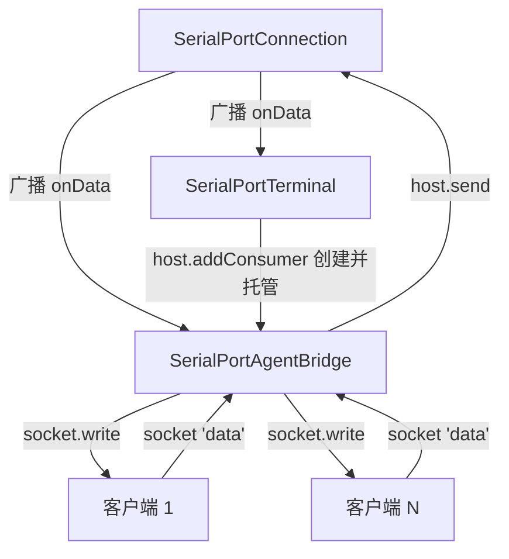
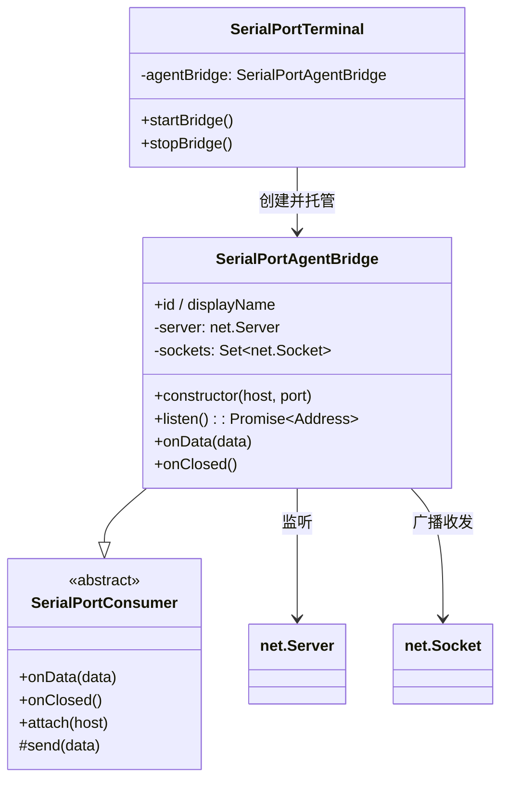

# SerialPortAgentBridge 设计

> 状态：已实现 ｜ 目录：`src/SerialPortConsumer/SerialPortAgentBridge/` ｜ 规范：SerialPortConsumer设计.md ｜ 上位文档：总体架构.md

## 1. 定位

SerialPortAgentBridge 是一个**依附型、双向 `SerialPortConsumer`**：把某条串口连接的数据流桥接到**本机 TCP 端口**，让一个或多个外部 AI Agent 通过该端口像操作虚拟终端一样读写嵌入式 Linux 机器的串口控制台。

- 由 **SerialPortTerminal 创建并托管**（对齐 SerialPortLogRecorder 的依附方式），随终端连接而可用、随断开/拔除/关闭面板而清理；
- 双向透传：串口 → 桥 → 所有客户端（`onData`），任一客户端 → 桥 → 串口（`send`）；
- **多客户端**：同一时刻可有多个客户端连接，串口数据广播给全部客户端。

## 2. 设计目标

- **裸字节透传**：串口 ↔ TCP 字节流原样转发，不做 ANSI、行编辑、协议封装；
- **实时、不缓冲**：无客户端时串口数据丢弃；客户端只收连接后的实时数据，不做历史补发；
- **多客户端**：输出广播给所有客户端，所有客户端输入合并转发到串口；
- **本机优先、安全默认**：默认仅监听 `127.0.0.1`；
- **无 headless**：依附 Terminal，关闭终端即断开，桥随之清理。

## 3. 模块关系



## 4. API 定义

```ts
class SerialPortAgentBridge extends SerialPortConsumer {
  readonly id = 'serialPortAgentBridge';
  readonly displayName = 'Serial Port Agent Bridge';

  constructor(host: string, port: number);
  listen(): Promise<{ host: string; port: number }>;  // 启动监听；端口占用则 reject
  onData(data: Buffer): void;   // 广播给所有已连接 socket
  onClosed(): void;             // 关闭全部 socket 与 server（幂等）
}
```

- `listen()` 成功后才 `host.addConsumer(this)`，失败（如 EADDRINUSE）报错、不注册；
- `onData` 广播给 `Set<net.Socket>` 中所有 socket；任一 socket `'data'` 经 `send()` 转发到串口；
- 无客户端时 `onData` 数据直接丢弃（不缓冲、不补发）。

## 5. 生命周期（由 Terminal 托管）

```
终端标题栏按钮「开启 Agent Bridge」→ Terminal.startBridge()
    → 读配置 ports → QuickPick 选端口（单值跳过）→ new AgentBridge(host, port)
    → await listen() 成功 → host.addConsumer(bridge) → 回显 host:port → setContext(active)
    → listen() 失败（端口占用）→ showErrorMessage，不注册

客户端 connect → socket 加入集合 → 实时收发
客户端断开 → socket 从集合移除（server 继续监听）

按钮「停止 Agent Bridge」→ Terminal.stopBridge() → host.removeConsumer(id) → onClosed 清理
串口断开 / 设备拔除 / 关闭终端面板 → Connection.close → consumers.onClosed → 桥清理
```

## 6. 数据流

```
串口 → Connection.handle.onData ──广播──▶ Terminal（显示）
                                    └──▶ LogRecorder（落盘）
                                    └──▶ AgentBridge.onData → 广播给所有 socket

任一客户端 → socket 'data' → AgentBridge.send() → handle.write → 串口
```

## 7. 交互与状态

- **终端标题栏按钮**（对齐 LogRecorder 的 context-key 模式）：
  - 未启动：`$(broadcast)` 图标按钮「开启 Agent Bridge」，点击开启；
  - 已启动：`$(record)` 图标按钮「停止 Agent Bridge」，作为「已开启」状态指示，点击关闭；
- **context key**：`serialPortTerminal.agentBridgeActive`（是否运行）、`serialPortTerminal.agentBridgeClients`（当前客户端数，用于状态展示）；
- **回显**：启动成功后 `showInformationMessage` 显示 `host:port`（如 `127.0.0.1:2000`）；
- **状态栏持久显示**：桥运行时状态栏常驻 `$(record) AgentBridge <host:port>`，点击复制地址到剪贴板；桥停止 / 断开时隐藏。状态跟随**活动终端**——每个终端独立记录自己的地址，切换终端时状态栏随之切换（活动终端无桥则隐藏）。

## 8. 配置

| 配置项 | 类型 | 默认 | 说明 |
|---|---|---|---|
| `serialPortTerminal.agentBridge.host` | string | `127.0.0.1` | 监听地址（默认仅本机） |
| `serialPortTerminal.agentBridge.ports` | array(number) | `[2000]` | 候选端口列表；启动时下拉选择，单值时跳过（同 `baudRates` 的做法） |

## 9. 组件结构



## 10. 路线图 / 后续演进

- **v1（本次）**：依附 Terminal 的本机裸 TCP 桥、多客户端、实时不缓冲、终端标题栏按钮启停、端口下拉选择；
- **后续**：
  - 客户端接入提示：连接/断开时在终端或状态栏提示客户端数变化；
  - 行尾归一化：CR / LF / CRLF（关联 M3-P2）；
  - **不在范围**：headless（AgentBridge 依附 Terminal，无独立无终端形态）。
