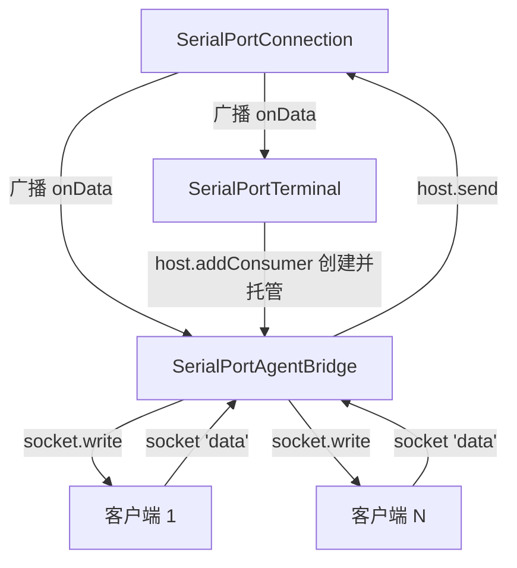
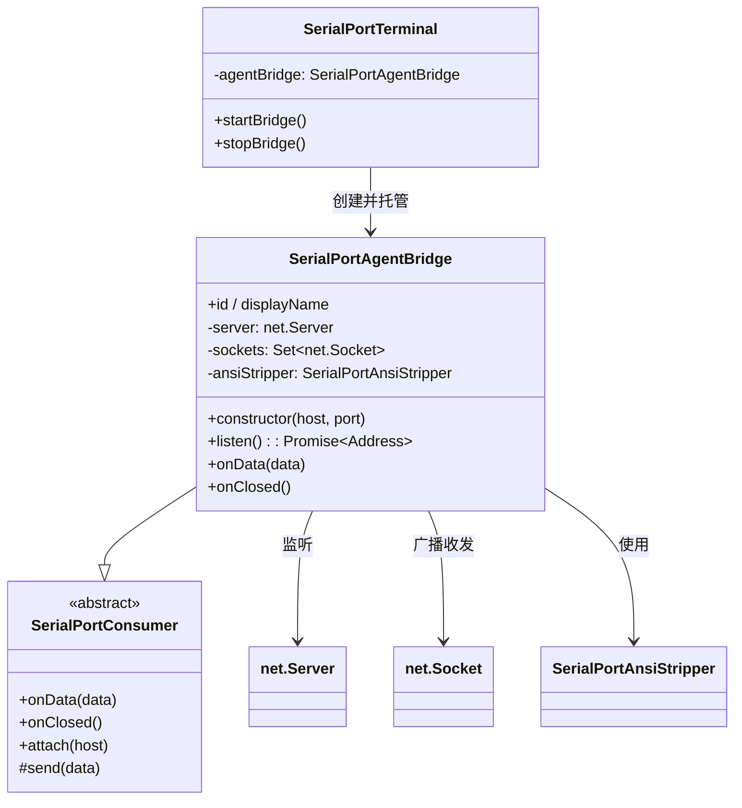

# SerialPortAgentBridge 设计

> 目录：`src/SerialPortConsumer/SerialPortAgentBridge/` ｜ 规范：[SerialPortConsumer设计.md](SerialPortConsumer设计.md) ｜ 上位文档：[总体架构.md](../总体架构.md)

## 1. 定位

SerialPortAgentBridge 是一个**依附型、双向 `SerialPortConsumer`**：把某条串口连接的数据流桥接到**本机 TCP 端口**，让一个或多个外部 AI Agent 通过该端口像操作虚拟终端一样读写嵌入式 Linux 机器的串口控制台。

- 由 **SerialPortTerminal 创建并托管**（对齐 SerialPortLogRecorder 的依附方式），随终端连接而可用、随断开/拔除/关闭面板而清理；
- 双向透传：串口 → 桥 → 所有客户端（`onData`），任一客户端 → 桥 → 串口（`send`）；
- **多客户端**：同一时刻可有多个客户端连接，串口数据广播给全部客户端。

## 2. 设计目标

- **去 ANSI 的行缓冲转发**：串口数据剥离 ANSI 转义序列后按行转发给客户端，不做行编辑、协议封装；
- **尾行保留与空闲刷出**：未获得换行的半行保留至下个 `\n`、静默 200ms 自动刷出，或桥关闭时刷出；无客户端时串口数据丢弃，不做历史补发；
- **多客户端**：输出广播给所有客户端，所有客户端输入合并转发到串口；
- **本机优先、安全默认**：默认仅监听 `127.0.0.1`；
- **无 headless**：依附 Terminal，关闭终端即断开，桥随之清理。

## 3. 模块关系


```mermaid
graph TD
    Conn[SerialPortConnection] -->|广播 onData| Terminal[SerialPortTerminal]
    Conn -->|广播 onData| Bridge[SerialPortAgentBridge]
    Terminal -->|host.addConsumer 创建并托管| Bridge
    Bridge -->|socket.write| C1[客户端 1]
    Bridge -->|socket.write| C2[客户端 N]
    C1 -->|socket 'data'| Bridge
    C2 -->|socket 'data'| Bridge
    Bridge -->|host.send| Conn
```

## 4. API 定义

```ts
class SerialPortAgentBridge extends SerialPortConsumer {
  readonly id = 'serialPortAgentBridge';
  readonly displayName = 'Serial Port Agent Bridge';

  constructor(host: string, port: number, readonlyMode = false, stripAnsi = true,
              onClientCountChanged?: (count: number) => void,
              onOutboundBytes?: (data: Buffer) => void);
  listen(): Promise<{ host: string; port: number }>;  // 启动监听；端口占用 reject（透传底层错误），
                                                      // listening 送达前被关闭则 reject 取消
                                                      // （AgentBridgeCancelledError，见 §5）
  isReadonly(): boolean;        // 只读模式标记
  isStripAnsi(): boolean;       // ANSI 剥离开关标记
  onData(data: Buffer): void;   // 剥离模式：剥离 ANSI 后广播；透传模式：原样广播
  onClosed(): void;             // 关闭全部 socket 与 server（幂等；无条件 close 触发
                                // 'close' 事件——listen 的取消路径依赖它）
}
```

- `readonlyMode`（1.4.3 起，安全增强）：只读观察者模式——socket **不挂 `data` handler**，客户端发送的字节被丢弃、永不到达设备；设备 → 客户端的广播方向不受影响。承载方式为设置项 `serialPortTerminal.agentBridge.readonly`（默认 `false`，见 §8），由 Terminal 创建桥时读取；
- `stripAnsi`（预留接口，供未来纯字节流 Consumer 使用）：默认 `true`（终端语义：剥离 ANSI 转义序列 + 200ms 空闲刷出）；`false` 时字节**原样透传**——不经剥离行缓冲、不挂空闲刷出（数据即时到达，二进制协议不被 UTF-8 往返损坏）；
- `onClientCountChanged`（可选回调，客户端计数）：客户端接入或断开后触发，`count` 为当前在线数；桥停止/断开收尾销毁 socket **不触发**（收尾无用户可感知状态变化），socket `'close'` 迟到于收尾清空时不回调（`delete` 返回 false 守卫）。普通函数回调对齐 Connection 构造器 `onRequestClose` 先例；不传时行为与无此参版本完全一致。由 Terminal 接线为状态栏计数（见 §7）；**不写终端提示行**——提示行干扰终端内容本身（用户实测定夺）；
- `onOutboundBytes`（P1-b，可选回调，出站字节）：桥客户端发来的字节（即将写入串口）在转发 send 之前触发——托管方（Assist）据此记录（DataRecorder TX 行）与回显（面板 TX 行），桥客户端操作与面板发送同权可见；readonly 模式 socket 不挂 data handler，回调**天然永不触发**（自洽）；多客户端并发按到达顺序触发（= 写序）；不传 = 行为与现状完全一致（Terminal 传 5 参零改动）；回调内**禁止**再经 host.send 写串口（防回环）；
- 注册时序：Terminal 先 `addConsumer(this)`、后 `await listen()`；listen 失败（如 EADDRINUSE）时 `removeConsumer` 回滚注销并报错；
- `onData` 广播给 `Set<net.Socket>` 中所有 socket；非只读模式下任一 socket `'data'` 经 `send()` 转发到串口；
- 无客户端时 `onData` 数据直接丢弃（不缓冲、不补发）。

## 5. 生命周期（由 Terminal 托管）

```
终端标题栏按钮「开启 Agent Bridge」→ Terminal.startBridge()
    → 重入守卫：选端口窗口（QuickPick）内二次调用静默返回（bridgeStarting 标志，防双桥竞态）；listen 窗口由 agentBridge 置位后的空值守卫自然拦截
    → 读配置 ports → QuickPick 选端口（单值跳过）→ new AgentBridge(host, port, readonly)
    → host.addConsumer(bridge)（先注册）→ await listen() 成功 → 回显 host:port（只读追加标记）→ setContext(active)
    → listen() 失败（端口占用）→ removeConsumer 回滚注销 + showErrorMessage

客户端 connect → socket 加入集合 → 实时收发 → onClientCountChanged(count) → 刷新状态栏计数
客户端断开 → socket 从集合移除（server 继续监听）→ onClientCountChanged(count) → 刷新状态栏计数

按钮「停止 Agent Bridge」→ Terminal.stopBridge() → host.removeConsumer(id) → onClosed 清理
    → listen 挂起（onClosed 发生在 listening 送达前）：经 server 'close' 事件 reject 取消
      （AgentBridgeCancelledError），startBridge 的 catch 对取消静默——清理已由本路径完成，
      无永久挂起的 promise、无实例泄漏
串口断开 / 设备拔除 / 关闭终端面板 → Connection.close → consumers.onClosed → 桥清理（同上取消路径）
```

## 6. 数据流

```
串口 → Connection.handle.onData ──广播──▶ Terminal（显示）
                                    └──▶ LogRecorder（落盘）
                                    └──▶ AgentBridge.onData → SerialPortAnsiStripper 行缓冲剥离 → 广播给所有 socket
                                                             静默 200ms：自动 flush 刷出尾行（消除提示符延迟）
                                                             断开收尾：flush 剩余半行后关闭

任一客户端 → socket 'data' → onOutboundBytes?.()（可选，托管方记录/回显）→ AgentBridge.send() → handle.write → 串口
```

## 7. 交互与状态

- **终端标题栏按钮**（对齐 LogRecorder 的 context-key 模式）：
  - 未启动：`$(broadcast)` 图标按钮「开启 Agent Bridge」，点击开启；
  - 已启动：`$(record)` 图标按钮「停止 Agent Bridge」，作为「已开启」状态指示，点击关闭；
- **context key**：`serialPortTerminal.agentBridgeActive`（是否运行）；
- **回显**：启动成功后 `showInformationMessage` 显示 `host:port`（如 `127.0.0.1:2000`）；只读模式追加 ` (read-only)` 后缀；
- **命令面板**：`serialPortAgentBridge.toggleReadonly` 切换只读设置并提示生效时机（修改在重新开启 Agent Bridge 后生效）；
- **状态栏持久显示**：桥运行时状态栏常驻 `$(record) AgentBridge <host:port>`（只读模式追加 ` (read-only)` 后缀），点击复制地址到剪贴板；桥停止 / 断开时隐藏。状态跟随**活动终端**——每个终端独立记录自己的地址，切换终端时状态栏随之切换；活动终端无桥（或无活动串口终端）时回退显示任一 Assist 会话的运行中桥（全局桥指示，Assist 状态迁移经 `refreshAgentBridgeStatus` 同步；点击复制同源回退）。文本在客户端数 ≥1 时追加 ` · N` 计数（客户端接入/断开经回调刷新；与地址一样跟随活动终端；"0" 是常态噪音，不显示）。客户端接入呈现**有意只做状态栏计数**：不写终端提示行（干扰终端内容本身，用户实测定夺）、不用 toast（Agent 重连频繁，轰炸不可接受）。

## 8. 配置

| 配置项 | 类型 | 默认 | 说明 |
|---|---|---|---|
| `serialPortTerminal.agentBridge.host` | string | `127.0.0.1` | 监听地址（默认仅本机） |
| `serialPortTerminal.agentBridge.ports` | array(number) | `[2000]` | 候选端口列表；启动时下拉选择，单值时跳过（同 `baudRates` 的做法） |
| `serialPortTerminal.agentBridge.readonly` | boolean | `false` | 只读模式：客户端仅能接收设备数据，发送的字节被丢弃、永不到达设备（安全增强，观察者场景推荐开启） |

## 9. 组件结构


```mermaid
classDiagram
    class SerialPortConsumer {
        <<abstract>>
        +onData(data)
        +onClosed()
        +attach(host)
        #send(data)
    }
    class SerialPortAgentBridge {
        +id / displayName
        +constructor(host, port)
        +listen(): Promise~Address~
        +onData(data)
        +onClosed()
        -server: net.Server
        -sockets: Set~net.Socket~
        -ansiStripper: SerialPortAnsiStripper
    }
    class SerialPortTerminal {
        +startBridge()
        +stopBridge()
        -agentBridge: SerialPortAgentBridge
    }
    SerialPortAgentBridge --|> SerialPortConsumer
    SerialPortTerminal --> SerialPortAgentBridge : 创建并托管
    SerialPortAgentBridge --> net.Server : 监听
    SerialPortAgentBridge --> net.Socket : 广播收发
    SerialPortAgentBridge --> SerialPortAnsiStripper : 使用
```

## 10. 范围边界

- headless 不在范围：AgentBridge 依附 Terminal，无独立无终端形态。
