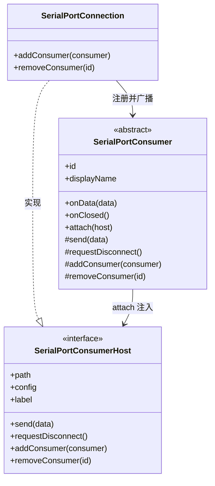

# SerialPortConsumer 设计

> 状态：已实现 ｜ 目录：`src/SerialPortConnection/SerialPortConsumer.ts` ｜ 上位文档：SerialPortConnection设计.md

## 1. 定位

SerialPortConsumer 是数据**消费方**的通用规范，由 Connection 模块定义。任何接入串口数据流的组件 —— 终端展示、可视化、协议分析 —— 均继承这一基类，向 SerialPortConnection 注册。数据转义、更好显示等加工由 DataParser 等**数据处理类**承担，属于 Consumer 内部的实现细节，不是 Consumer。

新增 Consumer 的方式：在 `src/SerialPortConsumer/<组件名>/` 下新建子类，实现基类契约，经 Connection 的注册入口接入。

## 2. 设计目标

- **单向接收**：Consumer 只接收数据；发送必须经 Connection 中枢（host），"唯一触碰数据流"的始终是 Connection；
- **生命周期由 Connection 驱动**：注册（attach）、注销（onClosed）均发生在 Connection 的上下文中，Consumer 不感知端口细节；
- **可管理**：每个 Consumer 有 id 与显示名，支持未来的二级菜单展示与手动关闭（M5）；
- **关闭行为自决**：`onClosed` 时用户可见类型保留视图并提示断开，用户不可见类型直接销毁自身资源 —— 选择权在子类，基类不做假设。

## 3. API 定义

### 3.1 SerialPortConsumerHost —— Connection 向 Consumer 提供的能力

Consumer 注册时由 Connection 注入，是 Consumer 与连接之间的唯一交互通道：

| 成员 | 契约 |
|---|---|
| `readonly path: string` | 所属设备路径，用于显示与日志 |
| `readonly config: SerialConfig` | 当前连接的配置参数（终端标题等展示用途） |
| `readonly label: string \| undefined` | 连接来源标签（快捷配置名）；手动配置连接时为 `undefined` |
| `send(data: Buffer)` | 向串口发送数据，Consumer 的**唯一**发送途径 |
| `requestDisconnect()` | 请求断开连接，由 Connection 转交 Service 的销毁流程（终端内断开走这里） |
| `addConsumer(consumer)` | 注册附属 Consumer（依附型 Consumer 的接入点，如 SerialPortLogRecorder） |
| `removeConsumer(id)` | 注销指定 Consumer |

### 3.2 SerialPortConsumer —— 抽象基类

```ts
export abstract class SerialPortConsumer {
  abstract readonly id: string;          // 唯一标识（未来二级菜单的键）
  abstract readonly displayName: string; // 显示名（未来二级菜单展示）
  onData?(data: Buffer): void;           // 可选：接收数据，仅需接收数据的 Consumer 实现（只发送不接收的可省略）
  abstract onClosed(): void;             // 连接销毁通知：可见类型提示断开并保留视图，不可见类型销毁资源
  onError?(error: Error): void;          // 可选：运行期错误

  attach(host: SerialPortConsumerHost): void; // 注册时由 Connection 调用
  protected send(data: Buffer): void;         // 转发到 host
  protected requestDisconnect(): void;        // 转发到 host
  protected addConsumer(consumer): void;      // 转发到 host（依附型 Consumer 注册）
  protected removeConsumer(id): void;         // 转发到 host
}
```

- `attach` 后基类持有 host，子类经受保护的 `send` / `requestDisconnect` / `addConsumer` / `removeConsumer` 使用；
- `onData`（可选）由 Connection 的数据流入口调用，调用顺序即串口到达顺序；仅需接收数据的 Consumer 实现它，只发送不接收的 Consumer 可省略；
- 基类不关心数据的解析、转义、配色 —— 那是各 Consumer 自身职责。

## 4. 注册与生命周期

```
Service.connect 成功
    → 构造 Connection
    → Service 经工厂注册默认 Consumer（SerialPortTerminal）
        → Connection.addConsumer(terminal)
        → terminal.attach(host)
    → 数据到达 → terminal.onData(data)
断开 / 拔除 / 扩展停用
    → Connection 销毁前逐个调用 consumer.onClosed()
    → Consumer 按自身类型处理关闭（保留视图并提示 / 直接销毁）
```

| 规则 | 说明 |
|---|---|
| `addConsumer(consumer)` | 注册并 attach；同 id 重复注册时先对旧实例执行 `onClosed` |
| `removeConsumer(id)` | 注销指定 Consumer（M5 二级菜单"手动关闭"走这里） |
| Consumer 减为零 | Connection 通知 Service → 关闭串口并销毁 Connection（等同于一次断开） |
| 默认 Consumer | SerialPortTerminal，由 Service 在 connect 成功后经工厂注册；其移除同样适用"减为零"规则 |
| 依附型 Consumer | 由已注册的 Consumer 经 `host.addConsumer` 注册、并托管其生命周期（如 SerialPortLogRecorder 由 SerialPortTerminal 创建与管理，见 SerialPortLogRecorder设计.md） |

### 4.1 关闭行为约定

`onClosed` 的实现由 Consumer 类型自行决定：

- **用户可见类型**（如 SerialPortTerminal）：保留视图并提示"已断开"，日志可继续回看；此后视图进入冻结态（数据与输入均失效）；
- **用户不可见类型**（如未来的 Logger）：直接在 `onClosed` 中销毁自身资源。

该约定不写入接口：基类不做假设，保留/销毁的选择权完全在子类。

## 5. 数据流向

```
串口 → HAL 句柄 onData
    → Connection 分发给每个已注册 Consumer.onData(data)
    → Terminal 显示 / 分析器处理（各自内部，可经 DataParser 数据处理类做转义、更好显示等加工）
```

Connection 只广播不加工；数据的转义、解析与展示由各 Consumer 内部经数据处理类（如 DataParser）自行完成，Consumer 之间不协作、不经 Connection 传递加工结果。若未来出现跨 Consumer 共享加工结果的管道需求，再引入 Processor 概念，不扩充 Consumer 契约。

## 6. 组件结构



## 7. 路线图

- **M3**：SerialPortTerminal 作为默认 Consumer（已落地），输入增强（行尾符配置）与 Parser（Consumer 自决）演进；
- **M5**：多 Consumer 注册、二级菜单展示与手动关闭、减为零自动关串口（已实现）；
- **DataParser 公共化（已实现）**：新增 `src/SerialPortConsumer/SerialPortDataParsers/` 公共目录与 `SerialPortAnsiStripper`（剥离 ANSI 转义）；日志专属按行时间戳拆为 `SerialPortLineTimestampBuffer`（留 LogRecorder 目录）；`SerialPortLogDataParser` 已移除。
