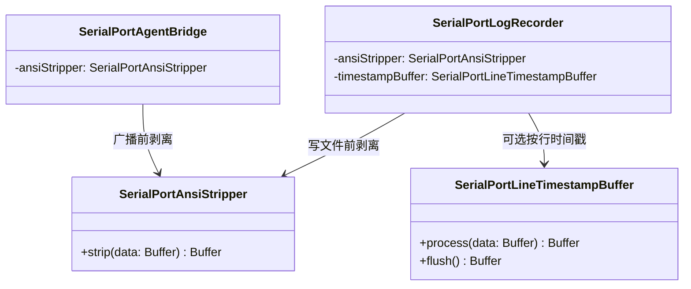

# SerialPortDataParsers 设计

> 目录：`src/SerialPortConsumer/SerialPortDataParsers/` ｜ 规范：[SerialPortConsumer设计.md](SerialPortConsumer设计.md) ｜ 上位文档：[总体架构.md](../总体架构.md)

## 1. 定位

数据处理类集合：Consumer 内部的数据加工件。Consumer 只负责展示、落盘与转发，数据的剥离、转义等加工由数据处理类承担（见 [SerialPortConsumer设计.md](SerialPortConsumer设计.md) §1、§5）。

- 现有成员：`SerialPortAnsiStripper`——剥离 ANSI 转义序列的公共数据处理类；
- 日志专属的按行时间戳缓冲 `SerialPortLineTimestampBuffer` 仅 LogRecorder 使用，按就近原则位于 LogRecorder 目录，不收入本目录；
- 使用方：SerialPortLogRecorder（写文件前剥离）、SerialPortAgentBridge（转发客户端前剥离），均为逐 chunk 调用。

## 2. 设计目标

- **纯函数式、无状态**：输入 Buffer → 输出 Buffer，调用间不共享状态，调用方按 chunk 逐次调用；
- **零运行时依赖**：不 import `vscode` 与第三方包，纯 Node 可单测（见 `doc/Test/开发测试体系规划.md` §6.1）；
- **不误伤**：`\r\n`、`\t`、退格等有语义的控制字符与全部可打印文本原样保留；
- **调用方零约束**：不感知上游 Consumer 类型，任何 Consumer 均可复用。

## 3. SerialPortAnsiStripper 契约

```ts
class SerialPortAnsiStripper {
  strip(data: Buffer): Buffer; // 剥离 ANSI 转义序列；其余内容经 UTF-8 往返原样保留
}
```

剥离范围（单一正则全局匹配、替换为空）：

| 序列类别 | 形式 | 示例 |
|---|---|---|
| CSI | `ESC [ … <终止字节>` 或 `0x9B … <终止字节>` | `\x1b[31m`、`\x1b[2J`、`\x9b4m` |
| OSC | `ESC ] <参数> BEL` | `\x1b]0;title\x07` |

终止字节字符集为 `[\dA-PR-TZcf-nq-uy=><~]`（正则原文保留在实现内，不在此展开）。

## 4. 已知行为与限制（均经单测或实测固化）

| # | 输入情形 | 实测行为 |
|---|---|---|
| 1 | chunk 内完整序列（CSI / OSC / C1） | 完整剥离 |
| 2 | 截断序列且末字节属于终止符字符集 | 被贪婪剥离：`foo\x1b[31` → `foo` |
| 3 | 截断序列以裸 ESC 结尾 | ESC 保留：`foo\x1b` → `foo\x1b` |
| 4 | 序列跨 chunk（ESC 上 chunk、终止符下 chunk） | 前段贪婪剥离 + 终止符残段按字面泄漏：`foo\x1b[3` 与 `1mbar\x1b[0m` 拼接后为 `foo1mbar` |
| 5 | OSC 参数含空格等参数集外字符 | 匹配中断且前缀被部分吞食：`\x1b]0;my title\x07rest` → `y title\x07rest` |
| 6 | UTF-8 多字节字符跨 chunk | 在 `toString` 环节即产生替换符（chunk 边界固有效应，非本类引入）；chunk 内多字节字符不受影响 |

根因：无状态设计无法感知 chunk 边界上的序列延续。现状取舍依据：串口设备流（内核日志等）极少恰好在 chunk 边界切开转义序列；完整剥离需要跨 chunk 缓冲状态机，属行为变更（牵动 LogRecorder 与 AgentBridge 两个调用方），列为待评估演进项（§8）。

## 5. 数据流

```
Connection.handle.onData ──广播──▶ Consumer.onData(data)
    ├─ SerialPortLogRecorder：AnsiStripper.strip → LineTimestampBuffer（可选）→ 写文件
    └─ SerialPortAgentBridge：AnsiStripper.strip → socket 广播
```

## 6. 组件结构



## 7. 测试

`SerialPortAnsiStripper` 由 10 例单元测试覆盖（§4 各限制行为均含现状固化用例），经 `npm test` 运行，用例清单见 `doc/Test/开发测试体系规划.md` §6.1。

## 8. 演进路线

- **已决定、待实现：行缓冲式改造**——以 `\n` 为行单位剥离（转义序列不跨行生效），未完成尾行跨调用保留，断开时 `flush()` 刷出剩余半行；目标契约与 19 例用例见 `doc/Test/开发测试体系规划.md` §6.1（现状 12 通过 / 7 失败，失败即实现差距）。实现完成前，本文档 §3–§4 描述的是现行无状态实现。
- **关联 M3-P3**：分帧 Parser、不可见字符可视化等新增数据处理类落位于本目录，沿用「输入 Buffer → 输出 Buffer、无状态或显式声明状态」的契约模式。
