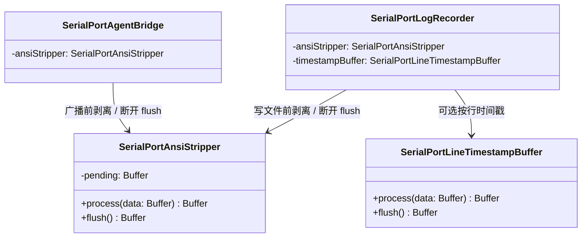

# SerialPortDataParsers 设计

> 目录：`src/SerialPortConsumer/SerialPortDataParsers/` ｜ 规范：[SerialPortConsumer设计.md](SerialPortConsumer设计.md) ｜ 上位文档：[总体架构.md](../总体架构.md)

## 1. 定位

数据处理类集合：Consumer 内部的数据加工件。Consumer 只负责展示、落盘与转发，数据的剥离、转义等加工由数据处理类承担（见 [SerialPortConsumer设计.md](SerialPortConsumer设计.md) §1、§5）。

- 现有成员：`SerialPortAnsiStripper`——行缓冲式 ANSI 转义序列剥离器；
- 日志专属的按行时间戳缓冲 `SerialPortLineTimestampBuffer` 仅 LogRecorder 使用，按就近原则位于 LogRecorder 目录，不收入本目录；
- 使用方：SerialPortLogRecorder（写文件前剥离）、SerialPortAgentBridge（转发客户端前剥离），均为逐 chunk 调用 `process`、断开收尾时调用 `flush`。

## 2. 设计目标

- **行缓冲式**：以 `\n` 为行单位处理，转义序列不跨行生效；未完成尾行按原始字节跨调用保留，`flush()` 刷出——chunk 边界由上游驱动读取产生，经字节级缓冲后对剥离逻辑成为无关量；
- **零运行时依赖**：不 import `vscode` 与第三方包，纯 Node 可单测（见 `doc/Test/开发测试体系规划.md` §6.1）；
- **不误伤**：`\r\n`、`\t`、退格等有语义的控制字符与全部可打印文本原样保留；
- **调用方零约束**：不感知上游 Consumer 类型，任何 Consumer 均可复用，但断开收尾时必须调用 `flush()`。

## 3. SerialPortAnsiStripper 契约

```ts
class SerialPortAnsiStripper {
  process(data: Buffer): Buffer; // 行缓冲剥离：输出完整行的剥离结果，尾行保留待后续数据
  flush(): Buffer;               // 断开收尾：剥离并刷出剩余半行，随后状态复位
}
```

剥离范围（单一正则全局匹配、替换为空，作用于完整行文本）：

| 序列类别 | 形式 | 示例 |
|---|---|---|
| CSI | `ESC [ … <终止字节>` 或 `0x9B … <终止字节>` | `\x1b[31m`、`\x1b[2J`、`\x9b4m` |
| OSC | `ESC ] <参数> BEL` | `\x1b]0;title\x07` |

终止字节字符集为 `[\dA-PR-TZcf-nq-uy=><~]`（正则原文保留在实现内，不在此展开）。

## 4. 行为与限制（均经单测或实测固化）

| # | 情形 | 行为 |
|---|---|---|
| 1 | 行内完整序列（CSI / OSC / C1） | 完整剥离 |
| 2 | 序列 / 多字节字符跨 chunk | 字节级缓冲续全后剥离，不泄漏、不损坏（行缓冲已消除原无状态实现的残段泄漏与替换符问题） |
| 3 | 行尾悬挂 ESC | 按字面保留——序列不跨行生效的契约语义 |
| 4 | 行内截断序列（末字节属于终止符字符集） | 行内剥离，无残留：`abc\x1b[31` → `abc` |
| 5 | OSC 参数含空格等参数集外字符 | 匹配中断且前缀部分吞食（正则级限制，行内仍存在）：`\x1b]0;my title\x07rest` → `y title\x07rest` |
| 6 | 半行滞留 | 契约语义：尾行等待 `\n` 或 `flush()`；转发类调用方（AgentBridge）以 200ms 空闲刷出消除提示符延迟，断开时亦刷出 |

## 5. 数据流

```
Connection.handle.onData ──广播──▶ Consumer.onData(data)
    ├─ SerialPortLogRecorder：AnsiStripper.process → LineTimestampBuffer（可选）→ 写文件
    │                          断开收尾：AnsiStripper.flush → LineTimestampBuffer.flush → 写文件
    └─ SerialPortAgentBridge：AnsiStripper.process → socket 广播
                               断开收尾：AnsiStripper.flush → 向在线客户端广播后关闭
```

## 6. 组件结构



## 7. 测试

`SerialPortAnsiStripper` 由 19 例单元测试覆盖（§4 各行为均含用例），经 `npm test` 运行，当前全部通过；用例清单见 `doc/Test/开发测试体系规划.md` §6.1。

## 8. 演进路线

- **已实现：行缓冲式改造**——契约与 19 例用例见 `doc/Test/开发测试体系规划.md` §6.1，LogRecorder / AgentBridge 已联动（调用 `process`、断开 `flush` 收尾）；
- **待评估**：OSC 参数集扩展（含空格等字符的正则修订，消除 #5 前缀吞食）；
- **关联 M3-P3**：分帧 Parser、不可见字符可视化等新增数据处理类落位于本目录，沿用「`process` / `flush` 行缓冲」的契约模式。
