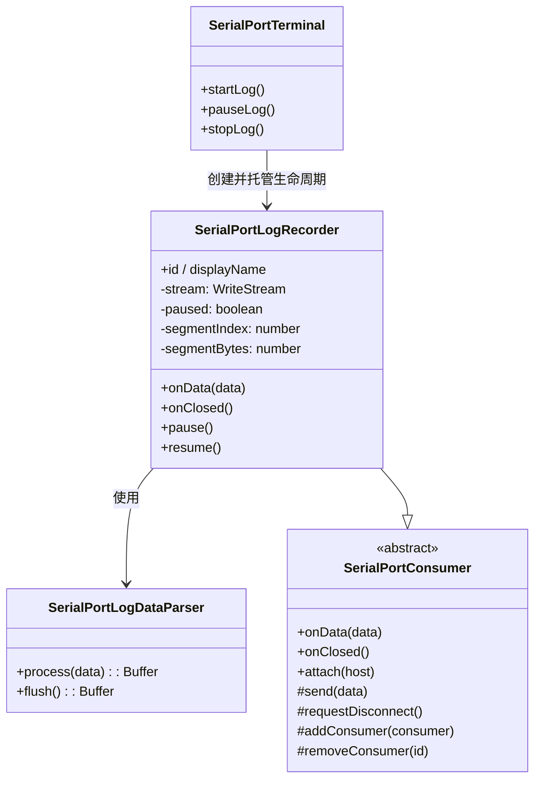

# SerialPortLogRecorder 设计

> 状态：已实现 ｜ 目录：`src/SerialPortConsumer/SerialPortLogRecorder/` ｜ 规范：SerialPortConsumer设计.md ｜ 上位文档：总体架构.md

## 1. 定位

SerialPortLogRecorder 是日志记录 Consumer：把串口**接收**的原始字节流写入日志文件。它在**数据流维度**上是独立 Consumer（注册到 `SerialPortConnection`，由 Connection 直接广播数据），在**生命周期维度**上依附于 `SerialPortTerminal`（由 Terminal 创建、暂停、继续、停止与销毁）。

它不是默认 Consumer：连接建立时不自动存在，由用户在终端面板标题栏点击「保存」后按需创建。

## 2. 设计目标

- **独立数据流**：作为 Consumer 注册到 Connection，直接接收广播的 `onData`，不经 Terminal 转发；
- **生命周期托管**：创建 / 暂停 / 继续 / 停止均由 Terminal 发起；断开或关闭终端时随 Connection 销毁自动收尾；
- **流式写入**：用 `fs.createWriteStream` 追加写入，支持按大小分割（见 8.1）；
- **可配置目录**：保存目录可配置，默认落在 Windows 文档目录；
- **最小实现**：落盘原始字节流；ANSI 剥离、每行时间戳、按大小分割等已实现（见 6 数据流与 8 文件与配置）。

## 3. 模块关系

两个维度相互独立，不矛盾：

| 维度 | 归属 | 含义 |
|---|---|---|
| 数据流 | 独立 Consumer | 继承 `SerialPortConsumer`，经 `host.addConsumer` 注册，Connection 直接广播 `onData` |
| 生命周期 | 依附 Terminal | 创建 / 暂停 / 继续 / 停止 / 销毁由 `SerialPortTerminal` 发起与管理 |

## 4. API 定义

```ts
class SerialPortLogRecorder extends SerialPortConsumer {
  readonly id = 'serialPortLogRecorder';
  readonly displayName = 'Serial Port Log Recorder';

  constructor(baseFilePath: string);   // 记录目标「主体」文件路径（分段时派生 _002/_003…），首次收到数据时才创建文件
  onData(data: Buffer): void;          // 未暂停时写文件；累计超过大小阈值则滚动到下一段
  onClosed(): void;                    // 关闭文件流；若有数据写入则提示「文件已保存到 <主体文件路径>」
  pause(): void;                       // 暂停写入（仍注册、仍接收广播）
  resume(): void;                      // 恢复写入
  isPaused(): boolean;
}
```

- `onData` 由 Connection 的数据流入口调用，调用顺序即串口到达顺序；
- 首次收到数据时才创建文件（延迟创建），未收到数据即停止不产生空文件；
- `pause` / `resume` 只切换内部标志，**不注销** Consumer；
- `onClosed` 幂等：重复调用安全（文件流未创建或已关闭时短路）；
- 停止收尾时（无论「停止」按钮还是断开连接触发）若本次有数据写入，弹出「文件已保存到 <path>」提示。

## 5. 生命周期

```
点击[保存] → Terminal.startLog()
   → 计算文件路径 → new SerialPortLogRecorder(filePath)
   → host.addConsumer(recorder)        // 注册，Connection 开始广播
   → 进入「记录中」

记录中 → Connection 广播 onData(data) → recorder 首次收到数据时创建文件并写入

点击[暂停] → recorder.pause()          // 内部标志置位，onData 跳过写入
点击[继续] → recorder.resume()

点击[停止] → host.removeConsumer(id) + recorder.onClosed() + 销毁引用
            // Terminal 保持连接，只是不再记录

断开 / 关闭终端面板
   → Connection.close() → 逐个调用 consumer.onClosed()
   → recorder.onClosed() 关闭文件流（被动收尾，随连接销毁）
```

规则：

- **暂停不注销**：仍挂在 Connection 上，只是不写文件（开销可忽略，见 SerialPortConsumer设计.md「广播效率」讨论）；
- **停止注销并销毁**：不影响 Terminal 的连接状态；
- **停止收尾提示**：`onClosed()` 关闭文件流后，若本次有数据写入，弹出「文件已保存到 <path>」（点「停止」与断开连接两条路径都会触发）；
- **断开 / 关终端为最终收尾**：LogRecorder 随 Connection 一起销毁。

## 6. 数据流

```
串口 → Connection.handle.onData ──广播──▶ SerialPortTerminal（显示）
                                   └──▶ SerialPortLogRecorder（经 SerialPortLogDataParser 剥离 ANSI 后写文件）
```

LogRecorder 写入前经 `SerialPortLogDataParser` 剥离 ANSI 转义序列（颜色码、光标控制等），并按行加时间戳（`logTimestampEnabled` 开启时），保留 `\r\n`、`\t`、退格等有意义的控制字符。当前 Terminal 无本地回显，故该字节流即设备真实发出的数据。

> **行缓冲说明**：时间戳按「行」加，而数据按「chunk」到达，chunk 边界与行边界不对齐。因此 `process()` 维护内部缓冲，按 `\n` 切分：完整行加时间戳后输出，末尾半行留在缓冲等待下一 chunk 补全；`flush()` 在结束前冲刷剩余的半行（无结尾换行的最后一行）。关闭时间戳时不缓冲、直接透传。

## 7. UI：按钮与命令

### 7.1 按钮位置

采用 littrick/vscode-serial-terminal 同款方案：**终端面板标题栏按钮**（`contributes.menus.view/title` + `when: "view == terminal"`），命令带 `icon`。按钮显隐由 context key 驱动。

另有全局「打开日志目录」按钮，位于**设备列表视图标题栏**（`when: "view == serialPortDeviceList"`，图标 `$(folder-opened)`）：经命令 `serialPortLog.openDirectory` 在系统文件管理器中打开日志目录，不依赖活动终端或记录会话。

### 7.2 状态机与 context key

| 状态 | 终端标题栏按钮 |
|---|---|
| 未记录 | `[保存]` |
| 记录中 | `[暂停] [停止]` |
| 暂停中 | `[继续] [停止]` |

context key：

| key | 含义 |
|---|---|
| `serialPortTerminal.focus` | 当前活动终端是串口终端 |
| `serialPortTerminal.recording` | 已存在 LogRecorder |
| `serialPortTerminal.paused` | 已暂停 |

按钮 `when` 组合：

| 按钮 | when |
|---|---|
| 保存 | `view == terminal && serialPortTerminal.focus && !serialPortTerminal.recording` |
| 暂停 | `view == terminal && serialPortTerminal.focus && serialPortTerminal.recording && !serialPortTerminal.paused` |
| 继续 | `view == terminal && serialPortTerminal.focus && serialPortTerminal.recording && serialPortTerminal.paused` |
| 停止 | `view == terminal && serialPortTerminal.focus && serialPortTerminal.recording` |

### 7.3 命令与实例定位

命令 `serialPortLog.start / pause / resume / stop`：

1. 取 `vscode.window.activeTerminal`；
2. 经 `Map<vscode.Terminal, SerialPortTerminal>` 映射到 Terminal 实例；
3. 调用 `startLog() / pauseLog() / resumeLog() / stopLog()`。

`vscode.window.onDidChangeActiveTerminal` 维护三个 context key（切换终端时刷新显隐）。

### 7.4 快捷键（Ctrl+S）

在**串口终端内**按 `Ctrl+S`（字节 `0x13`）可在「开始记录 / 停止记录」之间切换。因 VS Code 终端聚焦时会把按键发给终端进程（而非 VS Code 快捷键系统），故该快捷键在 `SerialPortPseudoTerminal.handleInput` 中**直接拦截**实现，不依赖 context key。

- **默认关闭**：配置项 `serialPortTerminal.logShortcutsEnabled`（boolean，默认 `false`）。
- **拦截语义**：开启后，终端内按 `Ctrl+S` 被扩展消费、触发开始/停止记录，**不会发送给设备**；关闭时 `Ctrl+S` 原样发送给设备。
- 只作用于当前串口终端实例（`handleInput` 属于该终端自己的 Pseudoterminal），多终端并存不会互相干扰。

## 8. 文件与配置

### 8.1 文件分割（按大小）

- **开关**：`logMaxFileSize` = `0`（默认）为不分割；设为 ≥1（单位 KB）时启用分割，最小阈值 1KB（建议 32768 = 32MB）；
- **命名**：主体 + 编号，平铺同目录、不建文件夹 —— `COM3_20250112_153045.log`（第 1 段，无编号）、`COM3_20250112_153045_002.log`、`_003.log`…（编号 3 位零填充，插在扩展名前）；
- **触发**：启用时每段累计写盘字节数超过阈值（KB→字节）即关闭当前流、段号 +1、开下一段、计数清零；按 chunk 边界分割（原始字节流跨行切可接受，单块超阈值时整块写入再切）；
- **通知**：保持不变，始终提示「文件已保存到 <主体文件路径>」（即第 1 段路径，不含分段编号），不额外提示段数。

| 项 | 方案 |
|---|---|
| 写入 | `fs.createWriteStream`（流式追加，首次收到数据时才创建文件） |
| 文件名 | 由模板生成，默认 `{device}_{YYYY}{MM}{DD}_{HH}{mm}{ss}.log`，如 `COM3_20250112_153045.log`；占位符：`{device}`=设备名、`{YYYY}{MM}{DD}{HH}{mm}{ss}`=时间戳；替换后清洗非法字符 `\ / : * ? " < > \|` 为 `_` |
| 配置项 | `serialPortTerminal.logDirectory`（string，默认空） |
| 配置项 | `serialPortTerminal.logFilenameTemplate`（string，默认 `{device}_{YYYY}{MM}{DD}_{HH}{mm}{ss}.log`，设置界面经 `pattern` 校验非法字符） |
| 配置项 | `serialPortTerminal.logMaxFileSize`（integer，单位 KB，默认 `0`=不分割，`minimum: 0`；≥1 时启用，建议 `32768`=32MB） |
| 时间戳 | 开启后每行日志前加时间戳（默认关闭，下次开始记录时生效），占位符 `{YYYY}{MM}{DD}{HH}{mm}{ss}{SSS}`（`{SSS}`=毫秒） |
| 配置项 | `serialPortTerminal.logTimestampEnabled`（boolean，默认 false） |
| 配置项 | `serialPortTerminal.logTimestampFormat`（string，默认 `[{HH}:{mm}:{ss}.{SSS}] `） |
| 配置项 | `serialPortTerminal.logShortcutsEnabled`（boolean，默认 false，开启后终端内 `Ctrl+S` 被拦截用于开始/停止记录，不会发送给设备） |
| 默认目录 | 空时取 `os.homedir()/Documents/SerialPortTerminal/Log`（Windows：`C:\Users\{user}\Documents\SerialPortTerminal\Log`）；目录不存在时递归创建 |
| 权限 | 写日志到文档目录属 workspace 外，实现时按需申请文件权限 |

## 9. 组件结构



## 10. 后续演进（本次不实现）

- **编码配置**：日志文件字符编码可选（当前固定 UTF-8）。
