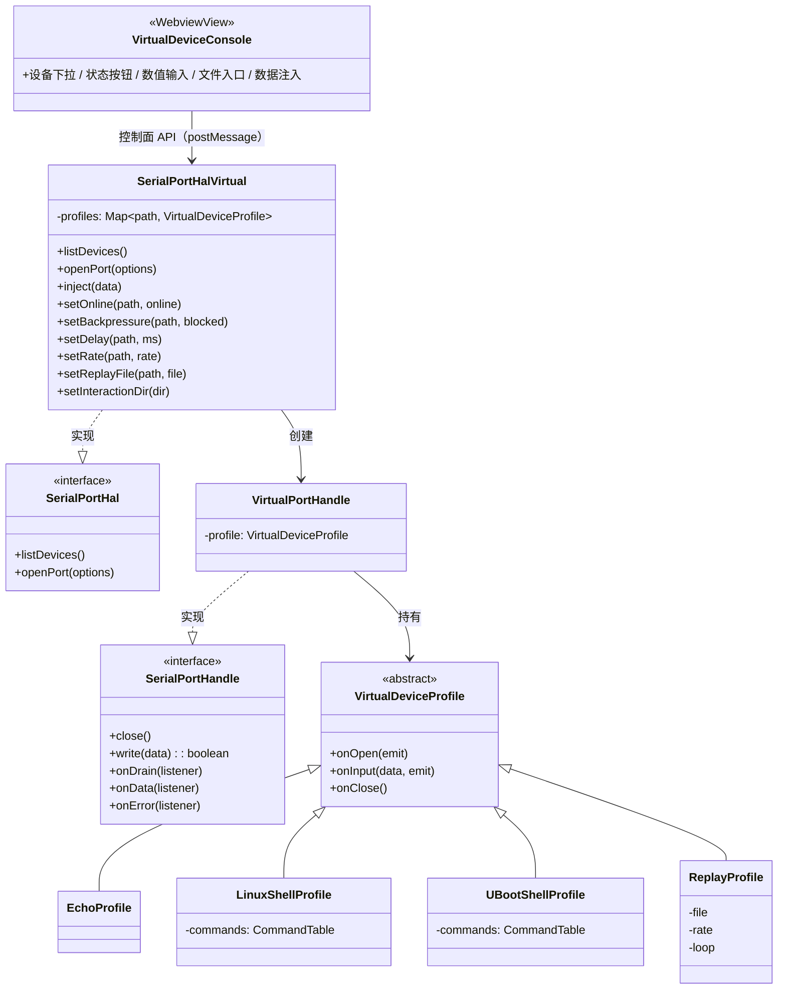

# SerialPortHalVirtual 设计

> 状态：规划中 ｜ 目录：`src/hal/SerialPortHalVirtual/` ｜ 上位文档：[总体架构.md](../总体架构.md) ｜ 契约：[SerialPortHal设计.md](SerialPortHal设计.md)

## 1. 定位

SerialPortHalVirtual 是产品测试模式的载体：`SerialPortHal` 接口的虚拟设备实现，与 `SerialPortHalImpl` 并列，经编译期开关进入构建，仅用于测试模式。上层 Detector、ConnectionService、Connection 与全部 Consumer 零改动地运行在虚拟设备之上，配套虚拟设备控制台（§8）提供设备侧的运行时控制。

用途：

- 无硬件体验完整链路：连接、终端交互、日志保存、AgentBridge 全部可用；
- 开发与调试 agent-bridge-skills：AI Agent 经 AgentBridge 操作虚拟终端；
- 以真实采集日志为数据源，验证日志相关能力（每行时间戳、ANSI 剥离、按大小分割）。

## 2. 设计目标

- **零业务侵入**：虚拟实现只存在于 HAL 层与装配层，不触碰任何服务层与 Consumer，见 [SerialPortHal设计.md](SerialPortHal设计.md) §2「可替换、可测试」；
- **编译期隔离**：虚拟 HAL 经源码开关进入构建，不存在运行时切换与设置切换；生产发布构建必须为真实 HAL；
- **显式区分**：虚拟设备在树视图中带 Virtual 标注，与真实设备明确区分；
- **参数容错**：连接参数（波特率、帧格式、流控）允许正常设置，实现直接忽略，上层连接流程不因虚拟设备产生分支；
- **行为可扩展**：命令应答表驱动，应答目录文件覆盖内置表，新增虚拟指令不需要改代码。

## 3. 设备清单

测试构建下默认提供四台虚拟设备，每台固定一个实例（`listDevices` 只返回虚拟设备）：

| 设备 | 路径 | 画像 | 用途 |
|---|---|---|---|
| 回显设备 | `VCOM-ECHO` | Echo | 管道验证：输入什么回显什么 |
| Linux 终端设备 | `VCOM-LINUX` | LinuxShell | Agent 连接测试：常用命令固定应答 |
| U-Boot 终端设备 | `VCOM-UBOOT` | UBootShell | Agent 连接测试：U-Boot 命令集固定应答 |
| 日志回放设备 | `VCOM-REPLAY` | Replay | 按可调速率回放日志文件 |

设备默认在线；控制台可切换「拔出 / 上线」模拟热插拔事件链（见 §8）。设备身份走退化链第三级（path 兜底）——虚拟设备路径固定且稳定，见 [SerialPortDeviceDetector设计.md](../SerialPortDeviceDetector设计.md) §4.1。

## 4. 设备画像

### 4.1 Echo（回显）

收到什么回什么，数据原样回显。用于验证数据管道与 [AgentBridge](../ConsumerDesign/SerialPortAgentBridge设计.md) 的字节透传。

### 4.2 LinuxShell（虚拟 Linux 终端）

- 打开端口时输出欢迎信息与提示符 `root@localhost:~# `；
- 命令按行匹配应答，内置默认表：

| 命令 | 应答 |
|---|---|
| `help` | 支持的命令清单 |
| `uname -a` | 固定的内核信息行 |
| `ls` / `pwd` | 预置目录列表 / 路径 |
| `echo <文本>` | 回显文本 |
| `cat <文件>` | 预置文件内容 |
| 其余命令 | `bash: <命令>: command not found` |

- 应答来源与文件覆盖约定见 §4.5；
- **远端回显**：画像自行回显键入字符（真实串口终端的回显来自设备端），保证终端内输入可见。

### 4.3 UBootShell（虚拟 U-Boot 终端）

同 LinuxShell：打开时输出版本横幅与提示符 `=>`，内置默认表：

| 命令 | 应答 |
|---|---|
| `help` | 支持的命令清单 |
| `version` | 固定的 U-Boot 版本信息 |
| `printenv` | 预置环境变量 |
| 其余命令 | `Unknown command '<命令>' - try 'help'` |

应答来源与文件覆盖约定见 §4.5。开机倒计时与 `boot` 命令切换 Linux 会话的状态机链路列入演进，首版两个画像相互独立。

### 4.4 Replay（日志回放）

- 数据源为纯文本日志文件（配置项），打开端口后按可调速率逐行播放；
- 速率与是否循环可配置；
- 速率语义（整体倍速 vs 行/秒）与播放控制（暂停、重新开始）在实现前定稿。

### 4.5 应答目录（交互型画像）

LinuxShell 与 UBootShell 的命令应答支持文件覆盖：

- 配置 `serialPortTerminal.testMode.interactionDir` 指定应答根目录，子目录 `linux/`、`uboot/` 分别对应两个画像（两画像存在同名命令，如 `help`，单层目录会冲突）；
- 文件名 = 命令行（如 `uname -a.txt`、`printenv.txt`），文件内容 = 静态应答文本，输出时自动补换行与提示符；
- 子目录或命令文件缺省时回退内置默认表；
- 文件名受 Windows 合法字符限制，含 `\ / : * ? " < > |` 的命令无法以文件覆盖，保留内置表应答；
- Echo 无命令表、Replay 属日志型，均不适用本约定。

## 5. 装配与选择（编译期）

- 源码开关常量（如 `src/hal/halSelection.ts` 的 `USE_VIRTUAL_HAL = false`）决定 `extension.ts` 注入的实现；不存在运行时切换，也不提供设置项；
- 本 HAL 仅用于测试模式：`vscode:prepublish` 校验开关为 `false`，未复位时拒绝打包，防止生产版本携带虚拟设备；
- 测试构建下设备来源**完全替换**：`listDevices` 只返回虚拟设备，虚拟与真实设备不混排；按路径前缀分发两级 HAL 的混排路由列入演进；
- 生命周期语义与真实设备一致：断开、关闭终端面板、扩展停用均走上层统一销毁流程，虚拟句柄在 `close` 时停止回放与定时器。

## 6. 配置（草案）

| 配置项 | 类型 | 默认值 | 说明 |
|---|---|---|---|
| `serialPortTerminal.testMode.replayFile` | string | `""` | 回放设备的纯文本日志文件路径 |
| `serialPortTerminal.testMode.replayRate` | number | `1` | 回放速率 |
| `serialPortTerminal.testMode.replayLoop` | boolean | `false` | 播放到文件末尾后是否循环 |
| `serialPortTerminal.testMode.responseDelay` | number | `0` | 命令应答延迟（ms），模拟真实设备的异步响应 |
| `serialPortTerminal.testMode.interactionDir` | string | `""` | 交互型画像的应答根目录，约定见 §4.5 |

配置项为草案，实现时定稿。虚拟 HAL 的启停由编译期开关决定（§5），不设运行期测试模式开关。

## 7. 关键机制

### 7.1 输入处理管线

```
handle.write(data) → responseDelay 延迟 → 画像处理 → emit onData(输出)
```

命令应答类画像内部维护行缓冲，按 `\r` 切分出命令行后查表匹配；Echo 与 Replay 不做行缓冲。

### 7.2 背压模拟

控制台状态按钮切换「阻塞 / 放行」：阻塞时 `write` 返回 `false`，放行时触发 `onDrain`，为 HAL 的已知限制「write 背压信号未消费」（见 [SerialPortHalImpl实现.md](SerialPortHalImpl实现.md) §5）提供无硬件的验证手段。

### 7.3 参数忽略

`openPort` 对任何 `SerialPortOpenOptions` 都成功打开，参数不生效，仅记录 debug 级日志便于排查。

## 8. 虚拟设备控制台（WebviewView）

侧边栏视图，挂在现有 `serialPortTerminalSideBar` 容器下。**全部虚拟设备共享一个控制台**，仅提供通用控制操作，不含画像专属界面。

| 控制项 | 形式 | 说明 |
|---|---|---|
| 目标设备 | 下拉框 | 切换当前控制的虚拟设备 |
| 在线 / 拔出 | 状态按钮 | 拔出时该设备从 `listDevices` 消失，经 Detector removed 事件走真实的连接销毁链；上线后恢复出现在设备列表 |
| 背压阻塞 / 放行 | 状态按钮 | 控制该设备 `write` 的背压行为（见 §7.2） |
| 应答延迟 | 数值输入 | 精确值（ms），不用滑杆类模糊控件 |
| 回放速率 | 数值输入 | 精确值 |
| 回放循环 | 状态按钮 | 切换 `replayLoop` |
| 回放文件 | 文件选择入口 | 选择纯文本日志文件，写入 `testMode.replayFile` |
| 应答根目录 | 目录选择入口 | 选择交互型画像应答根目录，写入 `testMode.interactionDir`（约定见 §4.5） |
| 数据注入 | 文本输入 + 发送 | 以设备侧视角向串口对端注入任意数据，用于模拟设备主动输出 |

实现约定：

- Webview ↔ 扩展主进程经 `postMessage` 通信，消息协议包含 `select` / `setOnline` / `setBackpressure` / `setDelay` / `setRate` / `setLoop` / `setFiles` / `inject` 与反向的 `stateChanged`；
- `SerialPortHalVirtual` 在 `SerialPortHal` 契约之外暴露**控制面 API**（`inject` / `setOnline` / `setBackpressure` / `setDelay` / `setRate` / `setLoop` / `setReplayFile` / `setInteractionDir`），仅控制台使用，不影响 HAL 契约本身；
- 控制台随编译期开关进入构建，生产构建不注册该视图。

## 9. 不做范围

- 桥接本地真实 shell（node-pty 原生依赖，风险等级与 serialport 相同）；
- 用户自定义 expect 规则引擎；
- CTS/RTS 流控线路信号模拟。

## 10. 演进路线

- **P0**：编译期开关 + HAL 骨架 + Echo 画像，跑通测试构建下的连接与终端交互；
- **P1**：LinuxShell / UBootShell 画像（内置默认表 + 应答目录覆盖 + 远端回显），支撑 agent-bridge-skills 调试；
- **P2**：Replay 画像（文件回放、速率、循环）；
- **P3**：虚拟设备控制台（WebviewView：设备下拉、状态按钮、精确数值输入、文件入口、数据注入）+ 背压模拟；
- **P4**：U-Boot → Linux 开机链路、混排路由。

## 11. 组件结构


