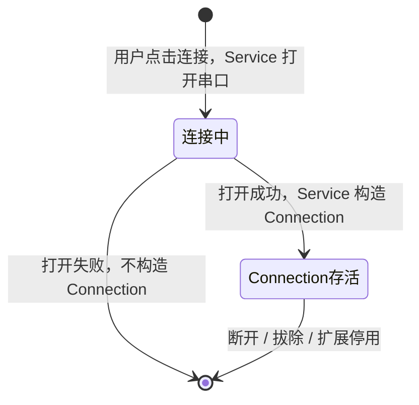
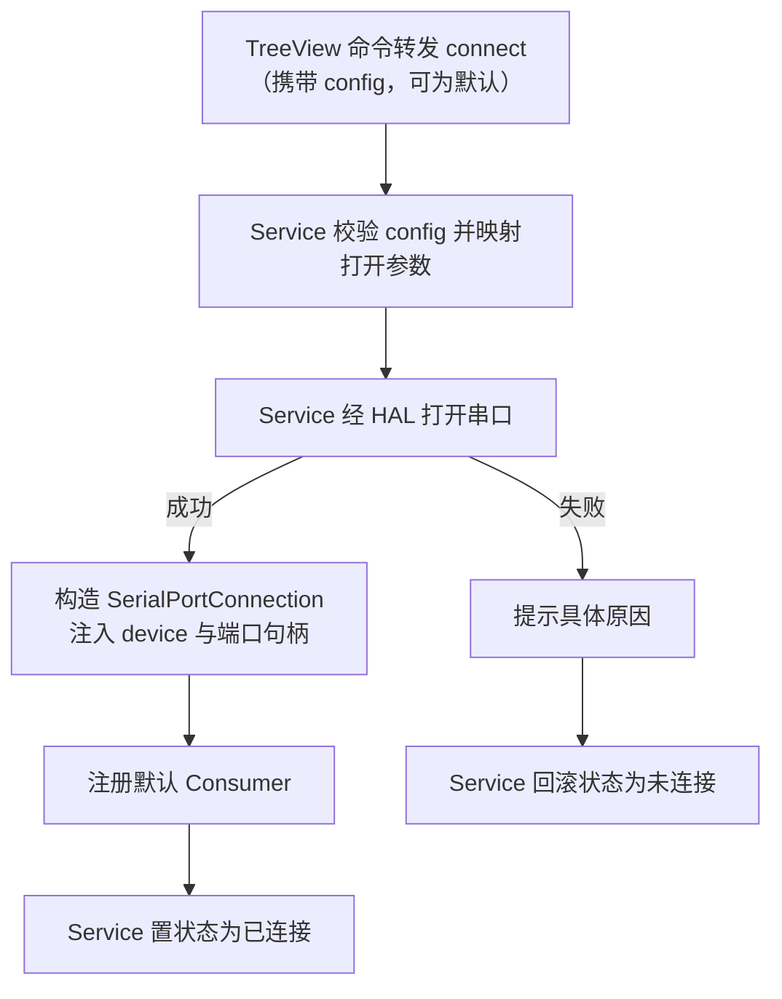
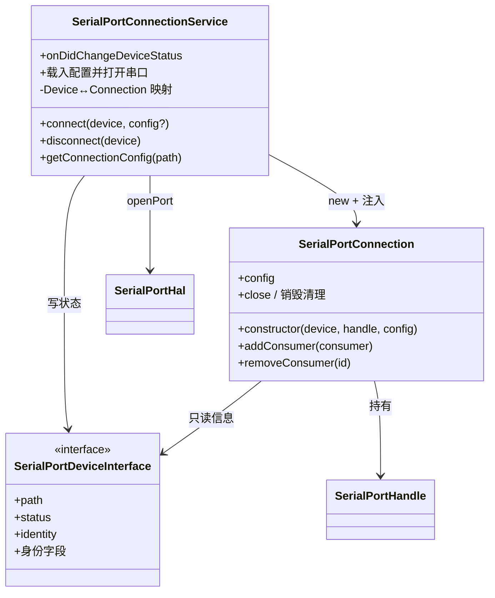

# SerialPortConnection 设计

> 状态：已实现 ｜ 目录：`src/SerialPortConnection/` ｜ 上位文档：总体架构.md

## 1. 定位

本模块包含连接域的两个角色：

- **SerialPortConnectionService** —— 连接生命周期的协调者：载入设备配置、经 HAL 打开串口、创建/销毁 Connection、维护 Device↔Connection 映射、回写连接状态。它承担"建立连接"的全部职责；
- **SerialPortConnection** —— 与单个串口连接绑定的组件：由 Service 在**打开串口成功后**创建，接管已打开的端口句柄，负责数据收发中枢与 Consumer 注册。它承担"持有连接"的职责。

一个 Connection 实例对应一个已建立的连接：实例随打开成功而创建，随断开、拔除或扩展停用而销毁。

## 2. 设计目标

- **存在即连接已建立**：Connection 只构造于打开成功之后，不存在"未连上的 Connection"；
- **状态由 Service 写**：连接状态的唯一写者是 Service；Connection 只读设备信息，不触碰视图与状态；
- **数据中枢**：收发数据统一经过 Connection，Consumer 从 Connection 订阅；
- **自清理**：销毁时关闭端口、注销全部 Consumer，不遗留资源。

## 3. 设备契约

SerialPortDeviceInterface（定义于 Detector 模块）是本模块与设备域之间的契约：

- **只读信息**：`path` 与身份字段供 Connection 识别与展示，遵循"Unknown 为空标记"原则；
- **identity**：由 Detector 按退化链计算，Service 直接用它查询设备配置；
- **状态可写**：`setStatus()` 按约定只由 Service 调用，Connection 只读 `status` getter；
- 具体类对 Connection 不可见：Connection 依赖接口而非 TreeItem，可替换实现、可单测。

## 4. 生命周期

Connection 的存在前提是"有一个已打开且未断开的串口连接"：



| 事件 | 行为 |
|---|---|
| 点击连接且打开成功 | Service 构造 Connection，注入 device 与端口句柄，注册默认 Consumer，置 connected |
| 视图点击断开 | Service 销毁 Connection，连带销毁其全部 Consumer，端口在销毁时关闭 |
| 经 SerialPortTerminal 断开 | Terminal 是特殊 Consumer，经 `requestDisconnect` 发起，由 Service 间接销毁 |
| 连接失败 | 不构造 Connection —— 构造时机在打开成功之后，失败仅回滚状态，无销毁负担 |
| 设备拔除 | Service 订阅 Detector 的 removed 事件，销毁对应 Connection 并清理 |
| 扩展停用 | 订阅均入 context.subscriptions，框架统一清理 |

### 4.1 断开回传机制

连接创建必须经由 Service；Service 是 Connection 的创建者与持有者，维护 **Device ↔ Connection 映射**（以设备路径为键，与状态键一致）。断开存在两个入口：

- **视图入口**：TreeView 命令转发 → Service 按 device 经映射查找并销毁；
- **Connection 内部入口**（Terminal 发起）：Consumer 经 host 的 `requestDisconnect` 发起，由 Connection 转交 Service。

销毁动作收敛于 Service 单一入口（映射注销 → 销毁 Connection → 状态回写），两处入口不产生第二套销毁逻辑。设备已从 Detector 消失时，销毁请求自然短路，无递归风险。

## 5. 功能设计

### 5.1 连接流程



- 打开动作在 Service 侧：失败时 Connection 尚未产生，失败路径没有销毁负担；
- 端口句柄所有权在构造时移交 Connection：此后数据的收发与关闭由 Connection 负责；
- 守卫规则：目标设备状态非 disconnected 时连接请求**必须**被拒绝（防止并发重复打开）。

### 5.2 断开流程

```
注销全部 Consumer → 关闭端口 → 销毁 Connection → Service 置为未连接 → 待轮询移除
```

- 断开后条目保持"未连接"，由 Detector 在下一次扫描中移除（或手动扫描）；
- Connection 销毁前**必须**关闭端口、注销全部订阅；
- 设备拔除由 Detector 事件驱动（4.1）。

### 5.3 状态事件

Service 每次状态写入后发布 `onDidChangeDeviceStatus`，TreeView 订阅并重渲染；该事件是应用内**唯一**的连接状态词汇表。

## 6. 配置与持久化

连接参数以**命名配置集合**形态存在，完整的配置域设计（数据模型、存储、CRUD、交互向导）见 SerialPortQuickConfig设计.md。本节只定义连接服务的契约：

- `connect(device, config?)`：连接参数由调用方随连接请求传入（已接入：UI 经参数选择器传入）；未传时使用默认值 115200-8-N-1；
- `getConnectionConfig(path)`：当前连接配置的只读查询，供视图高亮（见 SerialPortQuickConfig设计.md「当前连接高亮」）；
- Service 不查询配置存储（当前阶段）：配置的选择与传递是视图层职责；自动恢复场景（M6）再评估注入 Store；
- 持久化归 SerialPortConfigStore（键为设备身份，换口重插自动找回）。

| 数据 | 键 | 是否持久化 | 说明 |
|---|---|---|---|
| 设备列表 | —— | 否 | 硬件事实，每次启动重新枚举 |
| 命名配置集合（SerialPortQuickConfig[]） | 全局池 `serialPortQuickConfigPool` + 每设备引用 `serialPortDeviceConfigRefs`（引用键=设备身份） | 是 | 用户配置，全局池复用/引用计数，换口重插按身份找回，归 ConfigStore 管理 |
| 上次使用配置（SerialConfig） | 设备身份 | 是 | 选择器置顶"上次使用"（已实现）；启动后自动恢复连接仍属 M6 |
| 当前连接状态 | 路径 | 否 | 随进程结束而失效 |

## 7. Consumer 中枢

Consumer 的通用规范见 SerialPortConsumer设计.md。Connection 对外的注册入口：

- `addConsumer(consumer)`：注册并 attach（注入 host）；同 id 重复注册时先对旧实例执行 `onClosed`；
- `removeConsumer(id)`：注销（M5 二级菜单"手动关闭"走这里）；
- **减为零规则**：某设备的 Consumer 全部移除时，Connection 通知 Service，关闭串口并销毁 Connection，等同于一次断开。

默认 Consumer：Service 在 connect 成功后经工厂注册 SerialPortTerminal（见 SerialPortTerminal设计.md）；多 Consumer 与二级菜单属于 M5。依附型 Consumer（如 SerialPortLogRecorder）由 SerialPortTerminal 经 `addConsumer` 注册并托管生命周期，见 SerialPortLogRecorder设计.md。

## 8. 组件结构



## 9. 路线图

- **M3**：默认 Consumer（SerialPortTerminal）完善 —— 输入增强（行尾符配置）、Parser（Consumer 自决）；
- **M4**：快捷配置（已完成：配置管理（全局池 + 引用计数）、参数选择、高亮、上次使用，见 SerialPortQuickConfig设计.md 分阶段计划）；
- **M5**：多 Consumer 注册、二级菜单管理；
- **M6**：启动自动恢复（上次设备与配置）。
