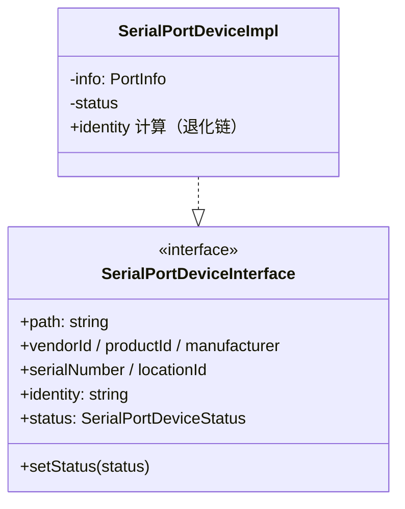
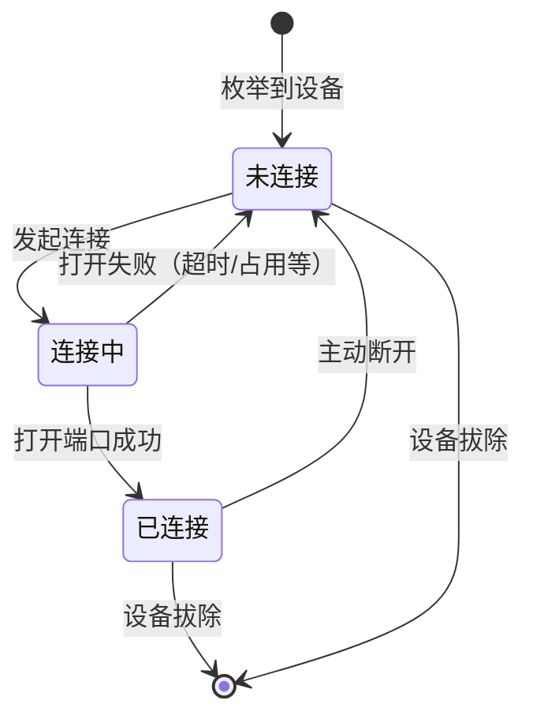

# SerialPortDeviceDetector 设计

## 简介

SerialPortDeviceDetector 是设备域组件：通过 HAL 周期性地枚举系统串口设备，维护一份稳定的设备模型列表，并以事件形式向订阅者发布设备的增删变化。它是全部设备事实的唯一来源，不触碰连接、UI 与数据收发。

## 设计目标

- **唯一设备事实源**：所有模块看到的设备信息都来自 Detector 的模型列表；
- **模型实例稳定**：轮询只增删模型、不重建实例 —— 连接状态与外部引用（Monitor、视图）不因轮询失效；
- **事件驱动**：设备增删通过 `{ added, removed }` 明细事件发布，订阅者各取所需；
- **职责纯粹**：只做侦测与模型管理，连接、配置读写、UI 均不在本模块；硬件访问经 HAL。

## 模型设计



- **信息 getters**：遵循"Unknown 为空标记"原则，缺失字段返回 `Unknown`；
- **identity**：按退化链计算，随模型一起维护，供连接服务查配置使用；
- **status**：三态（disconnected / connecting / connected）。`setStatus` 按约定只供服务层调用（类型层面无法强约束，依赖分工约定）；
- 视图包装器（TreeItem）与连接服务拿到的都是接口类型，具体实现对外不可见。

## 状态模型

连接是异步操作，状态设计为三态，状态转移如下：



状态以**设备路径**为键管理：模型实例在列表中按路径索引，轮询增删时状态随模型存活，视图重建不产生影响。

## 轮询与增删对比

底层串口库不提供跨平台的热插拔事件，设计采用**轮询 + 快照对比**（经 HAL 的 `listDevices()` 枚举）：

- 按固定周期（默认数秒，可配置）重新枚举，与当前模型列表对比；
- 发现新增 → 创建 `SerialPortDeviceImpl` 加入列表；
- 发现消失 → 从列表移除模型，其连接状态随模型作废；
- 对比结果通过事件发布 `{ added, removed }`；
- 轮询的启停由外部（视图可见性）驱动，Detector 提供 `start()` / `stop()`。

## 事件接口

```ts
readonly onDidChangeDevices: vscode.Event<{
  added: SerialPortDeviceInterface[];
  removed: SerialPortDeviceInterface[];
}>;
```

- 明细事件让订阅者各取所需：视图按 added/removed 增删 item，连接服务按 removed 清理资源；
- Detector 对外另提供 `getDevices()` 快照与 `refresh()` 手动刷新。

## 设备身份管理

状态与配置的生命周期不同，键的选型也不同：**状态以路径为键，配置以设备身份为键**。

### 身份计算（退化链）

按可靠性从高到低：

1. `serialNumber` —— 唯一且稳定，首选；注意廉价转接器的序列号常为全 0 字符串，需显式判空判零，视为无效；
2. `vendorId + productId + locationId` —— 型号 + USB 物理位置，无序列号时也能区分同型号多台设备；
3. `path` —— 兜底：此时设备身份无法识别，接受配置错配风险（物理限制，非设计错误）。

身份计算结果与来源等级一起存储（`identity` + `identityLevel`），避免后续无法判断键的可信度。

### 身份 ↔ 路径映射维护

Detector 在内存中维护会话级映射 `identity → path`，每次轮询时更新：

| 情形 | 判定 | 处理 |
|---|---|---|
| 同一身份出现在新路径 | 设备换了 USB 口或枚举顺序变化 | 更新映射，配置自动找回（换口不丢配置） |
| 同一路径出现不同身份 | COM 号被复用给了新设备 | 清空该路径的连接状态，按新身份查配置，绝不套用旧设备配置 |
| 同一身份重复出现 | 退化键冲突（理论上罕见） | 以 path 区分，记录告警日志 |
| 设备消失 | 拔除 | 映射与状态作废，配置保留 |

## 配置能力

- `serialPortTerminal.pollingInterval`：轮询间隔（默认 2 秒，1-15 可配）；
- `serialPortTerminal.hotPlugEnabled`：热插拔侦测开关；
- 配置变更监听在 Detector 内部，变更后立即生效；
- 轮询仅在视图可见时进行：TreeView 在可见性变化时调用 Detector 的 `start()` / `stop()`。

## 组件结构


