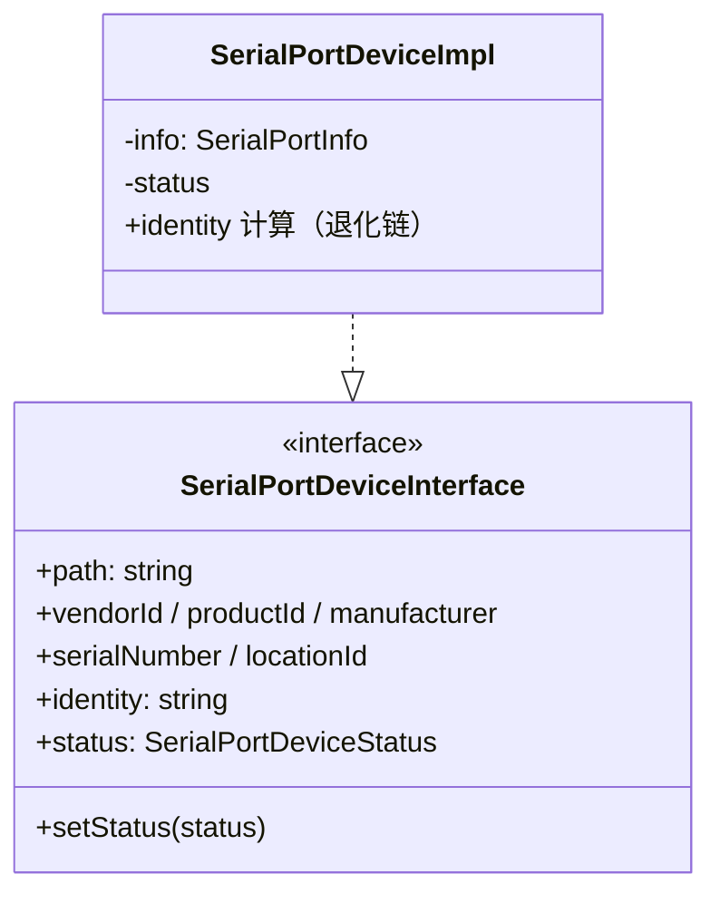
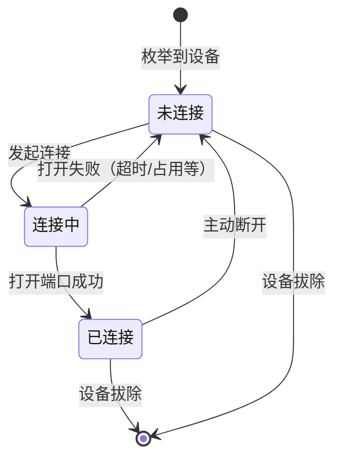
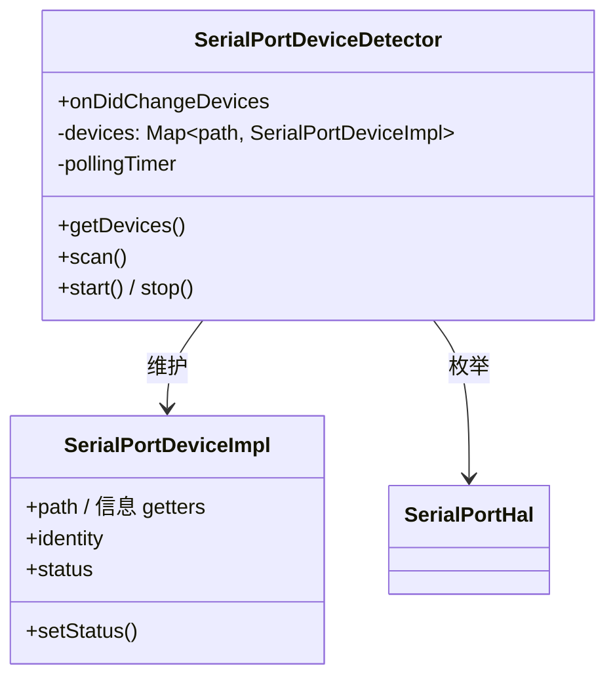

# SerialPortDeviceDetector 设计

> 状态：已实现 ｜ 目录：`src/SerialPortDeviceDetector/` ｜ 上位文档：总体架构.md

## 1. 定位

SerialPortDeviceDetector 是设备域组件：通过 HAL 周期性枚举系统串口设备，维护一份稳定的设备模型列表，以事件形式向订阅者发布设备增删。它是**全部设备事实的唯一来源**，不触碰连接、UI 与数据收发。

## 2. 设计目标

- **唯一设备事实源**：所有模块获得的设备信息均来自本组件的模型列表；
- **模型实例稳定**：轮询只增删模型、不重建实例 —— 连接状态与外部引用（Connection、视图）不得因轮询而失效；
- **事件驱动**：设备增删经 `{ added, removed }` 明细事件发布，订阅者各取所需；
- **职责纯粹**：只做侦测与模型管理；连接、配置读写、UI 均不在本模块。

## 3. 模型设计



### 3.1 字段语义

- 信息 getters 遵循"Unknown 为空标记"原则：缺失字段返回 `Unknown`，消费方将 `Unknown` 视同缺失；
- `identity` 按 4.1 退化链计算，随模型一起维护，供连接服务查询配置；
- `status` 为三态（disconnected / connecting / connected）。`setStatus` 按约定只供服务层调用 —— 类型层面无法强制，依赖分工约定（见 SerialPortConnection设计.md「设备契约」）。

## 4. 设备身份管理

状态与配置的生命周期不同，键的选型也不同：**状态以路径为键，配置以设备身份为键**。

### 4.1 身份计算（退化链）

按可靠性从高到低：

1. `serialNumber` —— 唯一且稳定，首选。序列号为空或全 0 字符串**必须**视为无效；
2. `vendorId + productId + locationId` —— 型号 + USB 物理位置，无序列号时区分同型号多台设备；
3. `path` —— 兜底：设备身份无法识别时接受配置错配风险（物理限制，非设计错误）。

身份计算结果与来源等级一并编码（`serial:` / `vid-pid-loc:` / `path:` 前缀），无需单独的等级字段即可判断键的可信度。

### 4.2 身份变化检测

Detector 以 path 为键维护模型列表，每次扫描对同路径设备做身份比对，检测到身份变化即按「旧 removed + 新 added」处理：

| 情形 | 判定 | 处理 |
|---|---|---|
| 同一路径、身份不变 | 同一设备持续在线 | 模型实例保留，状态与外部引用不失效 |
| 同一路径出现不同身份 | COM 号被复用给新设备 | 旧模型以 removed 发布（连接资源经事件链销毁）、新模型以 added 发布，绝不套用旧配置 |
| 新路径、新身份 | 新设备插入（或换口） | 新模型以 added 发布；配置按身份在 ConfigStore 中找回（身份稳定，换口不丢配置） |
| 设备消失 | 拔除 | 模型与状态作废，配置保留 |

## 5. 状态模型

连接是异步操作，状态为三态：



状态以**设备路径**为键：模型实例按路径索引于列表中，扫描增删时状态随模型存活，视图重建不产生影响。状态写者约定见 3.1。

## 6. 扫描与增删对比

底层串口库不提供跨平台热插拔事件，采用**轮询 + 快照对比**：

- 按固定周期（默认 2 秒，可配置）经 HAL `listDevices()` 枚举，与当前模型对比；
- 新增 → 创建 `SerialPortDeviceImpl` 并发布 added；
- 消失 → 移除模型并发布 removed（其连接状态随模型作废）；
- 同路径身份变化 → 视为"旧设备 removed + 新设备 added"（见 4.2）；
- 对比结果经一次事件发布 `{ added, removed }`，added 与 removed 的相对顺序保持"先增后删"；
- 轮询启停由外部（视图可见性）驱动，Detector 暴露 `start()` / `stop()`。

并发语义：扫描是异步的，连续两次扫描可能短暂交叠。模型更新与事件发布在单次扫描内顺序完成，交叠时以最后完成的扫描结果为准 —— 当前产品形态下该语义可接受。

## 7. 事件接口

```ts
readonly onDidChangeDevices: vscode.Event<{
  added: SerialPortDeviceInterface[];
  removed: SerialPortDeviceInterface[];
}>;
```

- 明细事件使订阅者各取所需：视图按 added/removed 增删 item，连接服务按 removed 清理资源；
- 另提供 `getDevices()` 快照与 `scan()` 手动触发一次扫描；
- 命名语义：Detector 的动作是"扫描"（scan），"刷新"是 UI 层词汇，两者在 TreeView 的命令回调中完成翻译。

## 8. 配置能力

- `serialPortTerminal.pollingInterval`：轮询间隔（默认 2 秒，1–15）；
- `serialPortTerminal.hotPlugEnabled`：热插拔侦测开关；
- 配置变更监听在本模块内部，变更后立即生效：以独立 `active` 状态跟踪"视图可见、应当轮询"（由 `start()`/`stop()` 维护），配置变更且 active 时以新配置重启轮询 —— 关闭开关再开启同样立即恢复，不依赖定时器是否在运行；
- 轮询仅在视图可见时进行（由 TreeView 按可见性调用 `start()` / `stop()`）。

## 9. 组件结构


