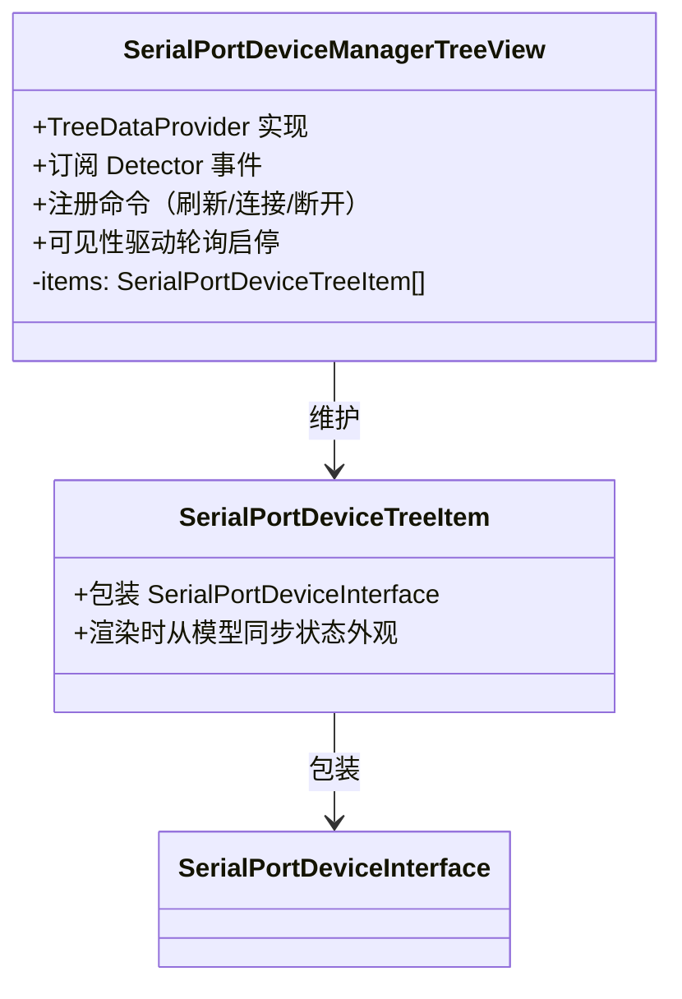
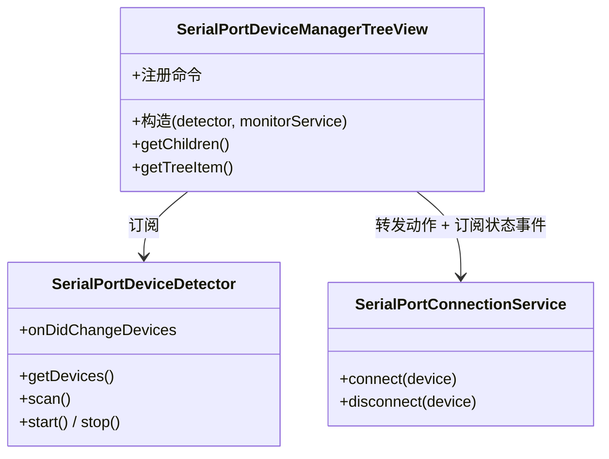

# SerialPortDeviceManagerTreeView 设计

## 简介

SerialPortDeviceManagerTreeView 是 UI 层组件：负责侧边栏树视图、命令注册、按钮与菜单等全部用户交互。它**不直接操作数据** —— 设备事实来自 Detector 的订阅，连接动作转发给 MonitorService，自身只维护"视图"。

## 设计目标

- **UI 与数据分离**：视图节点可随时重建，模型稳定（见 Detector 文档"模型实例稳定"）；
- **只转发不实现**：命令回调里只做转发，业务逻辑归服务层；
- **订阅驱动刷新**：视图刷新的两个触发器 —— Detector 的设备增删事件、MonitorService 的连接状态变化事件。

## 视图结构

- **SerialPortDeviceTreeItem 是模型的封装器**：构造时持有 `SerialPortDeviceInterface` 引用；`getTreeItem` 返回前从模型的 `status` 同步 contextValue 与图标，保证外观始终反映模型现状；
- 视图列表按 Detector 事件的 added/removed 精确增删，然后 `fire()`；
- 空状态：无设备时用 `treeView.message` 显示引导提示（"未检测到串口设备"）。

## 命令与菜单设计

### 命令命名规范

- `serialPortDeviceList.*` —— 视图级命令（如刷新）；
- `serialPortDevice.*` —— 条目级命令（如连接、断开）。

### 菜单设计

| 位置 | 命令 | 展示方式 |
|---|---|---|
| `view/title` | 刷新 | 常驻视图标题栏 |
| `view/item/context`（inline 组） | 连接 | 悬停条目时行内显示，仅未连接状态可见 |
| `view/item/context`（inline 组） | 断开连接 | 悬停条目时行内显示，仅已连接状态可见 |
| `view/item/context`（普通组） | 连接/断开/设备信息 | 右键菜单 |

### contextValue 约定

条目状态通过 `contextValue` 暴露给菜单系统：`serialPortDevice.disconnected` / `serialPortDevice.connecting` / `serialPortDevice.connected`，菜单按状态选择性显示。connecting 态不匹配任何菜单，用于禁用操作。

### 命令转发约定

| 命令 | 转发目标 |
|---|---|
| `serialPortDeviceList.refresh` | `detector.scan()` |
| `serialPortDevice.connect` | `connectionService.connect(item.device)` |
| `serialPortDevice.disconnect` | `connectionService.disconnect(item.device)` |

## 与服务的配合

- **设备增删**：`detector.onDidChangeDevices` → 按 `{ added, removed }` 增删 item 列表 → `fire()`；
- **连接状态变化**：`connectionService.onDidChangeDeviceStatus` → `fire()` 触发重渲染（item 渲染时从模型同步外观）；
- **轮询启停**：`treeView.onDidChangeVisibility` → 可见时 `detector.start()`，隐藏时 `detector.stop()`；
- 首次订阅时机：视图创建后立即订阅并同步一次全量列表。

## 组件结构

