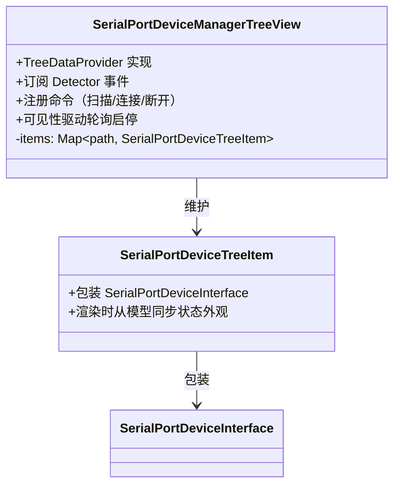
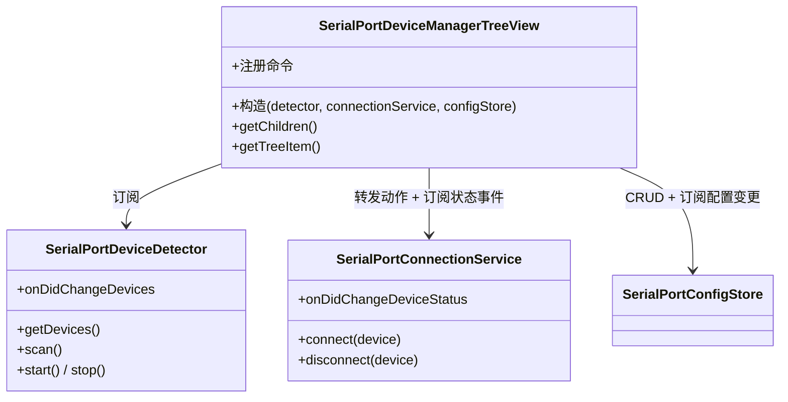

# SerialPortDeviceManagerTreeView 设计

> 状态：已实现 ｜ 目录：`src/view/` ｜ 上位文档：总体架构.md

## 1. 定位

SerialPortDeviceManagerTreeView 是 UI 层组件：负责侧边栏树视图、命令注册、按钮与菜单等全部用户交互。它**不直接操作数据** —— 设备事实来自 Detector 的订阅，连接动作转发给 ConnectionService，自身只维护视图状态。

## 2. 设计目标

- **UI 与数据分离**：视图节点可随时重建，模型实例稳定（见 SerialPortDeviceDetector设计.md「模型实例稳定」）；状态写者始终是服务层；
- **只转发不实现**：命令回调中仅做转发，业务逻辑归服务层；
- **订阅驱动刷新**：视图重渲染由三个事件触发器驱动 —— Detector 的设备增删事件、ConnectionService 的状态变化事件、ConfigStore 的配置变更事件。

## 3. 视图结构

- **SerialPortDeviceTreeItem 是模型的封装器**：构造时持有 `SerialPortDeviceInterface` 引用；`getTreeItem` 返回前从模型 `status` 同步 contextValue 与图标，保证外观始终反映模型现状；
- item 列表按 Detector 事件的 added/removed 精确增删，随后 `fire()`；
- **快捷配置子节点**：设备拥有快捷配置时节点变为可折叠，子节点为各配置项（label = 名称、description = 参数摘要、tooltip = 完整参数），渲染时查询 ConfigStore（见 SerialPortQuickConfig设计.md）；当前连接的配置子节点高亮（radio-tower 图标 + "当前连接"标注，见该文档「当前连接高亮」）；
- 空状态：无设备时经 `treeView.message` 显示引导提示（"未检测到串口设备"）。

## 4. 命令与菜单

### 4.1 命令命名规范

- `serialPortDeviceList.*` —— 视图级命令（如扫描）；
- `serialPortDevice.*` —— 设备条目级命令（如连接、断开）；
- `serialPortQuickConfig.*` —— 快捷配置级命令（添加、重命名、删除、用配置连接）；
- 所有命令在 `contributes.commands` 中统一加 `category` 为 `Serial Port Terminal`，命令面板中显示为 `Serial Port Terminal: <命令名>`，便于区分；
- 用户可见命令名一律经 `%...%` 本地化占位符解析（package.nls.json / package.nls.zh-cn.json）；
- 运行时用户可见字符串（提示、按钮、校验消息）一律经 `vscode.l10n.t` 解析，语言包在 `l10n/bundle.l10n.json`（英文基准）与 `l10n/bundle.l10n.zh-cn.json`；日志（console）不本地化（不经 `vscode.l10n.t`），为开发期调试输出。

### 4.2 菜单设计

| 位置 | 命令 | 展示方式 |
|---|---|---|
| `view/title` | 扫描 | 常驻视图标题栏 |
| `view/item/context`（inline 组） | 连接 | 悬停条目时行内显示，仅未连接状态可见 |
| `view/item/context`（inline 组） | 断开连接 | 悬停条目时行内显示，仅已连接状态可见 |
| `view/item/context`（普通组） | 连接/断开/设备信息/添加快捷配置 | 设备右键菜单 |
| `view/item/context`（普通组） | 重命名/删除 | 配置子节点右键菜单 |

### 4.3 contextValue 约定

条目状态经 `contextValue` 暴露给菜单系统，菜单按状态选择性显示：

| contextValue | 含义 |
|---|---|
| `serialPortDevice.disconnected` | 未连接（设备级连接按钮显示于此态，有/无快捷配置一致） |
| `serialPortDevice.connecting` / `serialPortDevice.connected` | 与配置无关，维持不变 |
| `serialPortQuickConfig` | 配置子节点（重命名/删除菜单匹配此值） |

connecting 态不匹配任何菜单，用于禁用操作。原"hasConfigs 按钮迁移"方案已取消：连接入口统一保留在设备上（见 SerialPortQuickConfig设计.md 6.3）。

### 4.4 命令转发约定

| 命令 | 转发目标 |
|---|---|
| `serialPortDeviceList.refresh` | `detector.scan()` |
| `serialPortDevice.connect` | 选中该设备的配置子节点时直连该配置（跳过选择器）；否则弹参数选择器（已存配置[上次使用置顶] + 预设组合）；连接成功后 `configStore.setLastUsedConfig` |
| `serialPortDevice.disconnect` | `connectionService.disconnect(item.device)` |
| `serialPortQuickConfig.add` | `configStore.add(identity, name, config)`（经两步向导收集输入） |
| `serialPortQuickConfig.rename` | `configStore.rename(identity, id, name)` |
| `serialPortQuickConfig.remove` | `configStore.remove(identity, id)` |

命令 id 中的 "refresh" 是 UI 层词汇（用户语义），Detector 的动作语义是"扫描"，翻译发生在命令回调中。

## 5. 与服务的配合

- **设备增删**：`detector.onDidChangeDevices` → 按 `{ added, removed }` 增删 item → `fire()`；处理顺序为**先 removed、后 added** —— 同路径身份变化时两者携带相同 path，先删后增避免同键覆盖导致新条目被误删；
- **连接状态变化**：`connectionService.onDidChangeDeviceStatus` → `fire()`（item 渲染时从模型同步外观）；
- **高亮查询**：渲染时经 `connectionService.getConnectionConfig(path)` 查询当前连接配置，配置子节点做值比较（`serialConfigEquals`）、设备行追加参数摘要；断开后查询返回 undefined，高亮随状态事件流自动消失；
- **选中直连**：`treeView.onDidChangeSelection` 跟踪单选；点设备连接按钮时，若选中项是该设备的配置子节点则直接以该配置连接（跳过参数选择器），否则走选择器流程；
- **配置变更**：`configStore.onDidChangeConfigs` → 重建受影响设备节点（含配置子节点）→ `fire()`；
- **手动配置读取**：手动配置向导的波特率 / 帧格式读取自 `serialPortTerminal.baudRates` / `serialPortTerminal.frameFormats` 设置（见 SerialPortQuickConfig设计.md），每次打开向导实时读取，设置修改无需重启；
- **轮询启停**：`treeView.onDidChangeVisibility` → 可见时 `detector.start()`，隐藏时 `detector.stop()`；
- 首次订阅时机：视图构造时订阅并触发一次 `detector.scan()` 同步全量列表；
- 全部订阅与命令注册均入 `context.subscriptions`，扩展停用时由框架统一清理。

## 6. 组件结构

