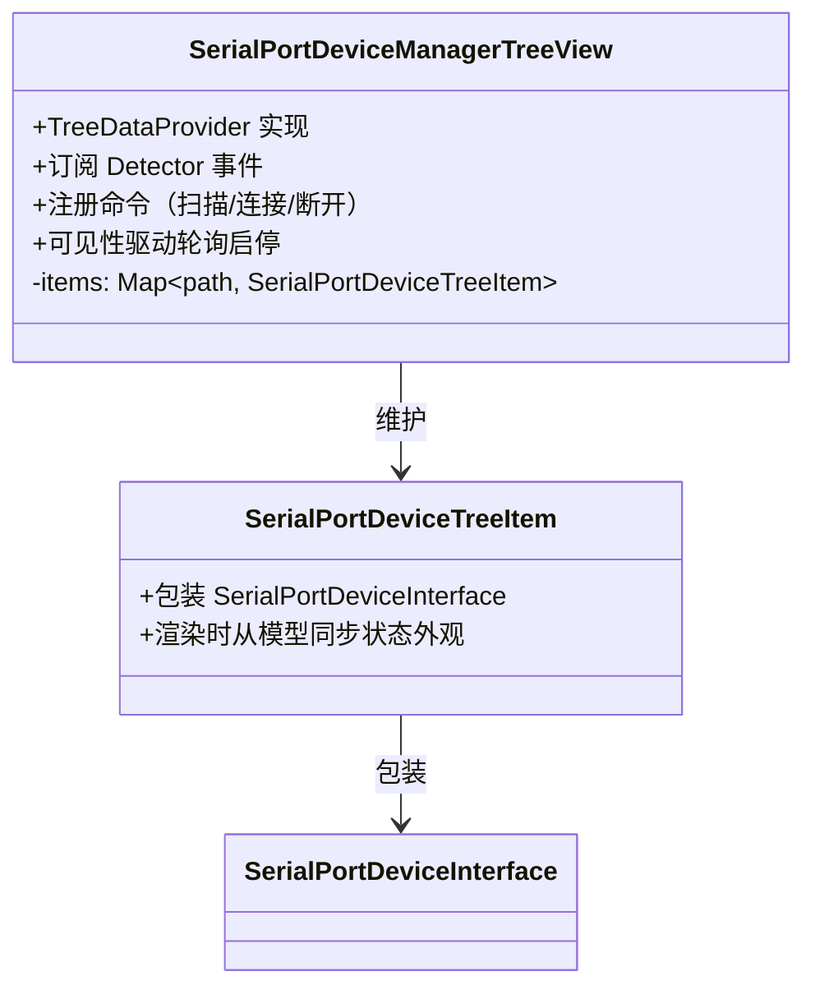
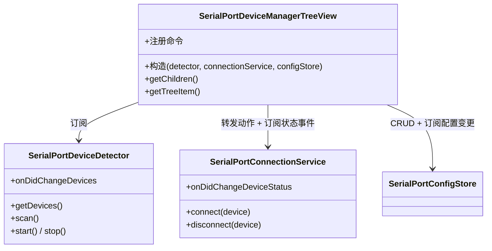

# SerialPortDeviceManagerTreeView 设计

> 状态：已实现 ｜ 目录：`src/view/` ｜ 上位文档：总体架构.md

## 1. 定位

SerialPortDeviceManagerTreeView 是 UI 层组件：负责侧边栏树视图、命令注册、按钮与菜单等全部用户交互。它**不直接操作数据** —— 设备事实来自 Detector 的订阅，连接动作转发给 ConnectionService，自身只维护视图状态。

## 2. 设计目标

- **UI 与数据分离**：视图节点可随时重建，模型实例稳定（见 SerialPortDeviceDetector设计.md「模型实例稳定」）；状态写者始终是服务层；
- **只转发不实现**：命令回调中仅做转发，业务逻辑归服务层；
- **订阅驱动刷新**：视图重渲染只有两个触发器 —— Detector 的设备增删事件、ConnectionService 的状态变化事件。

## 3. 视图结构

- **SerialPortDeviceTreeItem 是模型的封装器**：构造时持有 `SerialPortDeviceInterface` 引用；`getTreeItem` 返回前从模型 `status` 同步 contextValue 与图标，保证外观始终反映模型现状；
- item 列表按 Detector 事件的 added/removed 精确增删，随后 `fire()`；
- **快捷配置子节点**：设备拥有快捷配置时节点变为可折叠，子节点为各配置项（label = 名称、description = 参数摘要、tooltip = 完整参数），渲染时查询 ConfigStore（见 SerialPortQuickConfig设计.md）；
- 空状态：无设备时经 `treeView.message` 显示引导提示（"未检测到串口设备"）。

## 4. 命令与菜单

### 4.1 命令命名规范

- `serialPortDeviceList.*` —— 视图级命令（如扫描）；
- `serialPortDevice.*` —— 设备条目级命令（如连接、断开）；
- `serialPortQuickConfig.*` —— 快捷配置级命令（添加、重命名、删除、用配置连接）；
- 用户可见命令名一律经 `%...%` 本地化占位符解析（package.nls.json / package.nls.zh.json）。

### 4.2 菜单设计

| 位置 | 命令 | 展示方式 |
|---|---|---|
| `view/title` | 扫描 | 常驻视图标题栏 |
| `view/item/context`（inline 组） | 连接 | 悬停条目时行内显示，仅未连接状态可见 |
| `view/item/context`（inline 组） | 断开连接 | 悬停条目时行内显示，仅已连接状态可见 |
| `view/item/context`（普通组） | 连接/断开/设备信息/添加快捷配置 | 设备右键菜单 |
| `view/item/context`（inline 组） | 用此配置连接 | 配置子节点行内按钮 |
| `view/item/context`（普通组） | 重命名/删除 | 配置子节点右键菜单 |

### 4.3 contextValue 约定

条目状态经 `contextValue` 暴露给菜单系统，菜单按状态选择性显示：

| contextValue | 含义 |
|---|---|
| `serialPortDevice.disconnected` | 未连接且**无**快捷配置（设备级连接按钮显示于此态） |
| `serialPortDevice.disconnected.hasConfigs` | 未连接且**有**快捷配置（设备级连接按钮隐藏，连接入口迁移至配置子节点） |
| `serialPortDevice.connecting` / `serialPortDevice.connected` | 与配置无关，维持不变 |
| `serialPortQuickConfig` | 配置子节点（连接/重命名/删除菜单匹配此值） |

connecting 态不匹配任何菜单，用于禁用操作。

### 4.4 命令转发约定

| 命令 | 转发目标 |
|---|---|
| `serialPortDeviceList.refresh` | `detector.scan()` |
| `serialPortDevice.connect` | `connectionService.connect(item.device, config)`（先弹参数选择器：该设备的已存配置 + 预设组合，临时生效不保存） |
| `serialPortDevice.disconnect` | `connectionService.disconnect(item.device)` |
| `serialPortQuickConfig.connect` | `connectionService.connect(item.device, item.config)`（未实现：随配置连接阶段落地） |
| `serialPortQuickConfig.add` | `configStore.add(identity, name, config)`（经两步向导收集输入） |
| `serialPortQuickConfig.rename` | `configStore.rename(identity, id, name)` |
| `serialPortQuickConfig.remove` | `configStore.remove(identity, id)` |

命令 id 中的 "refresh" 是 UI 层词汇（用户语义），Detector 的动作语义是"扫描"，翻译发生在命令回调中。

## 5. 与服务的配合

- **设备增删**：`detector.onDidChangeDevices` → 按 `{ added, removed }` 增删 item → `fire()`；
- **连接状态变化**：`connectionService.onDidChangeDeviceStatus` → `fire()`（item 渲染时从模型同步外观）；
- **配置变更**：`configStore.onDidChangeConfigs` → 重建受影响设备节点（含配置子节点）→ `fire()`；
- **轮询启停**：`treeView.onDidChangeVisibility` → 可见时 `detector.start()`，隐藏时 `detector.stop()`；
- 首次订阅时机：视图构造时订阅并触发一次 `detector.scan()` 同步全量列表；
- 全部订阅与命令注册均入 `context.subscriptions`，扩展停用时由框架统一清理。

## 6. 组件结构

