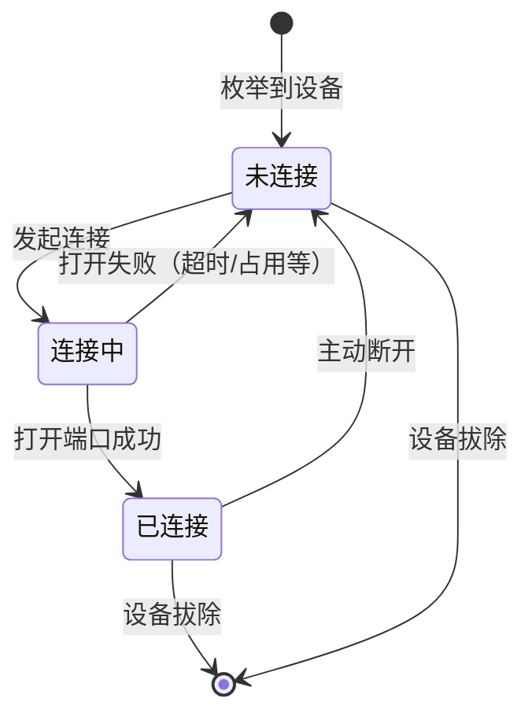
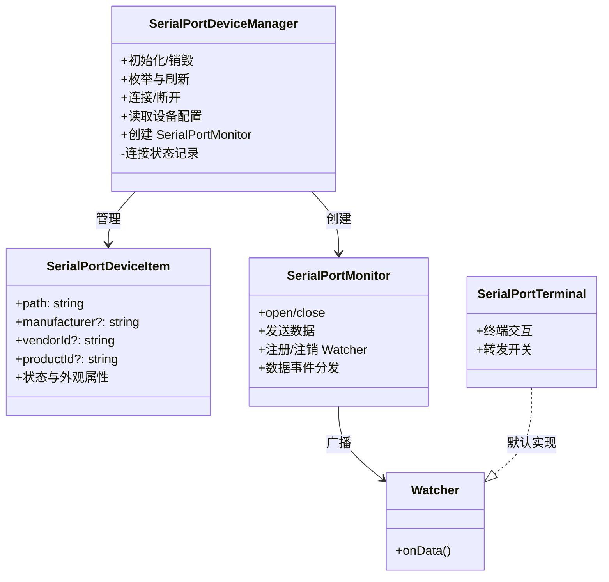

# SerialPortDeviceManager 设计

## 简介

SerialPortDeviceManager 是一个基于 DataProvider 的组件，在侧边栏提供一个串口设备的管理视图，提供用户交互视图入口与串口设备管理两个核心功能。

交互视图中提供一个系统 COM 设备列表，用户可以从这个设备列表管理设备的连接与断开，可以查看连接状态、设备信息等。

设备管理能力则体现在热插拔侦测上，不提供数据交互能力。

## 设计目标

- **单一入口**：用户总是从设备管理器启动终端，管理器是全部串口能力的起点；
- **职责单一**：管理器只负责设备列表、连接状态与组件创建，不持有端口、不处理数据流；
- **状态可靠**：连接状态有唯一事实源，任何视图重建、刷新都不能破坏它；
- **组件可拓展**：数据消费方通过 Watcher 机制接入，新组件无需改动管理器。

## 功能设计

### 视图与交互

- **设备列表**：展示系统枚举到的串口设备，每项显示路径、厂商信息与连接状态；
- **悬停详情**：鼠标悬浮时展示设备完整信息（路径、厂商 ID、产品 ID 等）；
- **连接/断开**：每个条目按当前状态提供"连接"或"断开连接"的行内操作按钮；
- **状态呈现**：通过图标与文字同时呈现状态，无需悬停即可辨别；
- **刷新**：视图标题栏提供刷新按钮，重新枚举设备；
- **空状态**：无设备时显示引导提示（如"未检测到串口设备"），而不是空白列表；
- **连接反馈**：连接进行中给出反馈（状态栏/通知）；连接失败时提示原因并回滚状态，绝不让 UI 停留在"假连接"状态。

### 状态模型

连接是异步操作，状态设计为三态，状态转移如下：



状态以**设备路径**为键管理（而非绑定在视图节点对象上）：视图节点可以随时重建（刷新、重启），状态记录必须独立于节点存活。

### 热插拔侦测

serialport 不提供跨平台的热插拔事件，设计采用**轮询 + 快照对比**：

- 管理器按固定周期（默认数秒，可配置）重新枚举设备，与上一份快照对比；
- 发现新增设备 → 列表插入新条目；
- 发现拔除设备 → 条目消失，其连接状态作废，并触发对应的资源清理流程；
- 轮询仅在视图可见时进行，降低无谓的系统调用。

## 组件生态与拓展

SerialPortDeviceManager 是最核心的一个组件，预计还需要设计 SerialPortTerminal、SerialPortDataPaster、SerialPortMonitor 等组件，用于转发数据与终端交互。用户总是从当前组件启动终端，再从终端控制是否向其他组件转发数据。

在用户触发连接后，创建一个 SerialPortMonitor 实例，并默认注册一个 SerialPortTerminal 作为第一个 Watcher，SerialPortTerminal 提供交互界面，用于触发注册其他 Watcher。允许 SerialPortTerminal 关闭，其他 Watcher 在后台监听数据（如果没有提供界面），以减小系统负载。

Watcher 会以二级菜单的形式显示在设备管理视图中，可手动关闭。当某个串口设备的 Watcher 减为零时，关闭串口。

### 组件职责

| 组件 | 职责 |
|---|---|
| SerialPortDeviceManager | 设备枚举与列表、连接状态管理、读取设备配置、创建/销毁 Monitor |
| SerialPortMonitor | 持有串口连接，数据收发中枢；管理 Watcher 注册；连接断开时负责清理 |
| SerialPortTerminal | 默认 Watcher：提供终端交互界面（输入发送、输出展示、日志保存） |
| SerialPortDataPaster | 数据处理组件，属于 Watcher 的一部分，主要处理数据转义，让字符显示更加美观，符合直觉。需根据 Watcher 特性开发。 |
| 其他 Watcher | 由插件拓展机制接入，如数据可视化、协议分析等 |

### 连接与断开流程


断开时反向执行：注销 Watcher → 关闭端口 → 销毁 Monitor → 状态置为未连接，连接状态置为未连接后，待下一个刷新周期自动移除，或手动刷新移除。

### Watcher 接口设计

- Monitor 对外提供注册/注销接口，Watcher 订阅数据事件；
- Watcher 只读数据，不直接接触端口；
- 同一数据流可广播给多个 Watcher，转发开关由终端控制；
- Monitor 销毁时自动注销全部 Watcher，Watcher 无需感知生命周期细节。

## 设备身份管理

状态与配置的生命周期不同，键的选型也不同：**状态以路径为键，配置以设备身份为键**。

### 身份计算（退化链）

按可靠性从高到低：

1. `serialNumber` —— 唯一且稳定，首选；注意廉价转接器的序列号常为全 0 字符串，需显式判空判零，视为无效；
2. `vendorId + productId + locationId` —— 型号 + USB 物理位置，无序列号时也能区分同型号多台设备；
3. `path` —— 兜底：此时设备身份无法识别，接受配置错配风险（物理限制，非设计错误）。

身份计算结果与来源等级一起存储（`identity` + `identityLevel`），避免后续无法判断键的可信度。

### 身份 ↔ 路径映射维护

管理器在内存中维护一份会话级映射 `identity → path`，每次枚举时更新：

| 情形 | 判定 | 处理 |
|---|---|---|
| 同一身份出现在新路径 | 设备换了 USB 口或枚举顺序变化 | 更新映射，配置自动找回（换口不丢配置） |
| 同一路径出现不同身份 | COM 号被复用给了新设备 | 清空该路径的连接状态，按新身份查配置，绝不套用旧设备配置 |
| 同一身份重复出现 | 退化键冲突（理论上罕见） | 以 path 区分，记录告警日志 |
| 设备消失 | 拔除 | 映射与状态作废，配置保留 |

状态仍是**以路径为键**：它描述"这个路径当前连没连"，生命周期就是当前枚举会话，设备拔除即失效，无需跨会话稳定。

## 数据与持久化设计

| 数据 | 键 | 是否持久化 | 说明 |
|---|---|---|---|
| 设备列表 | —— | 否 | 硬件事实，每次启动重新枚举 |
| 每设备连接参数（波特率、数据位、校验、停止位、流控） | 设备身份 | 是 | 用户配置，核心数据，换口重插自动找回 |
| 上次连接设备 | 设备身份 | 是 | 用于可选的"启动后自动恢复连接" |
| 当前连接状态 | 路径 | 否 | 随进程结束而失效 |

### SerialConfig 结构

```jsonc
{
  "schemaVersion": 1,          // 结构版本，便于将来迁移
  "baudRate": 115200,          // 波特率
  "dataBits": 8,               // 数据位
  "parity": "none",            // 校验：none / even / odd / mark / space
  "stopBits": 1,               // 停止位
  "flowControl": "none"        // 流控：none / rtscts / dtr
}
```

- 首次连接无配置时使用行业默认值 115200-8-N-1，并在用户修改后保存；
- 存储为 `identity → SerialConfig` 的映射（key 形如 `serialPortDeviceManager.configs`）；
- 存储选型：`context.globalState`（VS Code 托管 SQLite、跨重启）；若配置结构复杂或需要用户可见/可编辑，再迁移到 `globalStorageUri` 下的 JSON 文件；
- 读取时机：连接发起前按身份查询；写入时机：用户修改参数后立即直写（扩展单进程运行，无并发问题）。

## 命令与菜单设计

### 命令命名规范

- `serialPortDeviceList.*` —— 视图级命令（如刷新）；
- `serialPortDevice.*` —— 条目级命令（如连接、断开）。

### 菜单设计

| 位置 | 命令 | 展示方式 |
|---|---|---|
| `view/title` | 刷新 | 常驻视图标题栏 |
| `view/item/context`（inline 组） | 连接 | 悬停条目时行内显示，仅未连接状态可见 |
| `view/item/context`（inline 组） | 断开连接 | 悬停条目时行内显示，仅已连接状态可见 |
| `view/item/context`（普通组） | 连接/断开/设备信息 | 右键菜单 |

### contextValue 约定

条目状态通过 `contextValue` 暴露给菜单系统：`serialPortDevice.disconnected` / `serialPortDevice.connecting` / `serialPortDevice.connected`，菜单按状态选择性显示。

## 组件结构设计



## 路线图

- **M1 设备管理**：设备列表、连接状态三态管理、刷新与手动热插拔感知；
- **M2 真实连接**：SerialPort.open 接入、Monitor 骨架、连接失败回滚；
- **M3 终端交互**：SerialPortTerminal 作为默认 Watcher，完成收发与展示；
- **M4 数据转发**：多 Watcher 注册、终端转发开关；
- **M5 自动化**：热插拔轮询、设备参数配置与持久化、启动自动恢复。
