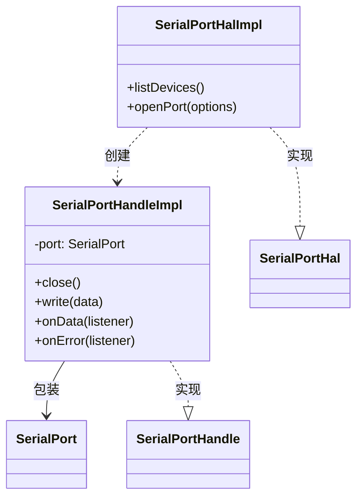

# SerialPortHalImpl 设计（serialport 实现）

## 简介

SerialPortHal 接口的 serialport 实现，位于 `src/hal/SerialPortHalImpl.ts`。全项目**唯一** import 'serialport' 的文件 —— 底层包的适配、规避与妥协全部发生在这里。

契约见 SerialPortHal设计.md，本文只讲实现。

## 依赖与风险

- `serialport` ^13，原生模块（C++ binding，bindings-cpp）；
- 原生模块在 VS Code 扩展宿主中的风险：`NODE_MODULE_VERSION` 不匹配、平台加载失败、构造/打开失败。这些问题的处理与将来替换后端，都收口在本文件。

## 实现细节

### 枚举：listDevices

```ts
listDevices(): Promise<SerialPortInfo[]> {
  return SerialPort.list();
}
```

直通底层。serialport 的 `PortInfo` 与 HAL 的 `SerialPortInfo` 字段一一对应，无需转换；`exactOptionalPropertyTypes` 下的兼容性由 HAL 接口的可选字段声明方式保证（见 SerialPortHal设计.md）。

### 打开：openPort

```ts
port = new SerialPort({ ...options, autoOpen: false } as ConstructorParameters<typeof SerialPort>[0]);
port.open(error => {
  if (error) { ... reject(error); }
  else { resolve(new SerialPortHandleImpl(port)); }
});
```

三步设计及其原因：

1. **`autoOpen: false` + 手动 `open(cb)`**：serialport 的构造默认在下一 tick 自动打开，打开失败以 **'error' 事件**形式发出；手动 open 则把打开错误交付给**回调**。用回调能在"打开失败"和"运行期错误"两个场景间划出清晰边界 —— 前者 reject，后者归句柄的 `onError` 订阅者；
2. **构造包裹 try/catch**：serialport 对非法参数（路径为空、参数越界）会**同步 throw**，必须转换为 reject 而不是让 Promise 构造器外的异常逃逸；
3. **打开失败后挂 noop error 监听**：失败的端口对象仍可能发出迟到的 'error' 事件，无监听者会触发 Node EventEmitter 的崩溃行为，挂空监听器兜底。

### 类型适配点

`as ConstructorParameters<typeof SerialPort>[0]` 是唯一的类型适配：

- HAL 的 `SerialPortOpenOptions` 为了对上层友好，字段类型较宽（如 `dataBits?: number`、`parity?: string`、`flowControl?: boolean | string`）；
- serialport 的选项声明是字面量联合（`dataBits?: 5 | 6 | 7 | 8` 等）；
- 适配在 HAL 边界完成：上层不需要了解底层约束，底层约束的校验（若有）由 serialport 自己抛错完成。

### 句柄：SerialPortHandleImpl

```ts
class SerialPortHandleImpl implements SerialPortHandle {
  constructor(private readonly port: SerialPort) {
    port.on('error', () => {});   // 兜底：防止订阅者未挂载时 error 事件崩溃
  }

  close(): Promise<void> {
    return new Promise(resolve => {
      this.port.close(() => resolve());
    });
  }

  write(data: Buffer): void {
    this.port.write(data);
  }

  onData(listener) { this.port.on('data', listener); }
  onError(listener) { this.port.on('error', listener); }
}
```

- **构造时的 noop error 监听**：句柄创建与上层订阅 `onError`（Connection 构造时）之间存在窗口，空监听器保证任何时点 error 事件都有人接；
- **close 的 Promise 化**：底层 close 是回调式；Promise 化后销毁流程可以 `await` 完成清理。关闭错误被有意忽略（尽力而为语义，销毁路径不值得为关闭失败报错）；
- **write 直通**：忽略底层返回的背压布尔值与错误回调。当前产品形态下发送错误最终会以 'error' 事件浮现，经 `onError` 订阅者处理。

## 组件结构



## 已知限制

- **打开失败原因未归一化**：当前把底层 Error 原样透传给连接服务。设计契约要求"不存在/占用/权限/参数错误"可区分展示 —— 需在 `openPort` 的 reject 路径按 `error.message` 特征归类（`ENOENT`/`EACCES`/`EBUSY` 等）；
- **write 无背压处理**：发送大块数据时忽略底层 `write` 返回的背压信号，数据泵送场景（未来 Consumer 转发）需要重新审视；
- **close 错误被吞**：销毁路径有意为之，但会使"关闭失败导致端口泄漏"这类问题不可见，可加 debug 级日志。
