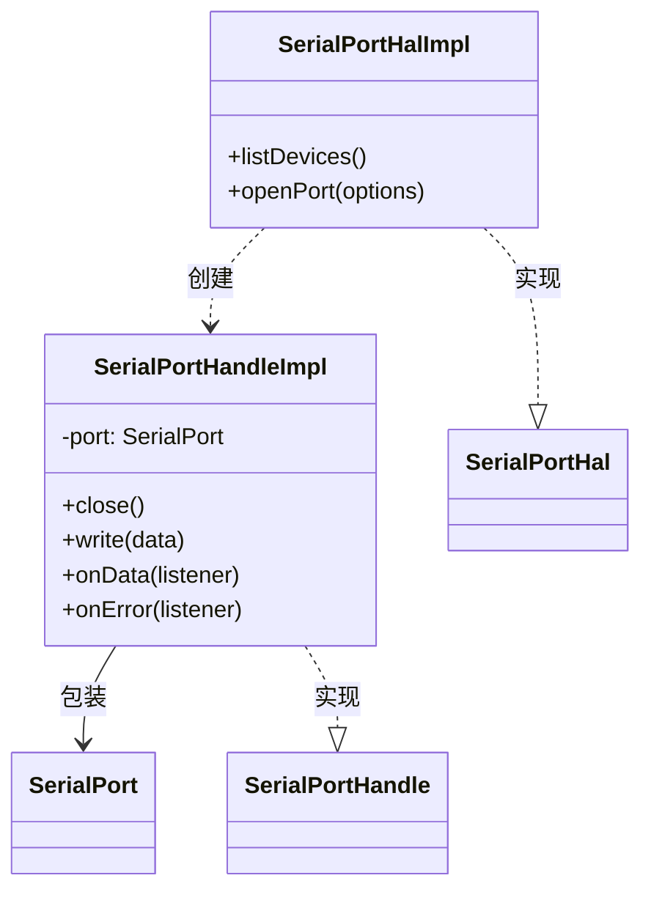

# SerialPortHalImpl 实现

> 状态：已实现 ｜ 目录：`src/hal/SerialPortHalImpl.ts` ｜ 契约：SerialPortHal设计.md

## 1. 定位

SerialPortHal 接口的 serialport 实现。全项目**唯一** import 'serialport' 的文件：底层包的适配、规避与妥协全部发生在此，不得外溢。

## 2. 依赖与风险

- 依赖 `serialport` ^13（原生模块，C++ binding，bindings-cpp）；
- 原生模块在 VS Code 扩展宿主中的风险：`NODE_MODULE_VERSION` 不匹配、平台加载失败、构造/打开失败。上述风险的处理与将来替换后端，均收口在本文件。

## 3. 实现要点

### 3.1 枚举：listDevices

```ts
listDevices(): Promise<SerialPortInfo[]> {
  return SerialPort.list();
}
```

直通底层。serialport 的 `PortInfo` 与 HAL 的 `SerialPortInfo` 字段一一对应，无需转换；`exactOptionalPropertyTypes` 下的兼容性由接口的可选字段声明方式保证（见 SerialPortHal设计.md 3.1）。

### 3.2 打开：openPort

```ts
port = new SerialPort({ ...options, autoOpen: false } as ConstructorParameters<typeof SerialPort>[0]);
port.open(error => {
  if (error) { /* 兜底监听 + reject */ }
  else { resolve(new SerialPortHandleImpl(port)); }
});
```

三项设计决策及其依据：

1. **`autoOpen: false` + 手动 `open(cb)`**：serialport 默认在下一 tick 自动打开，打开失败以 'error' 事件形式发出；手动 open 将打开错误交付给回调，从而在"打开失败"与"运行期错误"之间划出清晰边界 —— 前者 reject，后者归句柄的 `onError` 订阅者；
2. **构造包裹 try/catch**：serialport 对非法参数（空路径、参数越界）会同步抛出异常，**必须**转换为 reject，不得让异常逃逸出 Promise 构造器；
3. **打开失败后挂 noop error 监听**：失败的端口对象仍可能发出迟到的 'error' 事件，无订阅者会触发 Node EventEmitter 的进程异常，挂空监听器兜底（对应契约 3.3 的"任何时点存在 error 监听"要求）。

### 3.3 类型适配点

`as ConstructorParameters<typeof SerialPort>[0]` 是本文件唯一的类型适配：

- HAL 的 `SerialPortOpenOptions` 为上层友好而类型较宽（如 `dataBits?: number`、`parity?: string`；流控直接采用 serialport 的原生字段名 `rtscts?: boolean`）；
- serialport 的选项声明为字面量联合（`dataBits?: 5 | 6 | 7 | 8` 等）；
- 适配发生在 HAL 边界：上层不感知底层约束，非法取值由 serialport 自行抛错并经 3.2 的路径归一为 reject。

### 3.4 句柄：SerialPortHandleImpl

```ts
class SerialPortHandleImpl implements SerialPortHandle {
  constructor(private readonly port: SerialPort) {
    port.on('error', () => {});   // 兜底：订阅者未挂载时防止 error 事件崩溃
  }

  close(): Promise<void> {
    return new Promise(resolve => {
      this.port.close(() => resolve());
    });
  }

  write(data: Buffer): void { this.port.write(data); }
  onData(listener) { this.port.on('data', listener); }
  onError(listener) { this.port.on('error', listener); }
}
```

- **构造时挂 noop error 监听**：句柄创建与上层订阅 `onError`（Connection 构造时）之间存在窗口，空监听器保证任何时点 error 事件均有订阅者；
- **close 的 Promise 化**：底层 close 为回调式，Promise 化后销毁流程可 `await` 清理完成。关闭错误有意忽略（尽力而为语义：销毁路径不值得为关闭失败报错）；
- **write 直通**：忽略底层返回的背压布尔值与错误回调。当前产品形态下发送错误最终以 'error' 事件浮现，经 `onError` 订阅者处理。

## 4. 组件结构



## 5. 已知限制

| 限制 | 现状 | 处理方向 |
|---|---|---|
| 打开失败原因未归一化 | 底层 Error 原样透传 | 在 reject 路径按 `error.message` 特征归类（ENOENT / EACCES / EBUSY 等），满足契约 3.4 的"明确原因"要求 |
| write 无背压处理 | 忽略底层背压信号 | 数据泵送场景（多 Consumer 转发）落地前必须重新审视 |
| close 错误不可见 | 销毁路径有意忽略 | 可加 debug 级日志，避免"关闭失败导致端口泄漏"不可观测 |
