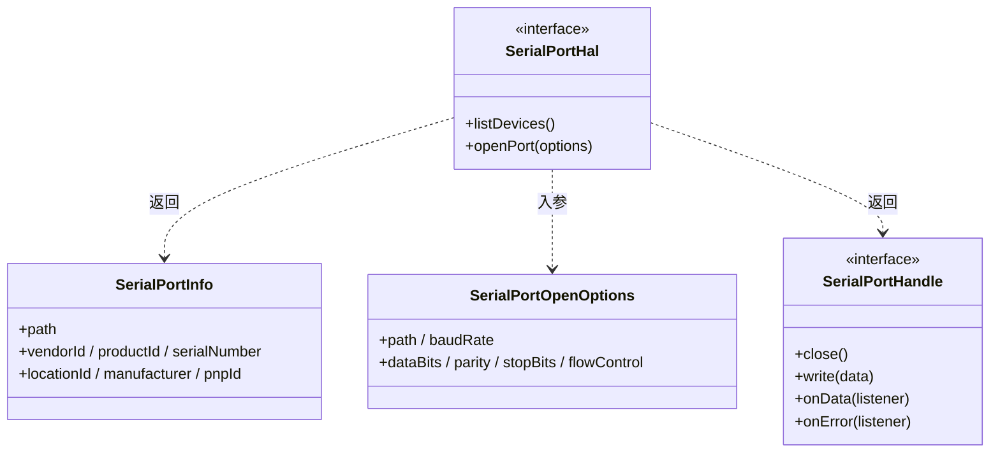

# SerialPortHal 设计

> 状态：已实现 ｜ 目录：`src/hal/` ｜ 实现文档：SerialPortHalImpl实现.md

## 1. 定位

HAL（Hardware Abstraction Layer，硬件抽象层）封装串口底层库，向服务层提供两个最小能力：**枚举串口设备**与**打开并读写串口**。服务层只依赖本模块定义的接口，不得触碰任何第三方包。

本文档定义 HAL 的**设计契约**；基于 serialport 包的具体实现见 SerialPortHalImpl实现.md。

## 2. 设计目标

- **最小面**：只回答"当前有哪些串口"与"打开/读写某个串口"，不承载业务语义；
- **隔离底层风险**：原生模块的加载失败、ABI 不匹配、平台差异的处理**必须**收口在实现层，不得泄漏到服务层；
- **可替换、可测试**：服务层只依赖接口；测试可注入替身实现；替换后端（如 web serial）不得触碰业务代码。

## 3. 接口契约

### 3.1 SerialPortInfo —— 设备信息值对象

一次枚举返回的**只读快照**，描述一台物理串口设备。它不承载任何状态（连接状态属于设备域模型）。

| 字段 | 必填 | 语义 |
|---|---|---|
| `path` | 是 | 设备路径（COM3、/dev/ttyUSB0）。打开端口的目标，亦为设备域的状态键 |
| `vendorId` | 否 | 厂商 ID，型号识别与身份退化链的第二级来源 |
| `productId` | 否 | 产品 ID，与 vendorId 组合标识型号 |
| `serialNumber` | 否 | 序列号，身份退化链的首选来源；廉价转接器可能为空或全 0，**必须**由消费方判空判零 |
| `locationId` | 否 | USB 物理位置，无序列号时区分同型号多台设备的次优来源 |
| `manufacturer` | 否 | 厂商名，仅用于展示 |
| `pnpId` | 否 | 即插即用 ID，当前未参与任何逻辑，预留 |

可选字段统一声明为 `?: string | undefined`：项目开启 `exactOptionalPropertyTypes`，底层库声明文件中的可选字段被解释为 `string | undefined`，显式联合声明保证赋值兼容；消费方一律以 `|| 'Unknown'` 兜底（"Unknown 为空标记"原则，见 SerialPortDeviceDetector设计.md）。

### 3.2 SerialPortOpenOptions —— 打开参数

| 字段 | 必填 | 语义 |
|---|---|---|
| `path` | 是 | 要打开的设备路径 |
| `baudRate` | 是 | 波特率，来自设备配置 |
| `dataBits` | 否 | 数据位（5/6/7/8） |
| `parity` | 否 | 校验方式（none/even/odd/mark/space） |
| `stopBits` | 否 | 停止位（1/1.5/2） |
| `flowControl` | 否 | 流控（none/rtscts/dtr） |

- 与 SerialConfig（见 SerialPortConnection设计.md）的关系：连接服务把持久化的设备配置**映射**为本结构后调用 `openPort`；
- 刻意不包含 `autoOpen`：打开时机属 HAL 内部事务，上层契约只要求"返回一个已打开的句柄"。

### 3.3 SerialPortHandle —— 已打开端口的句柄

`openPort` 成功后的返回值，是"已建立连接的能力"的载体。上层**不得**接触底层端口对象，一切收发与关闭均经句柄进行。

| 成员 | 契约 |
|---|---|
| `close(): Promise<void>` | 关闭端口，销毁 Connection 前调用；Promise 化，调用方可 `await` 清理完成。实现应当容忍重复调用 |
| `write(data: Buffer)` | 发送数据；不暴露底层返回值与回调，运行期错误经 `onError` 通道送达 |
| `onData(listener)` | 订阅接收数据流；回调顺序**必须**与端口到达顺序一致 |
| `onError(listener)` | 订阅运行期错误（意外断开等）；实现**必须**保证任何时点存在至少一个 error 监听，避免事件无订阅者导致进程异常 |

### 3.4 SerialPortHal —— HAL 门面

服务层唯一入口：

| 成员 | 契约 |
|---|---|
| `listDevices(): Promise<SerialPortInfo[]>` | 枚举当前在线设备，返回快照。Detector 的轮询与手动扫描均调用它 |
| `openPort(options): Promise<SerialPortHandle>` | 打开串口。成功 resolve 句柄；失败 reject，错误**必须**携带可向用户展示的明确原因（不存在/占用/权限/参数错误） |

## 4. 边界

- **不包含**：设备身份计算（设备域）、配置读写（连接域）、状态机（设备域）；
- **错误归一化**：打开失败归一化为带明确原因的 Error，由连接服务提示与回滚；
- 实现类（SerialPortHalImpl）是唯一允许 import 底层包的文件。

## 5. 组件结构

## 6. 使用方

| 使用方 | 使用的能力 |
|---|---|
| SerialPortDeviceDetector | `listDevices()` —— 轮询枚举 |
| SerialPortConnectionService | `openPort()` —— 建立连接 |
| SerialPortConnection | 持有 `SerialPortHandle` —— 数据收发、关闭端口 |
