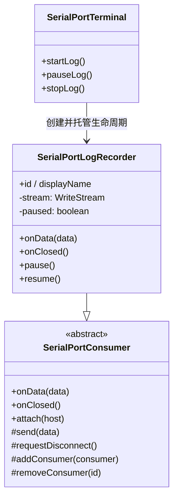

# SerialPortLogRecorder 设计

> 状态：已实现 ｜ 目录：`src/SerialPortConsumer/SerialPortLogRecorder/` ｜ 规范：SerialPortConsumer设计.md ｜ 上位文档：总体架构.md

## 1. 定位

SerialPortLogRecorder 是日志记录 Consumer：把串口**接收**的原始字节流写入日志文件。它在**数据流维度**上是独立 Consumer（注册到 `SerialPortConnection`，由 Connection 直接广播数据），在**生命周期维度**上依附于 `SerialPortTerminal`（由 Terminal 创建、暂停、继续、停止与销毁）。

它不是默认 Consumer：连接建立时不自动存在，由用户在终端面板标题栏点击「保存」后按需创建。

## 2. 设计目标

- **独立数据流**：作为 Consumer 注册到 Connection，直接接收广播的 `onData`，不经 Terminal 转发；
- **生命周期托管**：创建 / 暂停 / 继续 / 停止均由 Terminal 发起；断开或关闭终端时随 Connection 销毁自动收尾；
- **流式写入**：用 `fs.createWriteStream` 追加写入，为后续「按大小分割」留余地；
- **可配置目录**：保存目录可配置，默认落在 Windows 文档目录；
- **最小实现**：第一阶段只落盘原始字节流，转义、分割、时间戳等留待后续。

## 3. 模块关系

两个维度相互独立，不矛盾：

| 维度 | 归属 | 含义 |
|---|---|---|
| 数据流 | 独立 Consumer | 继承 `SerialPortConsumer`，经 `host.addConsumer` 注册，Connection 直接广播 `onData` |
| 生命周期 | 依附 Terminal | 创建 / 暂停 / 继续 / 停止 / 销毁由 `SerialPortTerminal` 发起与管理 |

## 4. API 定义

```ts
class SerialPortLogRecorder extends SerialPortConsumer {
  readonly id = 'serialPortLogRecorder';
  readonly displayName = 'Serial Port Log Recorder';

  constructor(filePath: string);       // 记录目标文件路径，首次收到数据时才创建文件
  onData(data: Buffer): void;          // 未暂停时写文件（首次写入时惰性创建文件流）
  onClosed(): void;                    // 关闭文件流；若有数据写入则提示「文件已保存到 <path>」
  pause(): void;                       // 暂停写入（仍注册、仍接收广播）
  resume(): void;                      // 恢复写入
  isPaused(): boolean;
}
```

- `onData` 由 Connection 的数据流入口调用，调用顺序即串口到达顺序；
- 首次收到数据时才创建文件（延迟创建），未收到数据即停止不产生空文件；
- `pause` / `resume` 只切换内部标志，**不注销** Consumer；
- `onClosed` 幂等：重复调用安全（文件流未创建或已关闭时短路）；
- 停止收尾时（无论「停止」按钮还是断开连接触发）若本次有数据写入，弹出「文件已保存到 <path>」提示。

## 5. 生命周期

```
点击[保存] → Terminal.startLog()
   → 计算文件路径 → new SerialPortLogRecorder(filePath)
   → host.addConsumer(recorder)        // 注册，Connection 开始广播
   → 进入「记录中」

记录中 → Connection 广播 onData(data) → recorder 首次收到数据时创建文件并写入

点击[暂停] → recorder.pause()          // 内部标志置位，onData 跳过写入
点击[继续] → recorder.resume()

点击[停止] → host.removeConsumer(id) + recorder.onClosed() + 销毁引用
            // Terminal 保持连接，只是不再记录

断开 / 关闭终端面板
   → Connection.close() → 逐个调用 consumer.onClosed()
   → recorder.onClosed() 关闭文件流（被动收尾，随连接销毁）
```

规则：

- **暂停不注销**：仍挂在 Connection 上，只是不写文件（开销可忽略，见 SerialPortConsumer设计.md「广播效率」讨论）；
- **停止注销并销毁**：不影响 Terminal 的连接状态；
- **停止收尾提示**：`onClosed()` 关闭文件流后，若本次有数据写入，弹出「文件已保存到 <path>」（点「停止」与断开连接两条路径都会触发）；
- **断开 / 关终端为最终收尾**：LogRecorder 随 Connection 一起销毁。

## 6. 数据流

```
串口 → Connection.handle.onData ──广播──▶ SerialPortTerminal（显示）
                                   └──▶ SerialPortLogRecorder（写文件）
```

LogRecorder 记录的是 `onData` 收到的**原始串口字节流**。当前 Terminal 无本地回显，故该字节流即设备真实发出的数据。

## 7. UI：按钮与命令

### 7.1 按钮位置

采用 littrick/vscode-serial-terminal 同款方案：**终端面板标题栏按钮**（`contributes.menus.view/title` + `when: "view == terminal"`），命令带 `icon`。按钮显隐由 context key 驱动。

另有全局「打开日志目录」按钮，位于**设备列表视图标题栏**（`when: "view == serialPortDeviceList"`，图标 `$(folder-opened)`）：经命令 `serialPortLog.openDirectory` 在系统文件管理器中打开日志目录，不依赖活动终端或记录会话。

### 7.2 状态机与 context key

| 状态 | 终端标题栏按钮 |
|---|---|
| 未记录 | `[保存]` |
| 记录中 | `[暂停] [停止]` |
| 暂停中 | `[继续] [停止]` |

context key：

| key | 含义 |
|---|---|
| `serialPortTerminal.focus` | 当前活动终端是串口终端 |
| `serialPortTerminal.recording` | 已存在 LogRecorder |
| `serialPortTerminal.paused` | 已暂停 |

按钮 `when` 组合：

| 按钮 | when |
|---|---|
| 保存 | `view == terminal && serialPortTerminal.focus && !serialPortTerminal.recording` |
| 暂停 | `view == terminal && serialPortTerminal.focus && serialPortTerminal.recording && !serialPortTerminal.paused` |
| 继续 | `view == terminal && serialPortTerminal.focus && serialPortTerminal.recording && serialPortTerminal.paused` |
| 停止 | `view == terminal && serialPortTerminal.focus && serialPortTerminal.recording` |

### 7.3 命令与实例定位

命令 `serialPortLog.start / pause / resume / stop`：

1. 取 `vscode.window.activeTerminal`；
2. 经 `Map<vscode.Terminal, SerialPortTerminal>` 映射到 Terminal 实例；
3. 调用 `startLog() / pauseLog() / resumeLog() / stopLog()`。

`vscode.window.onDidChangeActiveTerminal` 维护三个 context key（切换终端时刷新显隐）。

## 8. 文件与配置

| 项 | 方案 |
|---|---|
| 写入 | `fs.createWriteStream`（流式追加，首次收到数据时才创建文件） |
| 文件名 | 由模板生成，默认 `{device}_{YYYY}{MM}{DD}_{HH}{mm}{ss}.log`，如 `COM3_20250112_153045.log`；占位符：`{device}`=设备名、`{YYYY}{MM}{DD}{HH}{mm}{ss}`=时间戳；替换后清洗非法字符 `\ / : * ? " < > \|` 为 `_` |
| 配置项 | `serialPortTerminal.logDirectory`（string，默认空） |
| 配置项 | `serialPortTerminal.logFilenameTemplate`（string，默认 `{device}_{YYYY}{MM}{DD}_{HH}{mm}{ss}.log`，设置界面经 `pattern` 校验非法字符） |
| 默认目录 | 空时取 `os.homedir()/Documents/SerialPortTerminal/Log`（Windows：`C:\Users\{user}\Documents\SerialPortTerminal\Log`）；目录不存在时递归创建 |
| 权限 | 写日志到文档目录属 workspace 外，实现时按需申请文件权限 |

## 9. 组件结构



## 10. 后续演进（本次不实现）

- **DataParser**：写入前经 Parser 处理，移除不可见符号与颜色信息，保证日志可读性；
- **快捷键**：为「开始保存 / 暂停保存 / 停止保存」绑定快捷键；
- **文件分割**：按大小分割，超出后切分到同名文件夹；
- **时间戳**：写入行前追加时间戳；
- **更多配置**：分割大小、时间戳开关与间隔、编码等。
