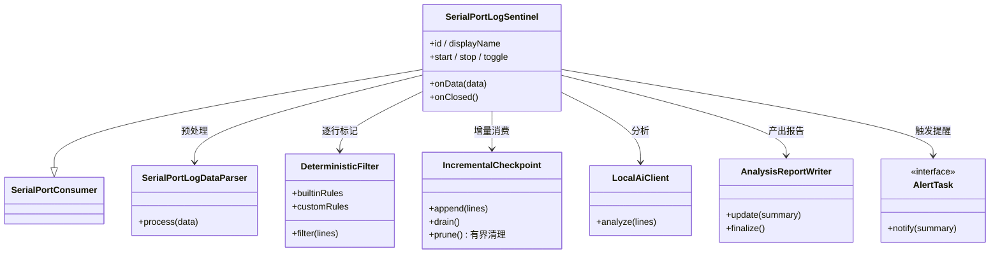

# SerialPortLogSentinel 设计

> 状态：规划中 ｜ 目录：`src/SerialPortConsumer/SerialPortLogSentinel/`（待实现） ｜ 上位文档：总体架构.md ｜ 规范：SerialPortConsumer设计.md

## 1. 定位

SerialPortLogSentinel（日志哨兵）是一个**接收型 Consumer**：实时监听串口日志流，经本地 AI 分析，发现错误/异常时触发**提醒任务**，并产出**绑定 Log 文件名的分析文档**。

- 它**只接收、不发送**（实现 `onData`，不调用 `send`），与 SerialPortTerminal（显示）、SerialPortLogRecorder（落盘）并列消费同一份数据流。
- **初期无独立界面**：在 Terminal 上提供状态指示（类似 LogRecorder），可从 Terminal 开启/关闭。
- 挂载方式同 LogRecorder：由 SerialPortTerminal 经 `addConsumer` / `removeConsumer` 管理生命周期。

## 2. 设计目标

- **实时监听不漏**：确定性预过滤 + 增量检查点（见 §4.1/§4.2）。
- **内置故障模式 + 自定义关键字**：默认监听 kernel oops / kernel panic / 宕机等常见事件，允许用户添加自定义关键字标记可疑行。
- **有界内存**：分析完的数据可丢弃，过时上下文可清理，内存占用不随会话时长增长。
- **本地 AI**：接入本地推理服务（Ollama / llama.cpp / LM Studio 等），日志数据不出设备。
- **产出分析文档**：生成绑定 Log 文件名的分析报告。
- **发现即行动**：检测到错误时触发可配置的提醒任务（画面 / 声音 / 邮件）。

## 3. 模块关系

```mermaid
graph TD
    Conn[SerialPortConnection] -->|广播 onData| Sentinel[SerialPortLogSentinel]
    Sentinel --> Parser[SerialPortLogDataParser 预处理]
    Parser --> Filter[确定性过滤器<br/>内置规则 + 自定义关键字]
    Filter --> Checkpoint[增量检查点队列<br/>有界 / 可清理]
    Checkpoint --> AIClient[本地 AI 客户端]
    AIClient -->|判定异常| Tasks[提醒任务]
    Tasks --> Screen[画面提醒]
    Tasks --> Sound[声音提醒]
    Tasks --> Email[邮件提醒]
    AIClient --> Report[分析文档写入器]
    Report --> File[(绑定 Log 文件名的报告)]
    AIClient -.->|HTTP| LocalModel[本地推理服务 Ollama / llama.cpp / LM Studio]
    Cmd[命令下发] -.->|临时规划| Device[设备]
    Sentinel -.-> Cmd
```



## 4. 核心机制

### 4.1 确定性预过滤（不漏）

- 一个廉价的正则/规则引擎**逐行**扫描所有日志，只标记「可疑行」。
- 规则分两类：
  - **内置规则**（默认启用，可开关）：kernel oops、kernel panic、宕机/重启、致命错误、看门狗复位、栈回溯等常见故障特征。
  - **自定义关键字**：用户添加的关键字/正则，命中即标记为可疑行。
- 它足够快，能跟上任意数据率，**保证不漏掉任何可疑行**。
- 复用 `SerialPortLogDataParser` 做 ANSI 剥离、分帧等预处理。

### 4.2 增量检查点 + 数据生命周期

- 记录「已消费到的行号」，每次只把**上次检查点之后的新增可疑行**交给 AI，处理完推进检查点。
- 与「固定滚动窗口」不同，它按增量消费，**不存在窗口滑动导致的行丢失**；仅当单次积压超过 AI 上下文上限时，才按明确策略截断/降采样。
- **有界内存**：AI 分析完的行即丢弃，仅保留检查点游标 + 最近摘要；队列按「条数上限 + 时间上限」清理过时上下文。

### 4.3 AI 分析（本地模型）

- 经 HTTP 调用本地推理服务的 OpenAI 兼容接口（如 `http://localhost:11434/v1/chat/completions`）。
- 按「分析间隔」批量提交累积的可疑行，由 AI 判断是否存在错误、严重程度与建议。
- 结果仅用于「是否触发提醒 + 写入分析文档」，不阻断数据流。

### 4.4 分析文档（绑定 Log 文件名）

- 每次分析/会话产出 Markdown 报告：发现的错误、时间戳、相关原文、AI 摘要与建议。
- **文件名绑定 Log 文件名**：复用与 Log 相同的目录 + 命名模板，仅后缀不同（`…_120000.log` → `…_120000.log.analysis.md`），二者同名同目录。
- **Sentinel 开关独立于 Log**：未开启记录时，用同一模板生成自己的会话基名出报告；开启记录时，报告与 Log 同名对应。
- 报告随会话推进增量更新，连接关闭时收尾落盘。

### 4.5 提醒任务

统一抽象为任务接口，按检测结果触发：

```ts
interface AlertTask {
  readonly id: string;
  notify(summary: string): void;
}
```

| 任务 | 说明 | 首版 |
|---|---|---|
| 画面提醒 | `vscode.window` 通知 / 状态栏提示 | ✅ 做 |
| 声音提醒 | vscode 通知 + 系统提示音 | ✅ 做 |
| 邮件提醒 | SMTP 发送，需配置发件/收件信息 | ⏳ 后续 |

## 5. 数据流

```
串口 → Connection.handle.onData
     → 广播给各 Consumer
     → SerialPortLogSentinel.onData(data)
        → 剥离 ANSI / 分帧（复用 SerialPortLogDataParser）
        → 确定性过滤器逐行标记可疑行（内置规则 + 自定义关键字）
        → 可疑行进入增量检查点队列（有界，过时上下文清理）
     →（按分析间隔）本地 AI 客户端批量分析
        → 判定异常 → 触发提醒任务（画面 / 声音 / 邮件）
        → 写入分析文档（绑定 Log 文件名）
```

## 6. 交互

### 6.1 初期（无界面）

- **状态指示**：同 LogRecorder，用 `setContext` 提供 `serialPortTerminal.sentinelActive` 等上下文键，驱动状态栏/标题指示。
- **开关**：提供命令（`serialPortSentinel.start/stop/toggle`）+ 可选 Terminal 内快捷键（复用 `logShortcutsEnabled` 拦截机制），可从 Terminal 开启/关闭。

### 6.2 未来界面（AI 配置与交互）

- **配置界面**：`endpoint` / `model` / `systemPrompt` / `filterRules` / `alerts` 等，优先走 VS Code 标准 Settings UI；后续可加 Webview 配置页。
- **交互界面**：WebviewView（类似宏列表 `serialPortMacroList`）实现 AI 问答——查看分析摘要、追问日志细节、调整规则，与 AI 对话。
- **实现要点**：Webview ↔ 扩展用 `postMessage` 通信；扩展侧复用 `LocalAiClient` 作为问答后端；会话历史存 `globalState`（字符串内容，非敏感配置）。

## 7. 配置（草案）

| 配置项 | 类型 | 默认值 | 说明 |
|---|---|---|---|
| `serialPortTerminal.sentinel.enabled` | boolean | `false` | 是否启用哨兵 |
| `serialPortTerminal.sentinel.endpoint` | string | `http://localhost:11434` | 本地推理服务地址 |
| `serialPortTerminal.sentinel.model` | string | `""` | 模型名 |
| `serialPortTerminal.sentinel.interval` | number | `5` | 分析间隔（秒） |
| `serialPortTerminal.sentinel.systemPrompt` | string | `""` | 系统提示词 |
| `serialPortTerminal.sentinel.builtinRulesEnabled` | boolean | `true` | 内置故障规则开关 |
| `serialPortTerminal.sentinel.filterRules` | array | `[]` | 自定义关键字/正则（标记可疑行） |
| `serialPortTerminal.sentinel.maxQueueSize` | number | `200` | 检查点队列条数上限（过时清理） |
| `serialPortTerminal.sentinel.reportEnabled` | boolean | `true` | 是否产出分析文档 |
| `serialPortTerminal.sentinel.alerts` | object | — | 提醒任务开关与参数（画面/声音/邮件） |

> 配置项为草案，实现时再细化；存储位置（settings vs globalState）届时确定。

## 8. 组件结构



## 9. 路线图

- **P0**：Consumer 骨架 + 确定性过滤器（内置规则 + 自定义关键字）+ 增量检查点（有界清理），跑通「数据 → 可疑行 → 队列」。
- **P1**：本地 AI 客户端（HTTP）+ 分析文档（绑定 Log 文件名）+ 画面/声音提醒 + Terminal 开关/状态指示，形成「发现错误 → 提醒 → 出报告」闭环。
- **P2**：邮件提醒、配置项完善、错误兜底与提示。
- **P3**：AI 配置与交互界面（WebviewView 问答）。

## 10. 临时规划（不列入开发主线）

- **按分析结果向设备下发简单命令**：AI 判定异常后，可配置地向设备写入一条简单命令（如复位/查询状态）。
- 该需求很弱，且会使 Sentinel 从「接收型」变为「双向」，改变当前定位；暂列临时规划，待主线上线后再评估。
