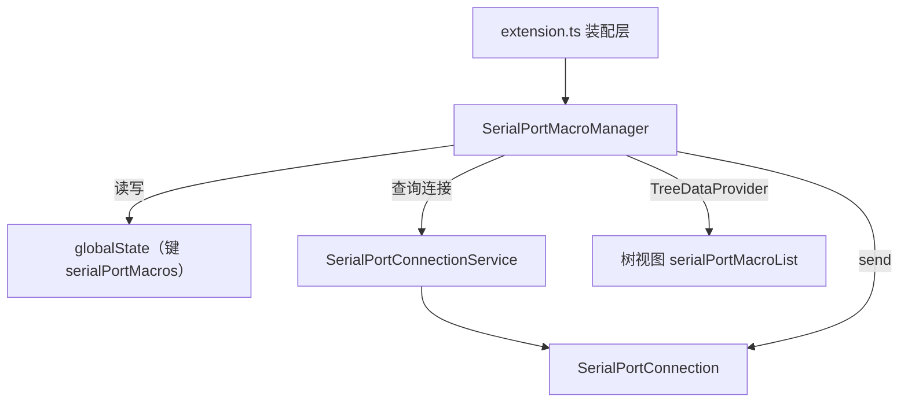
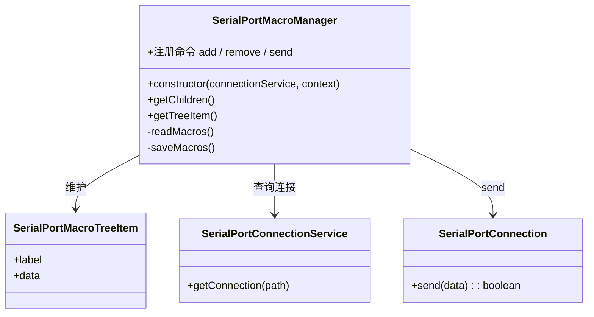

# SerialPortMacroSender 设计

> 状态：规划中 ｜ 目录：`src/SerialPortMacroSender/`（待实现） ｜ 上位文档：总体架构.md

## 1. 定位

SerialPortMacroSender 是一个**全局组件**（非 Consumer）：在侧边栏提供树视图，以 item 形式呈现预定义的命令/宏，提供**新增、删除、发送**操作。

它只负责「发送」，不接收数据、不持有连接、不注册为 Consumer；发送动作经 `SerialPortConnectionService` 查询到目标连接后，调用连接的 `send()`。

## 2. 设计目标

- **直观可发现**：宏以树视图 item 常驻侧边栏，无需记忆命令面板，仿照设备管理器交互。
- **操作完备**：提供新增、删除、发送三种操作。
- **不与 Consumer 混淆**：宏发送是「发送」语义，不继承 `SerialPortConsumer`，也不进入 Connection 的 consumers map。
- **存储驱动**：宏存于 globalState，由树视图 UI 统一管理，无需改代码。

## 3. 模块关系



## 4. 数据模型

宏以数组形式存于 globalState：

```ts
interface SerialPortMacro {
  label: string;
  data: string;
}
```

示例：

- `{ label: "重启", data: "reboot\r\n" }`
- `{ label: "查询版本", data: "AT+VER?\r\n" }`

- `label`：树视图 item 的显示名。
- `data`：原样发送的字符串（换行等由用户显式写入，如 `\r\n`）。

## 5. 视图结构

在现有侧边栏容器 `serialPortTerminalSideBar` 下新增视图 `serialPortMacroList`，与设备列表并列展示。

每个宏一个 item：

| 呈现 | 内容 |
|---|---|
| label | 宏名称 |
| description | data 摘要（截断展示） |
| icon | `$(symbol-text)` |
| contextValue | `serialPortMacro` |
| 行内按钮 | 发送（`$(play)`） |
| 右键菜单 | 删除 |

## 6. 交互设计

### 6.1 新增

- 视图标题栏按钮「新增」（`$(add)`）→ 命令 `serialPortMacro.add`。
- 依次 `showInputBox` 输入名称、命令数据 → 校验 → 写入 globalState → 刷新树。

### 6.2 发送

- item 行内「发送」按钮 → 命令 `serialPortMacro.send(item)`。
- 确定目标设备（§7）→ 经 `SerialPortConnectionService.getConnection(path)` → `connection.send(Buffer.from(data, 'utf-8'))`。
- 无目标连接 / 连接不存在时提示并返回。

### 6.3 删除

- item 右键「删除」→ 命令 `serialPortMacro.remove(item)`。
- modal 确认 → 从 globalState 移除 → 刷新树。

## 7. 目标设备确定

首版采用「**活动终端所在设备**」：

- 取 `vscode.window.activeTerminal`，经 Terminal 的实例映射得到设备路径；
- 用该路径经 `SerialPortConnectionService.getConnection(path)` 查询连接；
- 查询不到（设备未连接 / 已断开）时提示并返回。

> 备选：多设备场景改为「先选设备、再发送」或宏绑定设备；首版先用活动终端，交互最少。

## 8. 存储

| 项 | 方案 |
|---|---|
| 位置 | `context.globalState`（Memento） |
| 键 | `serialPortMacros` |
| 结构 | `SerialPortMacro[]`，每项 `{ "label": string, "data": string }` |
| 读写 | 由 `SerialPortMacroManager` 统一读写，不暴露给 settings |

## 9. 组件结构



## 10. 路线图

- **首版**：侧边栏树视图 + 新增 / 删除 / 发送 + globalState 存储 + 活动终端目标设备。
- **后续**：宏编辑、行尾符统一配置（关联 M3-P2）、多设备目标选择器、宏分类 / 排序。
