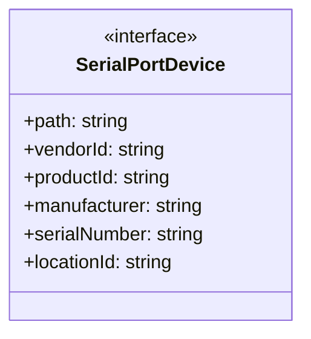
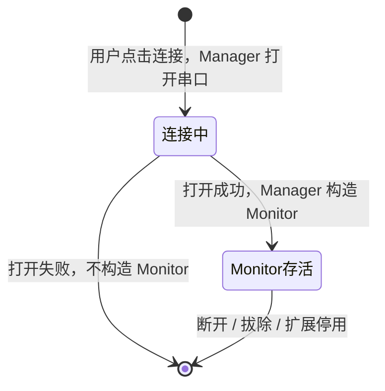
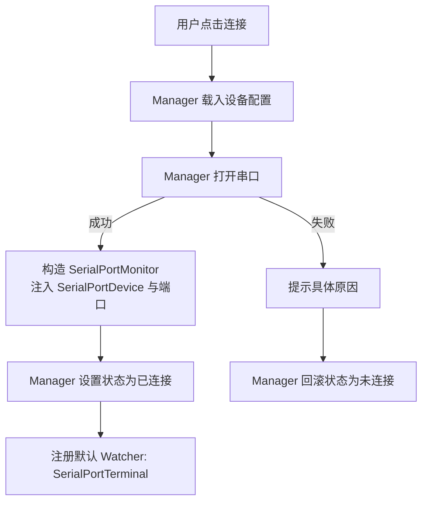
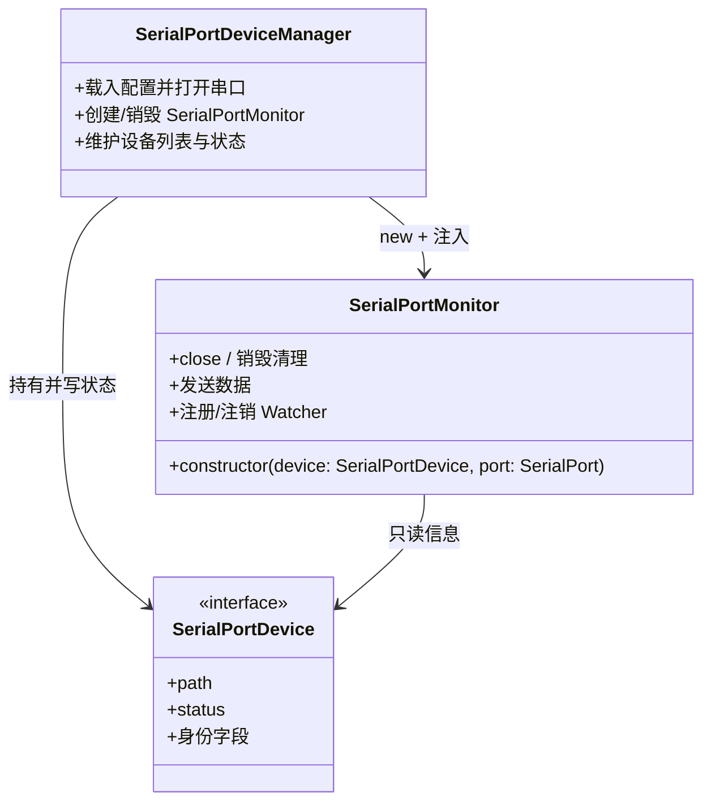

# SerialPortMonitor 设计

## 简介

SerialPortMonitor 是与单个串口连接绑定的组件：由 SerialPortDeviceManager 在**打开串口成功后**创建，接管已打开的端口，负责数据收发中枢与 Watcher 管理。Manager 负责"建立连接"，Monitor 负责"持有连接"。

一个 Monitor 实例对应一个已建立的连接：实例随打开成功而创建，随断开、拔除或扩展停用而销毁。

## 设计目标

- **存在即连接已建立**：Monitor 只构造于打开成功之后，不存在"未连上的 Monitor"；
- **状态由 Manager 控制**：连接状态（connecting / connected / disconnected）的唯一写者是 Manager；Monitor 只读设备信息，不触碰视图与状态；
- **数据中枢**：收发数据统一经过 Monitor，Watcher 从 Monitor 订阅；
- **自清理**：销毁时关闭端口、注销全部 Watcher，不遗留资源。

## SerialPortDevice 接口

接口是 Manager 与 Monitor 之间的契约，由 SerialPortDeviceItem 实现。对外只暴露 Monitor 需要的最小面：



契约要点：

- **只读信息**：`path` 与身份字段供 Monitor 识别与展示，遵循"Unknown 为空标记"原则（Unknown 视同缺失）；
- **状态只读**： API 只暴露 `status` 的 getter，Monitor 仅可读取状态；
- 具体类对 Monitor 不可见：Monitor 依赖接口而非 TreeItem，未来可替换实现、可单测。

## 生命周期

Monitor 的存在前提是"有一个已打开且未断开的串口连接"：



| 事件 | 行为 |
|---|---|
| 用户点击连接且打开成功 | Manager 构造 Monitor，注入 SerialPortDevice 与已打开的端口 |
| 用户在设备管理器视图点击断开 | Manager 销毁 Monitor，连带销毁其全部 Watcher，端口在销毁时关闭 |
| 用户通过 SerialPortTerminal 断开 | Terminal 是特殊 Watcher，可发起断开请求，经由 Manager 间接销毁 Monitor |
| 连接失败 | 不构造 Monitor —— 构造时机在打开成功之后，失败时 Manager 回滚状态即可，无销毁负担 |
| 设备拔除 | 热插拔侦测发现后，Manager 销毁对应 Monitor（含 Watcher）并清理资源 |
| 扩展停用 | Monitor 随 context.subscriptions 统一清理 |

### 断开回传机制

连接创建必须经由 Manager，Manager 是 Monitor 的创建者与持有者，并维护 **Device 与 Monitor 的稳定映射**（以设备路径为键，与状态键一致）。断开存在两个入口：

- **视图入口**：Manager 从命令参数拿到 device，经映射查找对应 Monitor 并销毁；
- **Monitor 内部入口**（如 Terminal 发起）：Monitor 暴露断开 API（close），或持有 Manager 注入的断开回调；触发后由 Manager 从映射中移除并销毁。

销毁动作始终收敛在 Manager 的单一入口（映射注销 → 销毁 Monitor → 状态回写），避免两处销毁逻辑漂移。

## 功能设计

### 连接流程



- 打开动作在 Manager 侧：失败时 Monitor 尚未产生，失败路径没有销毁负担；
- 端口所有权在构造时移交 Monitor：此后数据的收发与关闭由 Monitor 负责。

### 断开流程

```
注销全部 Watcher → 关闭端口 → 销毁 Monitor → Manager 置为未连接 → 待轮询移除
```

- 断开后条目保持"未连接"，由 Manager 在下一个轮询周期自动移除（或手动刷新移除）；
- Monitor 销毁前必须关闭端口、注销全部订阅，保证无泄漏。

### 配置载入

配置由 SerialPortDeviceManager 在打开串口前按设备身份载入（退化链与 SerialConfig 结构见 SerialPortDeviceManager设计.md「设备身份管理」「数据与持久化设计」）。

## Watcher 中枢（后续里程碑）

- 打开成功后，Monitor 默认注册 SerialPortTerminal 作为第一个 Watcher；
- Terminal 提供交互界面，用于触发注册其他 Watcher；
- 允许 Terminal 关闭，其他 Watcher 在后台监听（无界面时降低系统负载）；
- Watcher 以二级菜单形式显示在设备管理视图中，可手动关闭；
- 当某个设备的 Watcher 减为零时，关闭串口并销毁 Monitor，等同于一次断开。

## 组件结构



## 路线图

- **M2 连接落地**：SerialPortDevice 接口化、Manager 打开串口、Monitor 接管端口、失败回滚；
- **M3 终端交互**：默认 Watcher（SerialPortTerminal）收发与展示、Terminal 内断开；
- **M4 数据转发**：多 Watcher 注册与二级菜单管理；
- **M5 自动化**：配置持久化接入、启动自动恢复。
