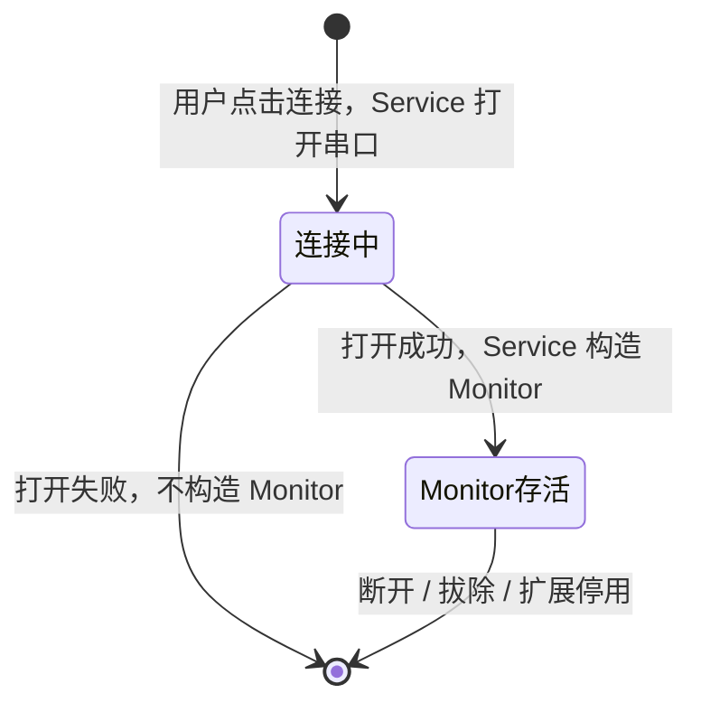
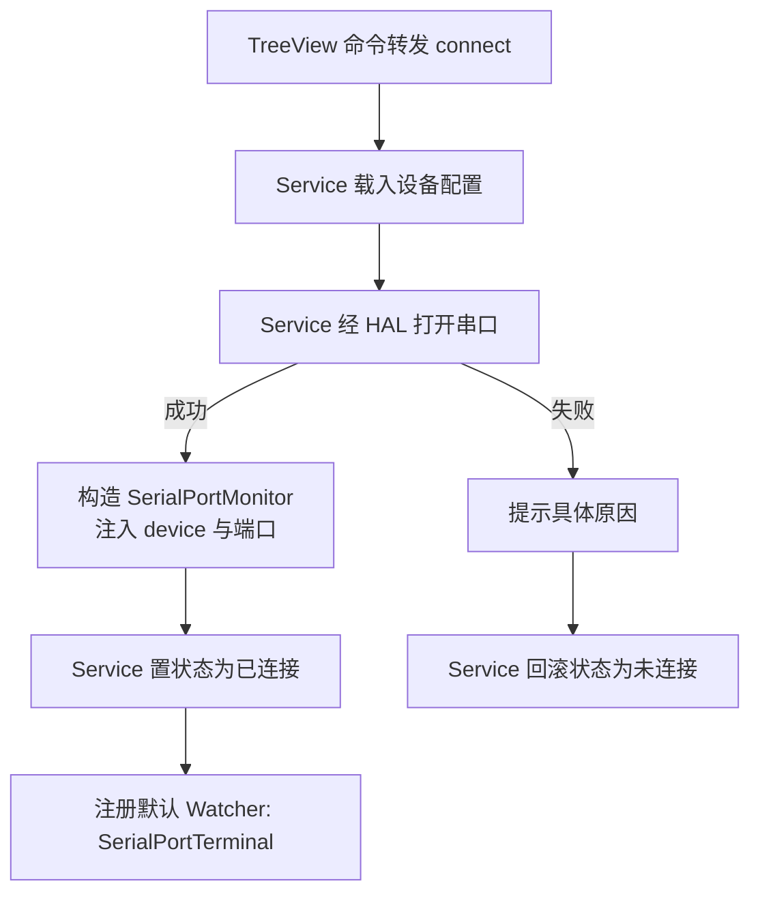
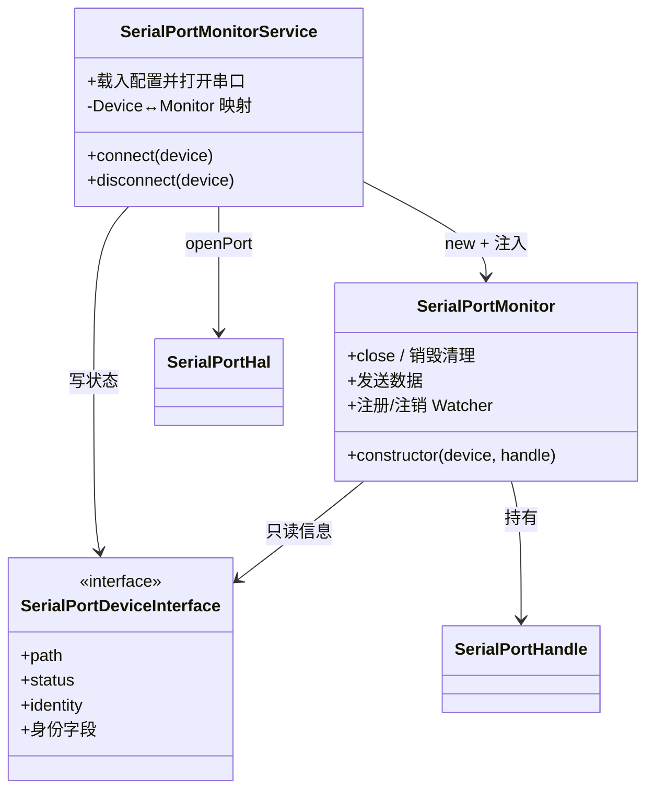

# SerialPortMonitor 设计

## 简介

本模块包含连接域的两个角色：

- **SerialPortMonitorService** —— 连接生命周期的协调者：载入设备配置、经 HAL 打开串口、创建/销毁 Monitor、维护 Device↔Monitor 映射、回写连接状态。它承担"建立连接"的全部职责；
- **SerialPortMonitor** —— 与单个串口连接绑定的组件：由 Service 在**打开串口成功后**创建，接管已打开的端口，负责数据收发中枢与 Watcher 管理。它承担"持有连接"的职责。

一个 Monitor 实例对应一个已建立的连接：实例随打开成功而创建，随断开、拔除或扩展停用而销毁。

## 设计目标

- **存在即连接已建立**：Monitor 只构造于打开成功之后，不存在"未连上的 Monitor"；
- **状态由 Service 写**：连接状态（connecting / connected / disconnected）的唯一写者是 Service；Monitor 只读设备信息，不触碰视图与状态；
- **数据中枢**：收发数据统一经过 Monitor，Watcher 从 Monitor 订阅；
- **自清理**：销毁时关闭端口、注销全部 Watcher，不遗留资源。

## 设备契约

SerialPortDeviceInterface（定义于 Detector 模块）是本模块与设备域之间的契约：

- **只读信息**：`path` 与身份字段供 Monitor 识别与展示，遵循"Unknown 为空标记"原则（Unknown 视同缺失）；
- **identity**：由 Detector 按退化链计算，Service 直接用它查询设备配置；
- **状态可写**：`setStatus()` 按约定只由 Service 调用，Monitor 只读 `status` getter；
- 具体类对 Monitor 不可见：Monitor 依赖接口而非 TreeItem，未来可替换实现、可单测。

## 生命周期

Monitor 的存在前提是"有一个已打开且未断开的串口连接"：



| 事件 | 行为 |
|---|---|
| 用户点击连接且打开成功 | Service 构造 Monitor，注入 SerialPortDevice 与已打开的端口 |
| 用户在设备管理器视图点击断开 | Service 销毁 Monitor，连带销毁其全部 Watcher，端口在销毁时关闭 |
| 用户通过 SerialPortTerminal 断开 | Terminal 是特殊 Watcher，可发起断开请求，经由 Service 间接销毁 Monitor |
| 连接失败 | 不构造 Monitor —— 构造时机在打开成功之后，失败时 Service 回滚状态即可，无销毁负担 |
| 设备拔除 | Service 订阅 Detector 的移除事件，销毁对应 Monitor（含 Watcher）并清理资源 |
| 扩展停用 | Monitor 随 context.subscriptions 统一清理 |

### 断开回传机制

连接创建必须经由 Service，Service 是 Monitor 的创建者与持有者，并维护 **Device 与 Monitor 的稳定映射**（以设备路径为键，与状态键一致）。断开存在两个入口：

- **视图入口**：TreeView 命令转发 → Service 按 device 经映射查找对应 Monitor 并销毁；
- **Monitor 内部入口**（如 Terminal 发起）：Monitor 暴露断开 API（close），或持有 Service 注入的断开回调；触发后由 Service 从映射中移除并销毁。

销毁动作始终收敛在 Service 的单一入口（映射注销 → 销毁 Monitor → 状态回写），避免两处销毁逻辑漂移。

## 功能设计

### 连接流程



- 打开动作在 Service 侧：失败时 Monitor 尚未产生，失败路径没有销毁负担；
- 端口所有权在构造时移交 Monitor：此后数据的收发与关闭由 Monitor 负责。

### 断开流程

```
注销全部 Watcher → 关闭端口 → 销毁 Monitor → Service 置为未连接 → 待轮询移除
```

- 断开后条目保持"未连接"，由 Detector 在下一个轮询周期自动移除（或手动刷新移除）；
- Monitor 销毁前必须关闭端口、注销全部订阅，保证无泄漏；
- 设备拔除由 Detector 事件驱动：Service 订阅 `removed`，销毁对应 Monitor。

### 配置载入与持久化

| 数据 | 键 | 是否持久化 | 说明 |
|---|---|---|---|
| 设备列表 | —— | 否 | 硬件事实，每次启动重新枚举 |
| 每设备连接参数（波特率、数据位、校验、停止位、流控） | 设备身份 | 是 | 用户配置，核心数据，换口重插自动找回 |
| 上次连接设备 | 设备身份 | 是 | 用于可选的"启动后自动恢复连接" |
| 当前连接状态 | 路径 | 否 | 随进程结束而失效 |

SerialConfig 结构：

```jsonc
{
  "schemaVersion": 1,          // 结构版本，便于将来迁移
  "baudRate": 115200,          // 波特率
  "dataBits": 8,               // 数据位
  "parity": "none",            // 校验：none / even / odd / mark / space
  "stopBits": 1,               // 停止位
  "flowControl": "none"        // 流控：none / rtscts / dtr
}
```

- 读取时机：由 Service 在打开串口前按设备身份（`device.identity`）查询；
- 写入时机：用户修改参数后立即直写（扩展单进程运行，无并发问题）；
- 无配置时使用行业默认值 115200-8-N-1；
- 存储选型：`context.globalState`（VS Code 托管 SQLite、跨重启）；若配置结构复杂或需要用户可见/可编辑，再迁移到 `globalStorageUri` 下的 JSON 文件。

## Watcher 中枢（后续里程碑）

- 打开成功后，Monitor 默认注册 SerialPortTerminal 作为第一个 Watcher；
- Terminal 提供交互界面，用于触发注册其他 Watcher；
- 允许 Terminal 关闭，其他 Watcher 在后台监听（无界面时降低系统负载）；
- Watcher 以二级菜单形式显示在设备管理视图中，可手动关闭；
- 当某个设备的 Watcher 减为零时，关闭串口并销毁 Monitor，等同于一次断开。

## 组件结构



## 路线图

- **M2 连接落地**：模块化重构（Detector / TreeView / Service）、Service 打开串口、Monitor 接管端口、失败回滚；
- **M3 终端交互**：默认 Watcher（SerialPortTerminal）收发与展示、Terminal 内断开；
- **M4 数据转发**：多 Watcher 注册与二级菜单管理；
- **M5 自动化**：配置持久化接入、启动自动恢复。
