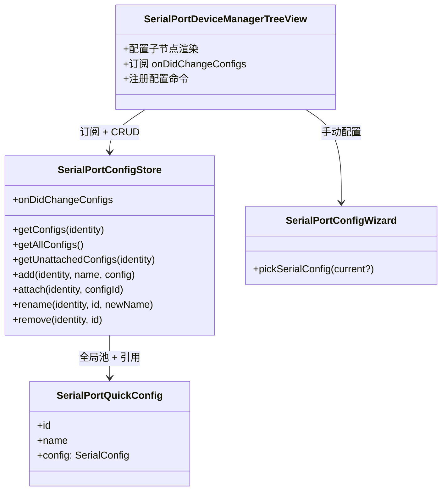

# SerialPortQuickConfig 设计

> 状态：已实现 —— 全局快捷配置（引用计数复用）、设备级参数选择（选中直连 / 选择器 / 手动配置）、当前连接高亮、上次使用置顶、终端标题带配置名 ｜ 目录：`src/SerialPortConfig/` ｜ 上位文档：总体架构.md

## 1. 定位

快捷配置是配置域组件：**全局命名连接配置**（波特率、数据位、校验、停止位、流控），经**每设备引用**（引用计数）复用——配置以「引用它的设备」的子节点形式展示。配置有身份（id）、名称与生命周期（增/改名/删/引用/去引用），是独立于连接状态的一等公民。

配置域由 `SerialPortConfigStore` 承载：全局池 + 每设备引用 + 引用计数、持久化与变更事件；UI（TreeView）负责呈现与管理入口；连接服务只接受配置参数，不持有配置存储。

## 2. 设计目标

- **全局复用**：快捷配置存于全局池，多个设备可引用同一配置，引用计数控制生命周期；
- **与连接状态无关**：添加、重命名、删除、引用不依赖当前是否连接；
- **事件驱动**：配置变更经事件发布，视图重渲染走既有订阅模式；
- **settings 驱动的手动配置**：波特率 / 帧格式取值来自 settings，单值时跳过对应下拉；
- **无损迁移**：旧按设备分区格式升级时自动迁移，已存配置不丢。

## 3. 数据模型

```ts
export interface SerialPortQuickConfig {
  readonly id: string;          // 稳定标识，重命名不影响
  readonly name: string;        // 显示名，用户可重命名
  readonly config: SerialConfig; // 连接参数
}

export interface SerialConfig {
  baudRate: number;
  dataBits: number;
  parity: 'none' | 'even' | 'odd' | 'mark' | 'space';
  stopBits: number;
  flowControl: 'none' | 'rtscts';
}
```

- `id` 由 Store 生成（时间戳或递增号），名称变化不改变引用；
- 流控只有 none / rtscts：serialport 不提供 DTR 流控，建模时即剔除，避免配置出无法兑现的参数。

## 4. 存储与持久化

- **全局池**：`serialPortQuickConfigs`（globalState），结构 `SerialPortQuickConfig[]`；
- **每设备引用**：`serialPortDeviceConfigRefs`（globalState），结构 `Record<deviceIdentity, string[]>`（引用计数键）；
- **引用计数**：`remove` 仅去引用；某配置被引用数归 0 时从全局池删除；
- **迁移**：旧格式 `Record<identity, SerialPortQuickConfig[]>` 首次读取时无损迁移为「全局池 + 每设备引用」（按 id 去重入池、按原设备重建引用）；
- 上次使用的配置：键 `serialPortLastUsedConfigs`（globalState），结构 `Record<deviceIdentity, SerialConfig>`，连接成功后由视图记录，选择器置顶用；
- 设备消失时引用**保留**（拔除不等于失去配置）；
- 全量读写即可：配置体量小，无需分片（扩展单进程运行，无并发问题）。

## 5. 配置仓库（SerialPortConfigStore）

| 成员 | 契约 |
|---|---|
| `getConfigs(identity): SerialPortQuickConfig[]` | 查询某设备引用的配置集合，无则空数组 |
| `getAllConfigs(): SerialPortQuickConfig[]` | 全部全局配置 |
| `getUnattachedConfigs(identity): SerialPortQuickConfig[]` | 未被该设备引用的全局配置（供「选择已存在快捷配置」） |
| `add(identity, name, config): SerialPortQuickConfig` | 新建配置入全局池并引用，随后发布变更事件 |
| `attach(identity, configId): void` | 引用已存在的全局配置（复用），发布变更事件 |
| `rename(identity, id, newName): void` | 重命名（全局池内生效），发布变更事件 |
| `remove(identity, id): void` | 去引用；引用数归 0 则从全局池删除，发布变更事件 |
| `getLastUsedConfig(identity): SerialConfig \| undefined` | 该设备上次成功连接的配置 |
| `setLastUsedConfig(identity, config): void` | 记录上次成功连接的配置（连接成功后由视图调用），静默持久化、不发布事件 |
| `onDidChangeConfigs: Event<string /*identity*/>` | 配置变更事件，负载为受影响的设备身份 |

校验规则（权威校验归 Store，add/rename 强制校验并抛出）：

- 名称必须非空，同设备内名称必须唯一；
- 参数组合全局唯一：不允许创建与已有配置参数完全相同的快捷配置（复用走「选择已存在快捷配置」）；
- 参数合法性：波特率正整数、数据位 ∈ {5,6,7,8}、停止位 ∈ {1,1.5,2}、校验/流控 ∈ 枚举（TS 类型约束）；
- UI 输入框的 `validateInput` 做同名即时反馈预校验，不替代 Store 的权威校验。

## 6. 交互设计

### 6.1 添加（已实现）

```
右键设备 → 添加快捷配置
    ↓ showQuickPick：$(add) 新建快捷配置 / $(link) 选择已存在快捷配置
    ├─ 新建：showInputBox 名称 → 手动配置向导（波特率/帧格式/流控，见 6.6）→ Store.add
    └─ 引用：showQuickPick 未被引用的全局配置 → Store.attach
    ↓
onDidChangeConfigs → 视图展开设备节点、新配置子节点出现
```

### 6.2 重命名（已实现）

配置子节点右键 → 重命名 → `showInputBox`（预填当前名）→ Store.rename → 事件刷新。

### 6.3 连接（已实现）

连接按钮保留在设备上（配置子节点不设连接入口，原"按钮迁移"方案取消）：

- 点击设备连接按钮 → 参数选择器（顶部「手动配置参数」项 + "保存的配置"分组）→ `connect(device, config)`，临时生效、不保存；
- **选中直连**：选中某配置子节点后再点该设备的连接按钮 → 直接用该配置连接，**跳过选择器**；未选中配置子节点（或选中的是其他设备的）时走选择器流程；
- **上次使用置顶**：该设备上次成功连接的配置排在"保存的配置"分组首位并标注"上次使用"；
- **手动配置参数**：选择器顶部「手动配置参数」项进入参数向导（波特率 → 帧格式 → 流控 → 保存选项），预填上次使用值，完成后连接（临时）并可选择保存为快捷配置（见 6.6）；
- 连接参数由调用方随连接请求传入，Service 不查询存储（M6 自动恢复场景再评估注入 Store）。

#### 6.3.1 当前连接高亮

连接成功后树视图高亮正在使用的配置：

- **Service 侧**：SerialPortConnection 持有本次连接的 `config`，Service 暴露 `getConnectionConfig(path)` 只读查询；
- **视图侧**：重渲染时（复用 `onDidChangeDeviceStatus` 事件流）对每个配置子节点做**值比较**（`serialConfigEquals`，五项全等，不依赖对象引用），命中的子节点图标换为 `radio-tower`、description 追加"当前连接"；设备行 description 追加参数摘要（如 `Arduino · 115200 8-N-1`）；
- 断开后查询返回 undefined，高亮随同一事件流自动消失；用未保存的手动参数连接时不命中任何子节点，自然无高亮。

### 6.4 删除（已实现）

配置子节点右键 → 删除 → 确认（`showWarningMessage`，modal）→ Store.remove → 事件刷新。

### 6.5 手动配置参数（已实现）

连接选择器顶部提供「手动配置参数」入口，进入参数向导：

1. **波特率**：`showQuickPick`，取值来自 settings `serialPortTerminal.baudRates`（默认 8 个常用值），单值时跳过并直接选中；
2. **帧格式**：`showQuickPick`，取值来自 settings `serialPortTerminal.frameFormats`（默认 10 个常用组合），单值时跳过并直接选中；
3. **流控**：`showQuickPick`（无 / RTS/CTS）；
4. **保存选项**：`showQuickPick`「仅本次连接 / 保存为快捷配置」；选保存则 `showInputBox` 输入配置名 → `Store.add`。

- 完成后以所选参数 `connect(device, config)`（临时、不保存）；选保存则先 `Store.add` 落盘、随 `onDidChangeConfigs` 刷新树；
- 参数选择逻辑由 `pickSerialConfig()` 助手承载（见 SerialPortConfigWizard.ts）；
- 上次使用值取自 `ConfigStore.getLastUsedConfig(identity)`。

## 7. 视图呈现

### 7.1 配置子节点

- 设备节点有配置时变为可折叠（`TreeItemCollapsibleState`），子节点为**该设备引用的**各配置项；
- 配置项呈现：label = 名称；description = 参数摘要（如 `115200 8-N-1`）；tooltip = 完整参数信息；当前连接的配置子节点高亮（`radio-tower` 图标 + "当前连接"标注，见 6.3.1）。

### 7.2 contextValue 约定

| contextValue | 含义 |
|---|---|
| `serialPortDevice.disconnected` | 设备未连接（设备级连接按钮显示于此态，有/无快捷配置一致） |
| `serialPortDevice.connecting` / `serialPortDevice.connected` | 与配置无关，维持不变 |
| `serialPortQuickConfig` | 配置子节点（重命名/删除菜单匹配此值） |

注：原"有快捷配置时隐藏设备连接按钮（hasConfigs）并迁移至配置子节点"的方案已取消 —— 连接入口统一保留在设备上（见 6.3）。

### 7.3 视图刷新

TreeView 订阅第三个事件源：`store.onDidChangeConfigs` → 重建受影响的设备节点（含子节点）→ `fire()`。加配置后设备节点自动进入展开态，新配置立即可见。

## 8. 命令与菜单

### 8.1 命令命名

- 沿用规范：`serialPortQuickConfig.*` —— 配置级命令（添加、重命名、删除）。

### 8.2 菜单设计

| 位置 | 命令 | 展示方式 |
|---|---|---|
| `view/item/context`（普通组） | 添加快捷配置 | 设备右键菜单，`viewItem =~ /^serialPortDevice\./`（连接与否均可添加） |
| `view/item/context`（普通组） | 重命名 | 配置子节点右键 |
| `view/item/context`（普通组） | 删除 | 配置子节点右键 |

## 9. 实现状态与待办

- **已实现**：数据模型 + Store（全局池 / 每设备引用 / 引用计数 / 迁移）、添加（新建 / 引用）、重命名、删除、设备级连接参数选择、当前连接高亮、上次使用置顶、手动配置参数（settings 下拉、单值跳过）、终端标题带配置名。
- **已移除**：预设功能（`serialPortTerminal.serialConfigPresets` 与预设管理 UI）。

## 10. 组件结构


