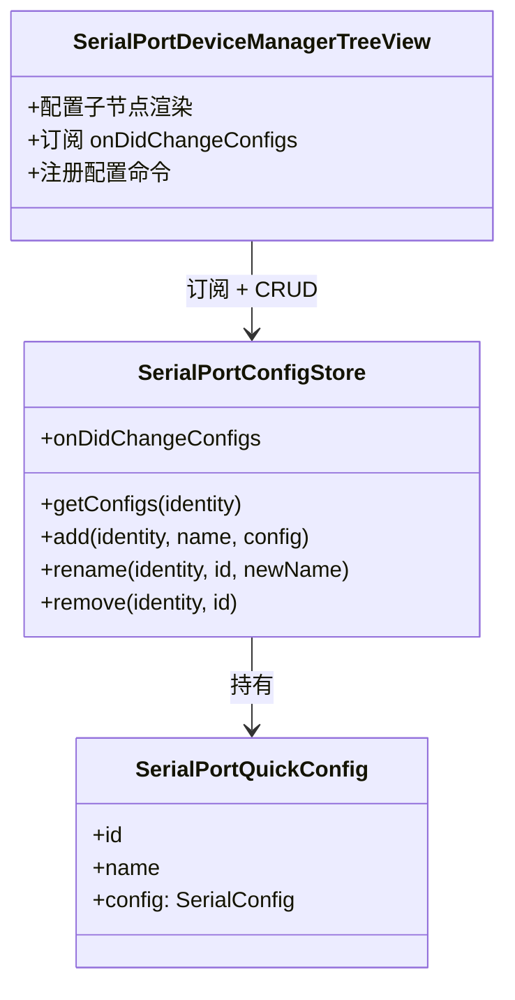

# SerialPortQuickConfig 设计

> 状态：已实现（当前里程碑完成）—— 配置管理 UI、设备级参数选择（选中直连 / 选择器）、当前连接高亮、上次使用置顶、预设管理 UI、终端标题带配置名 ｜ 目录：`src/SerialPortConfig/` ｜ 上位文档：总体架构.md

## 1. 定位

快捷配置是配置域组件：每台设备可以拥有多份**命名连接配置**（波特率、数据位、校验、停止位、流控），以设备子节点形式展示，用户选择其一发起连接。配置有身份（id）、名称与生命周期（增/改名/删），是独立于连接状态的一等公民。

配置域由 `SerialPortConfigStore` 承载：CRUD、持久化与变更事件；UI（TreeView）负责呈现与管理入口；连接服务只接受配置参数，不持有配置存储。

## 2. 设计目标

- **与设备身份绑定**：配置集合按设备身份（退化链）存储，换口重插自动找回，不随路径漂移；
- **与连接状态无关**：添加、重命名、删除不依赖当前是否连接；
- **事件驱动**：配置变更经事件发布，视图重渲染走既有订阅模式；
- **渐进实现**：按分阶段计划落地（见第 9 节），每一阶段独立可用。

## 3. 数据模型

```ts
export interface SerialPortQuickConfig {
  readonly id: string;          // 稳定标识，重命名不影响
  readonly name: string;        // 显示名，用户可重命名
  readonly config: SerialConfig; // 连接参数
}

export interface SerialConfig {
  baudRate: number;
  dataBits: number;
  parity: 'none' | 'even' | 'odd' | 'mark' | 'space';
  stopBits: number;
  flowControl: 'none' | 'rtscts';
}
```

- `id` 由 Store 生成（时间戳或递增号），名称变化不改变引用；
- 流控只有 none / rtscts：serialport 不提供 DTR 流控，建模时即剔除，避免配置出无法兑现的参数。

## 4. 存储与持久化

- 存储键：`serialPortQuickConfigs`（globalState），结构 `Record<deviceIdentity, SerialPortQuickConfig[]>`；
- 键为设备身份（退化链，见 SerialPortDeviceDetector设计.md「设备身份管理」）：配置跟随物理设备，COM 号复用/换口均不串味；
- 设备消失时配置**保留**（拔除不等于失去配置）；
- 上次使用的配置：键 `serialPortLastUsedConfigs`（globalState），结构 `Record<deviceIdentity, SerialConfig>`，连接成功后由视图记录，选择器置顶用；
- 预设组合不在此列：归 workspace 设置 `serialPortTerminal.serialConfigPresets`，随 settings.json 持久化并在设置界面编辑；
- 全量读写即可：配置体量小，无需分片（扩展单进程运行，无并发问题）。

## 5. 配置仓库（SerialPortConfigStore）

| 成员 | 契约 |
|---|---|
| `getConfigs(identity): SerialPortQuickConfig[]` | 查询某设备的配置集合，无则空数组 |
| `add(identity, name, config): SerialPortQuickConfig` | 创建配置并持久化，随后发布变更事件 |
| `rename(identity, id, newName): void` | 重命名，发布变更事件 |
| `remove(identity, id): void` | 删除配置，发布变更事件 |
| `getLastUsedConfig(identity): SerialConfig \| undefined` | 该设备上次成功连接的配置 |
| `setLastUsedConfig(identity, config): void` | 记录上次成功连接的配置（连接成功后由视图调用），静默持久化、不发布事件 |
| `onDidChangeConfigs: Event<string /*identity*/>` | 配置变更事件，负载为受影响的设备身份 |

校验规则（权威校验归 Store，add/rename 强制校验并抛出）：

- 名称必须非空，同设备内名称必须唯一；
- 参数合法性：波特率正整数、数据位 ∈ {5,6,7,8}、停止位 ∈ {1,1.5,2}、校验/流控 ∈ 枚举（TS 类型约束）；
- UI 输入框的 `validateInput` 做同名即时反馈预校验，不替代 Store 的权威校验。

## 6. 交互设计

### 6.1 添加（已实现）

```
右键设备 → 添加快捷配置
    ↓ showInputBox：配置名称（预填 "配置 N"，prompt 附命名示例，validateInput 校验非空、去重）
    ↓ showQuickPick：预设组合（label = "115200 8-N-1" 等摘要，description = 中文参数说明
      "波特率 115200 · 数据位 8 · 无校验 · 停止位 1 · 流控 无"，支持按说明搜索）
    ↓
Store.add → 持久化 → onDidChangeConfigs → 视图展开设备节点、新配置子节点出现
```

预设组合读取自设置项 `serialPortTerminal.serialConfigPresets`（数组，默认内置 8 个常用组合；运行时经 `readSerialPortPresets()` 解析校验，非法条目跳过并记录警告）。设置项是持久化载体，图形化编辑入口见 6.5；"自定义…" 项与完整五参数向导属 P2，P2 起用户自建的自定义组合并入候选列表。

### 6.2 重命名（已实现）

配置子节点右键 → 重命名 → `showInputBox`（预填当前名）→ Store.rename → 事件刷新。

### 6.3 连接（已实现）

连接按钮保留在设备上（配置子节点不设连接入口，原"按钮迁移"方案取消）：

- 点击设备连接按钮 → 参数选择器（"保存的配置"分组 + "预设组合"分组）→ `connect(device, config)`，临时生效、不保存；
- **选中直连**：选中某配置子节点后再点该设备的连接按钮 → 直接用该配置连接，**跳过选择器**；未选中配置子节点（或选中的是其他设备的）时走选择器流程；
- **上次使用置顶**：该设备上次成功连接的配置排在"保存的配置"分组首位并标注"上次使用"；
- 连接参数由调用方随连接请求传入，Service 不查询存储（M6 自动恢复场景再评估注入 Store）。

#### 6.3.1 当前连接高亮

连接成功后树视图高亮正在使用的配置：

- **Service 侧**：SerialPortConnection 持有本次连接的 `config`，Service 暴露 `getConnectionConfig(path)` 只读查询；
- **视图侧**：重渲染时（复用 `onDidChangeDeviceStatus` 事件流）对每个配置子节点做**值比较**（`serialConfigEquals`，五项全等，不依赖对象引用），命中的子节点图标换为 `radio-tower`、description 追加"当前连接"；设备行 description 追加参数摘要（如 `Arduino · 115200 8-N-1`）；
- 断开后查询返回 undefined，高亮随同一事件流自动消失；用预设（非已存配置）连接时不命中任何子节点，自然无高亮。

### 6.4 删除（已实现）

配置子节点右键 → 删除 → 确认（`showWarningMessage`，modal）→ Store.remove → 事件刷新。

### 6.5 预设管理 UI（已实现）

设置项 `serialPortTerminal.serialConfigPresets` 的图形入口（避免用户手改 JSON），由 SerialPortPresetManager（`src/view/`）承载：

- **入口**：视图标题栏齿轮按钮 / 命令面板 `serialPortPreset.manage`；
- **列表**：QuickPick 展示全部预设（label = 名称、description = 摘要、detail = 中文参数说明），顶部"＋ 新增预设"；回车进入编辑/删除菜单；
- **新增/编辑向导（四步）**：名称（非空、去重校验）→ 波特率（正整数校验）→ 帧格式（数据位 5/6/7/8 × 校验 N/E/O/M/S × 停止位 1/1.5/2，共 60 种组合）→ 流控（无 / RTS/CTS）；编辑时预填当前值；
- **删除**：modal 确认后移除；
- **排序**：列表每行悬停显示行内 ↑/↓ 按钮（QuickPickItemButtons，首条隐藏上移、末条隐藏下移），点击即移动并即时重排，选择器保持打开，顺序随设置持久化；
- **读写**：向导经 `saveSerialPortPresets()` 全量回写设置项（以校验通过的条目为准），**写入目标为 Global（用户设置）**——预设是用户级偏好，不随工作区漂移；注意 `update` 不指定目标时默认写工作区设置，未开工作区会直接抛错，因此必须显式指定；成功弹出提示（已新增/已更新/已删除），写入失败弹出错误提示；子级 Esc 返回列表、列表 Esc 退出；选择器（6.1/6.3）每次打开实时读取，改完立即生效。

## 7. 视图呈现

### 7.1 配置子节点

- 设备节点有配置时变为可折叠（`TreeItemCollapsibleState`），子节点为各配置项；
- 配置项呈现：label = 名称；description = 参数摘要（如 `115200 8-N-1`）；tooltip = 完整参数信息（悬浮显示基本信息）；当前连接的配置子节点高亮（`radio-tower` 图标 + "当前连接"标注，见 6.3.1）。

### 7.2 contextValue 约定

| contextValue | 含义 |
|---|---|
| `serialPortDevice.disconnected` | 设备未连接（设备级连接按钮显示于此态，有/无快捷配置一致） |
| `serialPortDevice.connecting` / `serialPortDevice.connected` | 与配置无关，维持不变 |
| `serialPortQuickConfig` | 配置子节点（重命名/删除菜单匹配此值） |

注：原"有快捷配置时隐藏设备连接按钮（hasConfigs）并迁移至配置子节点"的方案已取消 —— 连接入口统一保留在设备上（见 6.3）。

### 7.3 视图刷新

TreeView 订阅第三个事件源：`store.onDidChangeConfigs` → 重建受影响的设备节点（含子节点）→ `fire()`。加配置后设备节点自动进入展开态，新配置立即可见。

## 8. 命令与菜单

### 8.1 命令命名

- 沿用规范：`serialPortQuickConfig.*` —— 配置级命令（添加、重命名、删除）；
- `serialPortPreset.*` —— 预设管理级命令（`serialPortPreset.manage`），与设备无关、操作全局预设列表。

### 8.2 菜单设计

| 位置 | 命令 | 展示方式 |
|---|---|---|
| `view/item/context`（普通组） | 添加快捷配置 | 设备右键菜单，`viewItem =~ /^serialPortDevice\./`（连接与否均可添加） |
| `view/item/context`（普通组） | 重命名 | 配置子节点右键 |
| `view/item/context`（普通组） | 删除 | 配置子节点右键 |

## 9. 分阶段实施计划

| 阶段 | 内容 | 状态 |
|---|---|---|
| **P1** | 数据模型 + Store（持久化/事件）、添加向导（名称 + 设置驱动的预设组合，带中文参数说明）、配置子节点展示与 tooltip、重命名、删除（含确认）、设备级连接参数选择（已存配置 + 预设，临时不保存）、预设管理 UI（列表 + 行内排序 + 四步向导） | 已实现 |
| **P2** | 当前连接高亮（6.3.1）、上次使用置顶 | 已实现（当前里程碑完成） |
| **P3** | 终端标题附带配置名（快捷配置显示配置名，预设显示波特率） | 已实现 |

已取消/取代的项：编辑已有配置参数（内容简单，删除重建即可）；配置节点 inline 连接与设备级连接按钮迁移（连接入口统一保留在设备上，见 6.3）；自定义参数向导（由预设管理 UI 取代 —— 自建组合即预设）。

## 10. 组件结构


