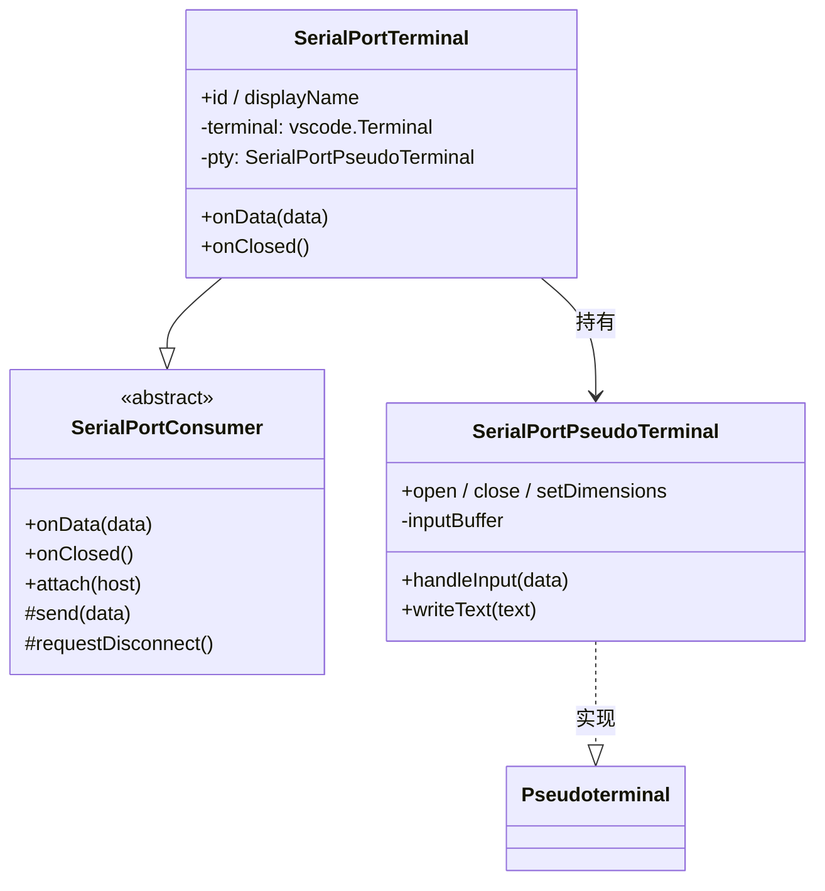

# SerialPortTerminal 设计

## 简介

SerialPortTerminal 是默认 Consumer，提供基础的终端交互能力：**连接成功后启动一块 VS Code 终端面板**，串口数据实时显示其中，用户在终端内键入、回车发送。代码位于 `src/SerialPortConsumer/SerialPortTerminal/`。

终端基于 VS Code 的 `Pseudoterminal` 接口实现（微软官方 serial-monitor 扩展同款方案）：扩展充当"伪终端"，把串口数据写入终端面板，把用户输入转发到串口。

## 设计目标

- **原生终端体验**：输入行、回车、滚动、复制粘贴、ANSI 颜色渲染全部由 VS Code 终端原生提供，扩展不写一行 UI；
- **原样透传**：第一阶段不做 Parser，串口数据以原字符串直接写入终端；
- **终端即会话**：终端面板的关闭就是断开连接的入口。

## 功能设计

### 显示（串口 → 终端）

- attach 时创建：`vscode.window.createTerminal({ name: 'Serial Port: <path>', pty })` 并 `show()`；
- `onData(data)` → `pty.writeText(data.toString('utf-8'))`；
- `writeText` 内部做换行归一化（`\n` → `\r\n`），保证设备只发 LF 时显示不跑偏。

### 输入（终端 → 串口）

`Pseudoterminal.handleInput(data)` 收到的是**字符流**，`SerialPortPseudoTerminal` 负责缓冲与解释：

| 输入 | 处理 |
|---|---|
| 普通字符 | 追加到行缓冲，**回显**到终端 |
| `\r`（回车） | 取出缓冲行 → 回显换行 → `host.send(line + '\n')` |
| `\x7f`（退格） | 从缓冲删一个字符，回显 `\b \b` |
| `\x1b…`（方向键等 ANSI 序列） | 忽略，不回显不缓冲 |

回显是必须的：Pseudoterminal 模式下 VS Code 不自动回显输入，不回显用户就看不到自己打了什么。

### 生命周期

```
connect 成功 → attach → 创建终端面板并显示
数据到达 → onData → 写入终端
终端内回车 → handleInput → send
连接断开（侧边栏/拔除/关闭面板）→ onClosed → 面板保留，写入"[已断开] <path>"，进入冻结态
用户此后关闭面板 → pty.close() → 仅资源清理
```

- **断开不销毁视图**：面板与日志保留，用户可继续回看；冻结态下数据与输入均失效（`disconnected` 标志）；
- **关闭面板仍触发断开**：面板还开着时用户点关闭 → `requestDisconnect()` → Service 断开 → `onClosed` 写入提示（若面板已关则跳过）；
- `disconnectByPath` 在设备已消失时自然短路，无递归风险。

### 后续演进（Parser 阶段）

- **分帧/归一化**：设备按任意字节数分帧到达，终端按字符显示，换行由 `writeText` 归一化 —— 分帧语义（自定义协议）留给 Parser；
- **ANSI 颜色**：终端原生渲染，无需实现；
- **字符转义**：不可见字符可视化等，在写入终端前加工（仍是"原样透传"原则的例外，属于显式增强）。

## 组件结构



## 文件布局

```
src/SerialPortConsumer/
└── SerialPortTerminal/
    ├── SerialPortTerminal.ts        ← Consumer 实现 + 伪终端
    ├── parser/                      ← 后续：Parser、字符转义
    └── view/                        ← 预留（若未来需要 Webview 增强界面）
```

## 路线图

- **M3-P1（本阶段）**：Pseudoterminal 终端 —— 显示、键入发送、关闭即断开；
- **M3-P2**：输入增强（命令历史、行尾符配置 CR/LF/CRLF、局部回显开关）；
- **M3-P3**：Parser（分帧）、字符转义（不可见字符可视化）；
- **M4**：Terminal 可关闭而其他 Consumer 后台运行、二级菜单管理。
