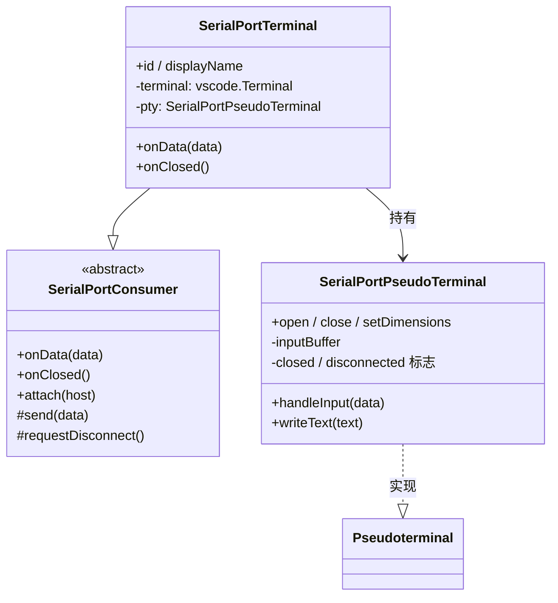

# SerialPortTerminal 设计

> 状态：已实现 ｜ 目录：`src/SerialPortConsumer/SerialPortTerminal/` ｜ 规范：SerialPortConsumer设计.md

## 1. 定位

SerialPortTerminal 是默认 Consumer，提供基础的终端交互能力：**连接成功后启动一块 VS Code 终端面板**，串口数据实时显示其中，用户在终端内键入、回车发送。它是连接建立后第一个注册的 Consumer。

终端基于 VS Code 的 `Pseudoterminal` 接口实现（微软官方 serial-monitor 扩展同款方案）：扩展充当伪终端，将串口数据写入终端面板，将用户输入转发到串口。

第一阶段刻意保持最小：不做 Parser、不做颜色/字符转义，接收数据以原字符串形式直接显示。

## 2. 设计目标

- **原生终端体验**：输入行、回车、滚动、复制粘贴、ANSI 颜色渲染均由 VS Code 终端原生提供，扩展不实现任何 UI；
- **原样透传**：串口数据以原字符串写入终端，分帧、转义等语义全部留待 Parser 阶段；
- **终端即会话**：终端面板的关闭即断开连接的入口；连接断开时面板保留（日志可回看），见 4.2。

## 3. 功能设计

### 3.1 显示（串口 → 终端）

- attach 时创建：`vscode.window.createTerminal({ name: 'Serial Port: <path>', pty })` 并 `show()`；
- `onData(data)` → `pty.writeText(data.toString('utf-8'))`；
- `writeText` 执行换行归一化：`\n` → `\r\n`，保证设备只发 LF 时显示不跑偏。

### 3.2 输入（终端 → 串口）

`Pseudoterminal.handleInput(data)` 收到的是**字符流**，`SerialPortPseudoTerminal` 负责缓冲与解释：

| 输入 | 处理 |
|---|---|
| 普通字符 | 追加到行缓冲，并**回显**到终端 |
| `\r`（回车） | 取出缓冲行 → 回显换行 → `host.send(line + '\n')` |
| `\x7f`（退格） | 从缓冲删除一个字符，回显 `\b \b` |
| `\x1b…`（方向键等 ANSI 序列） | 忽略：不回显、不缓冲 |

回显是必需的：Pseudoterminal 模式下 VS Code 不自动回显输入，不回显则用户无法看到键入内容。粘贴（含 `\r` 的多字符输入）按逐字符规则处理，天然支持。

### 3.3 冻结态与关闭

`SerialPortPseudoTerminal` 维护两个互斥的阶段标志：

| 标志 | 置位时机 | 语义 |
|---|---|---|
| `disconnected` | 连接销毁（`onClosed`） | 面板保留，写入 `[已断开] <path>` 提示；数据与输入均失效 |
| `closed` | 用户关闭面板 | 释放 pty 资源；此后一切回调短路 |

两标志保证"断开"与"关面板"两条路径互不干扰：断开后关面板仅清理资源（不重复触发断开）；面板先关时断开通告自动跳过（不触碰已释放的 emitter）。

## 4. 生命周期

```
connect 成功 → attach → 创建终端面板并显示
数据到达 → onData → 写入终端
终端内回车 → handleInput → send
连接断开（侧边栏/拔除/关闭面板）→ onClosed → 面板保留，写入"[已断开] <path>"，进入冻结态
用户此后关闭面板 → pty.close() → 仅资源清理
```

- **断开不销毁视图**：面板与日志保留，用户可继续回看（可见类型关闭行为约定，见 SerialPortConsumer设计.md 4.1）；
- **关闭面板仍触发断开**：面板存活期间用户点关闭 → `requestDisconnect()` → Service 断开 → `onClosed` 写入提示（面板已关则跳过）；
- Service 侧 `disconnectByPath` 在设备已消失时自然短路，无递归风险。

## 5. 组件结构



## 6. 文件布局

```
src/SerialPortConsumer/
└── SerialPortTerminal/
    ├── SerialPortTerminal.ts        ← Consumer 实现 + 伪终端
    ├── parser/                      ← 后续：Parser、字符转义
    └── view/                        ← 预留（若未来需要 Webview 增强界面）
```

## 7. 后续演进

- **输入增强**：命令历史、行尾符配置（CR / LF / CRLF）、局部回显开关；
- **Parser**：分帧语义（自定义协议）；换行归一化已在 `writeText` 完成；
- **ANSI 颜色**：由终端原生渲染，无需实现；字符转义（不可见字符可视化）在写入终端前加工，属显式增强而非默认行为。

## 8. 路线图

- **M3-P1（已落地）**：Pseudoterminal 终端 —— 显示、键入发送、关闭即断开、断开保留日志；
- **M3-P2**：输入增强（历史、行尾符配置）；
- **M3-P3**：Parser（分帧）、字符转义；
- **M4**：Terminal 可关闭而其他 Consumer 后台运行、二级菜单管理。
