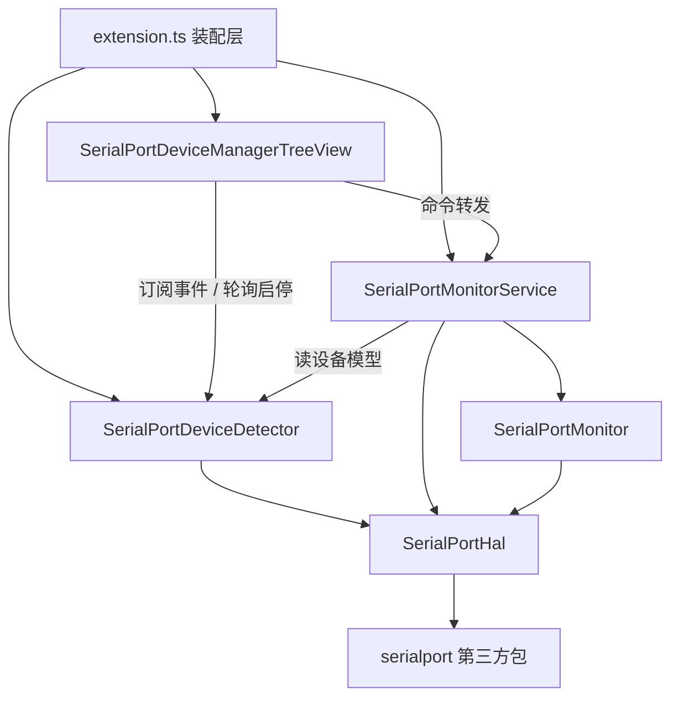

# 总体架构

## 模块划分



## 职责总表

| 模块 | 目录 | 职责 |
|---|---|---|
| SerialPortDeviceManagerTreeView | `src/view/` | UI 层：树视图、命令注册、按钮与菜单、订阅刷新。不直接操作数据 |
| SerialPortDeviceDetector | `src/SerialPortDeviceDetector/` | 设备域：轮询枚举、模型列表维护（增删不重建）、事件发布、配置 |
| SerialPortMonitorService | `src/SerialPortMonitor/` | 连接域：载入配置、打开串口、创建/销毁 Monitor、Device↔Monitor 映射、状态回写 |
| SerialPortMonitor | `src/SerialPortMonitor/` | 持有已打开的端口；未来是数据收发与 Watcher 中枢 |
| SerialPortHal | `src/hal/` | 硬件抽象层：枚举与打开串口，全项目唯一触碰 serialport 的位置 |

依赖方向单向：**UI → 服务 → HAL → 硬件**。两个服务层互不依赖对方实现，只通过 Detector 导出的设备模型接口握手；服务层只依赖 HAL 接口，不触碰第三方包。

## 两条核心数据流

### 设备事件流（Detector 驱动）

```
轮询枚举 → 与快照对比 → 发布 { added, removed }
    ├→ TreeView：增删 item 列表，fire() 刷新视图
    └→ MonitorService：removed 中有设备 → 销毁对应 Monitor 并清理
```

设备拔除的资源清理由事件自动驱动，不需要任何模块在刷新逻辑里"顺便"清理。

### 连接动作流（用户驱动）

```
用户点击连接（TreeView 命令）
    → MonitorService.connect(device)
    → 按设备身份载入配置 → 打开串口
    → 成功：构造 Monitor（注入 device 与端口）→ device 状态置 connected
    → 失败：提示原因 → device 状态回滚 disconnected
状态变化后由视图重渲染呈现
```

## 组件生态与拓展

SerialPortDeviceManager 是最核心的一个组件，预计还需要设计 SerialPortTerminal、SerialPortDataPaster、SerialPortMonitor 等组件，用于转发数据与终端交互。用户总是从当前组件启动终端，再从终端控制是否向其他组件转发数据。

在用户触发连接后，创建一个 SerialPortMonitor 实例，并默认注册一个 SerialPortTerminal 作为第一个 Watcher，SerialPortTerminal 提供交互界面，用于触发注册其他 Watcher。允许 SerialPortTerminal 关闭，其他 Watcher 在后台监听数据（如果没有提供界面），以减小系统负载。

Watcher 会以二级菜单的形式显示在设备管理视图中，可手动关闭。当某个串口设备的 Watcher 减为零时，关闭串口。

## 路线图

- **M1 设备管理**：设备列表、连接状态三态管理、刷新与手动热插拔感知；
- **M2 真实连接**：模块化重构（Detector / TreeView / MonitorService）、打开串口、配置载入、失败回滚；
- **M3 终端交互**：SerialPortTerminal 作为默认 Watcher，完成收发与展示、Terminal 内断开；
- **M4 数据转发**：多 Watcher 注册与二级菜单管理；
- **M5 自动化**：配置持久化接入、启动自动恢复。
