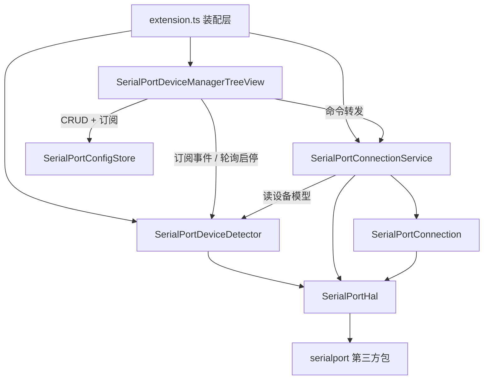
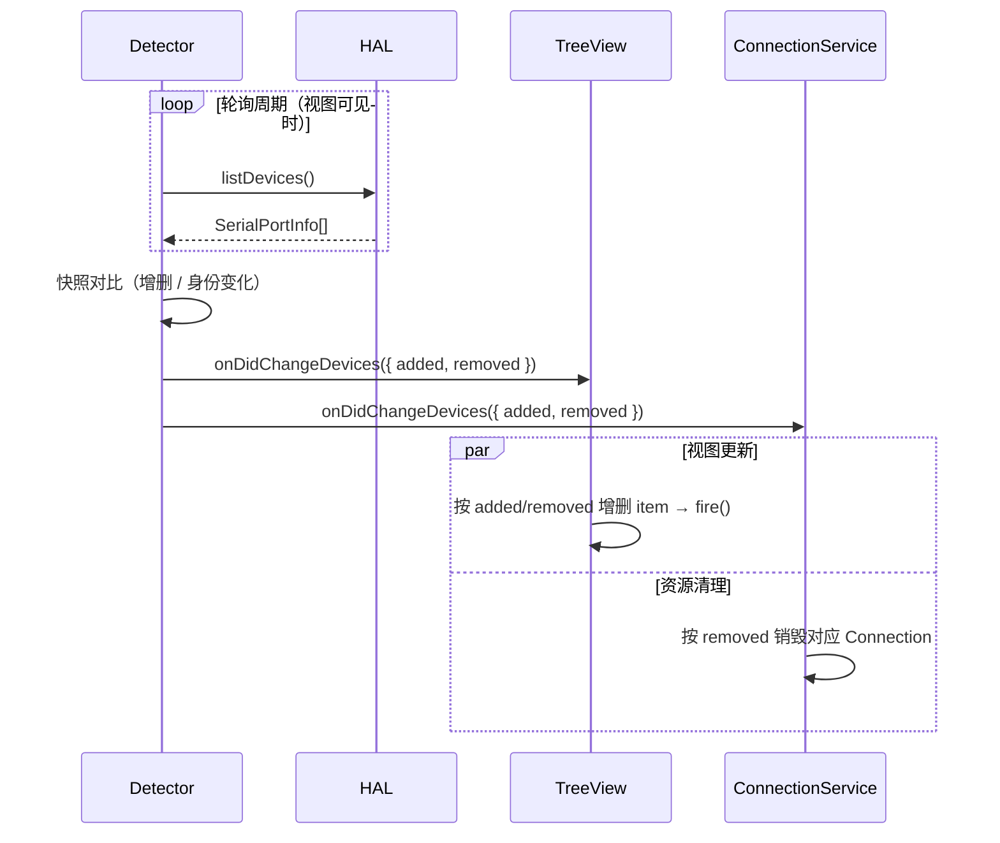
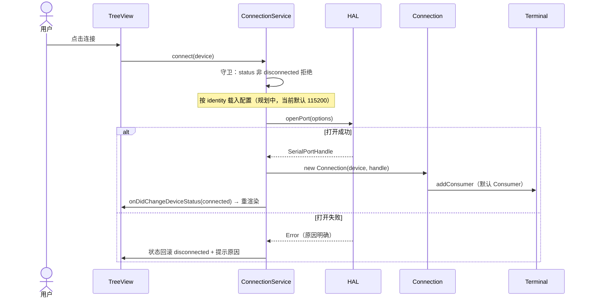
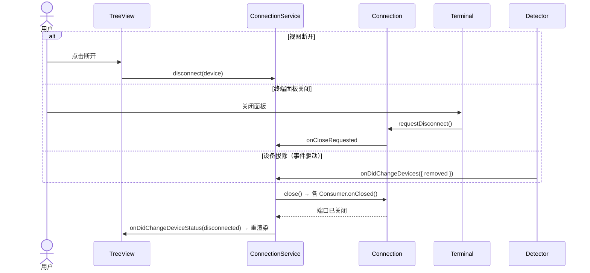
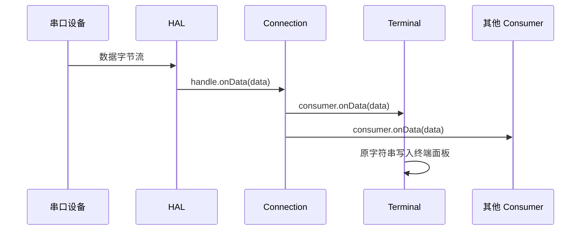

# 总体架构

> 状态：与当前实现同步 ｜ 定位：各模块设计文档的上位文档，模块细节见对应文档

## 1. 定位与范围

本文档定义扩展的整体模块划分、职责边界与交互规则。模块级契约、流程与实现细节由各模块设计文档描述，本文只回答三个问题：有哪些模块、谁依赖谁、数据如何流动。

## 2. 模块划分

## 3. 职责总表

| 模块 | 目录 | 职责 | 状态 |
|---|---|---|---|
| SerialPortDeviceManagerTreeView | `src/view/` | UI 层：树视图、命令注册、按钮与菜单、订阅刷新 | 已实现 |
| SerialPortDeviceDetector | `src/SerialPortDeviceDetector/` | 设备域：轮询扫描、模型列表维护、增删事件发布、扫描配置 | 已实现 |
| SerialPortConnectionService | `src/SerialPortConnection/` | 连接域：载入配置、经 HAL 打开串口、创建/销毁 Connection、映射与状态回写 | 已实现（配置载入为默认参数） |
| SerialPortConnection | `src/SerialPortConnection/` | 持有已打开的端口句柄；数据收发与 Consumer 注册中枢 | 已实现 |
| SerialPortConsumer | `src/SerialPortConnection/` | 数据消费方通用规范（基类与 host 契约） | 已实现 |
| SerialPortTerminal | `src/SerialPortConsumer/` | 默认 Consumer：Pseudoterminal 终端 | 已实现 |
| SerialPortConfigStore | `src/SerialPortConfig/` | 配置域：命名连接配置集合的 CRUD、持久化与变更事件 | 已实现（管理 UI；连接参数传递待对接） |
| SerialPortHal | `src/hal/` | 硬件抽象层接口与 serialport 实现 | 已实现 |

## 4. 依赖规则

以下规则对所有模块**必须**成立：

1. 依赖方向严格单向：**UI → 服务 → HAL → 硬件**；
2. 第三方串口包的唯一触碰点是 `SerialPortHalImpl`，其余任何模块**不得** import serialport；
3. 服务层之间**不得**依赖对方实现，只允许通过 Detector 导出的设备模型接口与事件通道交互；
4. 模块装配只发生在 `extension.ts`；默认 Consumer 通过工厂注入，服务层不依赖 Consumer 实现；
5. 设备状态（连接状态）的唯一写者是 ConnectionService；视图与 Connection 只读；
6. 连接参数由调用方随 `connect(device, config)` 传入，ConnectionService 不依赖配置存储（自动恢复场景时再评估注入）。

## 5. 核心数据流

### 5.1 设备事件流（Detector 驱动）

设备拔除的资源清理由事件自动驱动；任何模块**不得**在扫描逻辑之外"顺便"清理连接资源。

### 5.2 连接与断开（用户驱动）

三个断开入口均收敛于 Service 的单一销毁入口，见 SerialPortConnection设计.md「断开回传机制」。

### 5.3 数据流（Connection 驱动）

Connection 只广播不加工；Consumer 之间的协作不经过 Connection。

## 6. 组件生态

- 连接建立后，ConnectionService 通过工厂注册默认 Consumer（SerialPortTerminal）；
- 未来支持多 Consumer（SerialPortDataPaster 等）注册与二级菜单管理（M4）；
- Consumer 关闭行为由类型自决：用户可见类型保留视图并提示断开，不可见类型直接销毁（见 SerialPortConsumer设计.md「关闭行为约定」）；
- 减为零规则：某设备的 Consumer 全部移除时，关闭串口并销毁 Connection。

## 7. 实现状态

| 能力 | 状态 |
|---|---|
| 设备列表、热插拔轮询、三态状态机 | 已实现 |
| 真实连接（默认参数 115200-8-N-1） | 已实现 |
| 按设备身份载入配置（SerialConfig） | 规划（M5） |
| Pseudoterminal 终端（显示、发送、断开保留日志） | 已实现 |
| Parser / 字符转义 | 规划（M3-P3） |
| 快捷配置：多命名配置管理（增/改名/删、子节点展示、tooltip） | 已实现 |
| 快捷配置连接（`connect(device, config)`、连接按钮迁移） | 未实现（当前里程碑） |
| 多 Consumer 与二级菜单 | 规划（M4） |
| 日志保存 | 规划 |

## 8. 路线图

- **M3** 终端完善：输入增强（历史、行尾符配置）、Parser 与字符转义；
- **M4** 快捷配置（当前里程碑）：配置管理 UI（命名集合、子节点展示、增/改名/删）已实现，剩余配置连接与自定义参数向导（见 SerialPortQuickConfig设计.md 分阶段计划）；
- **M5** 数据转发：多 Consumer 注册、二级菜单管理、减为零自动关串口；
- **M6** 自动化：设备参数配置与持久化收尾、日志保存、启动自动恢复。
