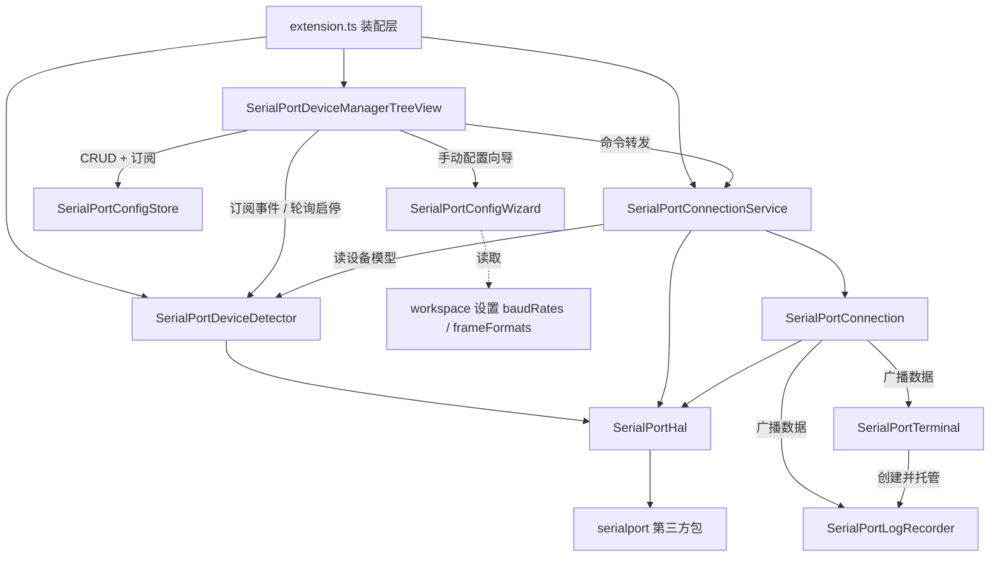
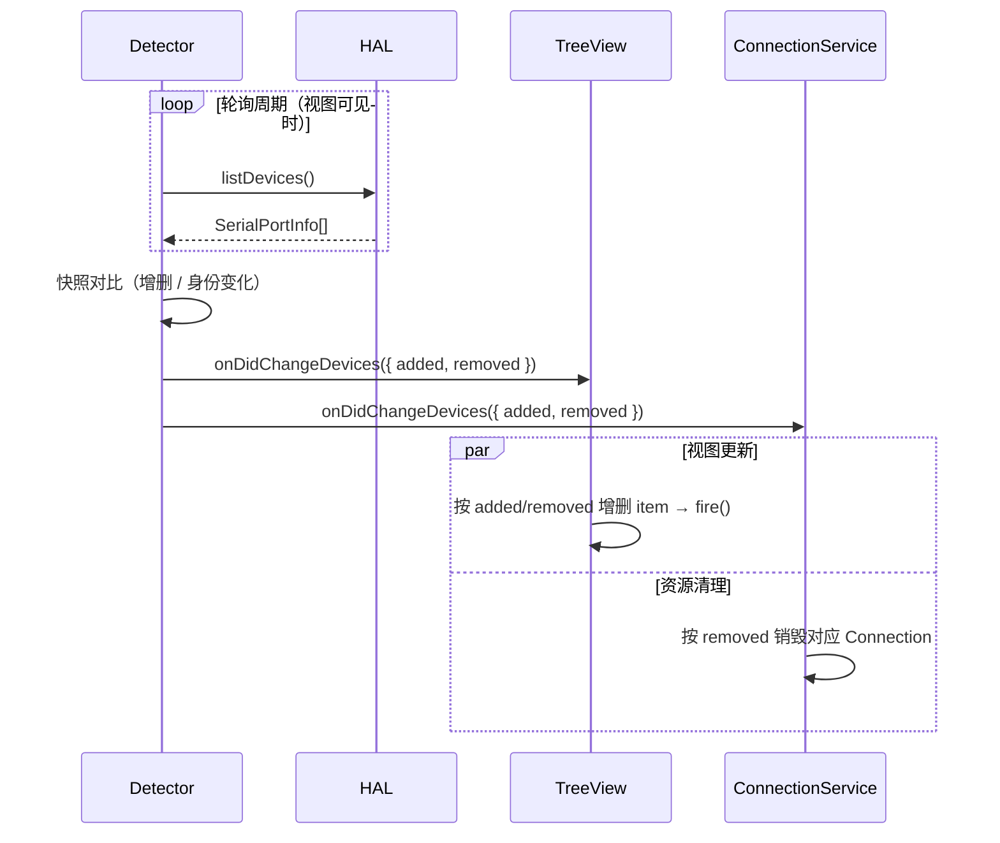
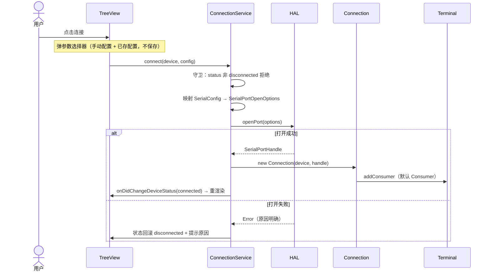
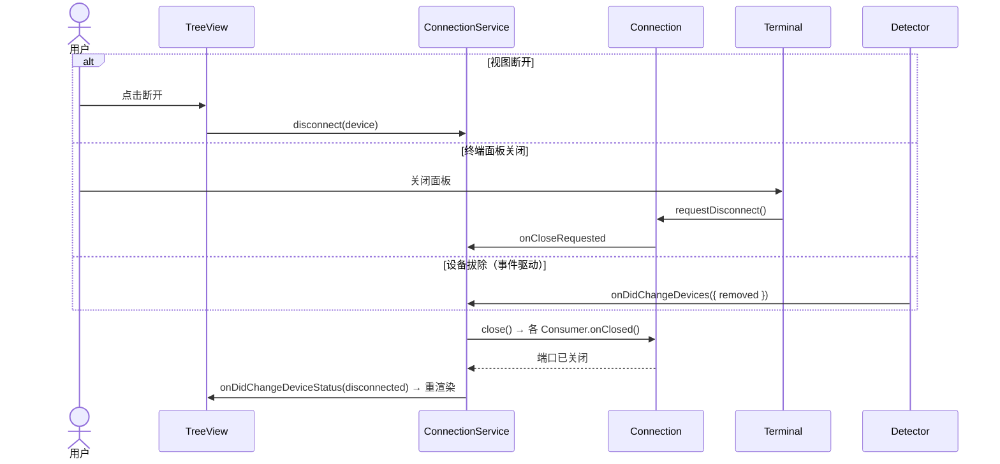
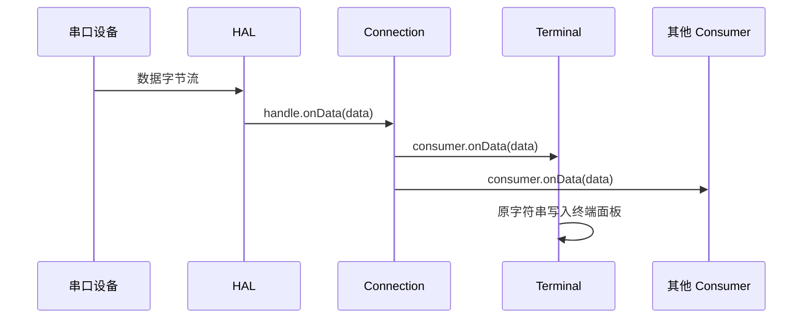

# 总体架构

> 状态：与当前实现同步 ｜ 定位：各模块设计文档的上位文档，模块细节见对应文档

## 1. 定位与范围

本文档定义扩展的整体模块划分、职责边界与交互规则。模块级契约、流程与实现细节由各模块设计文档描述，本文只回答三个问题：有哪些模块、谁依赖谁、数据如何流动。

## 2. 模块划分

## 3. 职责总表

| 模块 | 目录 | 职责 |
|---|---|---|
| SerialPortDeviceManagerTreeView | `src/view/` | UI 层：树视图、命令注册、按钮与菜单、订阅刷新 |
| SerialPortDeviceDetector | `src/SerialPortDeviceDetector/` | 设备域：轮询扫描、模型列表维护、增删事件发布、扫描配置 |
| SerialPortConnectionService | `src/SerialPortConnection/` | 连接域：连接参数随请求传入并映射为 HAL 打开参数、经 HAL 打开串口、创建/销毁 Connection、映射与状态回写、当前连接配置查询 |
| SerialPortConnection | `src/SerialPortConnection/` | 持有已打开的端口句柄；数据收发与 Consumer 注册中枢 |
| SerialPortConsumer | `src/SerialPortConnection/` | 数据消费方通用规范（基类与 host 契约） |
| SerialPortTerminal | `src/SerialPortConsumer/` | 默认 Consumer：Pseudoterminal 终端；托管日志记录与 AgentBridge 的生命周期 |
| SerialPortLogRecorder | `src/SerialPortConsumer/` | 日志记录 Consumer：接收串口数据并落盘，生命周期由 SerialPortTerminal 托管 |
| SerialPortAgentBridge | `src/SerialPortConsumer/` | 双向 Consumer：串口 ↔ 本机 TCP 裸字节桥（虚拟终端），供外部 AI Agent 访问，由 Terminal 托管启停、多客户端 |
| SerialPortConfigStore | `src/SerialPortConfig/` | 配置域：全局快捷配置池 + 每设备引用（引用计数）、CRUD、持久化与变更事件、上次使用记录 |
| SerialPortHal | `src/hal/` | 硬件抽象层接口与 serialport 实现 |

## 4. 依赖规则

以下规则对所有模块**必须**成立：

1. 依赖方向严格单向：**UI → 服务 → HAL → 硬件**；
2. 第三方串口包的唯一触碰点是 `SerialPortHalImpl`，其余任何模块**不得** import serialport；
3. 服务层之间**不得**依赖对方实现，只允许通过 Detector 导出的设备模型接口与事件通道交互；
4. 模块装配只发生在 `extension.ts`；默认 Consumer 通过工厂注入，服务层不依赖 Consumer 实现；
5. 设备状态（连接状态）的唯一写者是 ConnectionService；视图与 Connection 只读；
6. 连接参数由调用方随 `connect(device, config)` 传入，ConnectionService 不依赖配置存储（自动恢复场景时再评估注入）。

## 5. 核心数据流

### 5.1 设备事件流（Detector 驱动）

设备拔除的资源清理由事件自动驱动；任何模块**不得**在扫描逻辑之外"顺便"清理连接资源。

### 5.2 连接与断开（用户驱动）

三个断开入口均收敛于 Service 的单一销毁入口，见 [SerialPortConnection设计.md](SerialPortConnection设计.md) §4.1「断开回传机制」。

### 5.3 数据流（Connection 驱动）

Connection 只广播不加工；Consumer 之间的协作不经过 Connection。

## 6. 组件生态

- 连接建立后，ConnectionService 通过工厂注册默认 Consumer（SerialPortTerminal）；依附型 Consumer 由已注册的 Consumer 经 `host.addConsumer` 接入；
- 多 Consumer 注册已支持；Consumer 的二级菜单管理界面属 M5 规划。数据的转义、解析与显示加工由 Consumer 内部经数据处理类完成，不属于 Consumer 本体；
- Consumer 关闭行为由类型自决：用户可见类型保留视图并提示断开，不可见类型直接销毁，见 [SerialPortConsumer设计.md](ConsumerDesign/SerialPortConsumer设计.md) §4.1「关闭行为约定」；
- 减为零规则：某设备的 Consumer 全部移除时，关闭串口并销毁 Connection；
- SerialPortTerminal 托管 SerialPortLogRecorder（依附型 Consumer）：终端面板标题栏「保存」创建、经 host 注册、暂停/停止，断开随 Connection 收尾；
- SerialPortAgentBridge 为双向 Consumer：串口 ↔ 本机 TCP 裸字节桥（虚拟终端），由 SerialPortTerminal 托管启停、支持多客户端、默认仅监听 127.0.0.1，见 [SerialPortAgentBridge设计.md](ConsumerDesign/SerialPortAgentBridge设计.md)。

## 7. 路线图

- **M3** 终端完善：输入增强（行尾符配置）、Parser 与字符转义（由 Consumer 自决）；
- **M5** 数据转发：Consumer 二级菜单管理；
- **M6** 自动化：启动自动恢复（上次设备与配置）。
